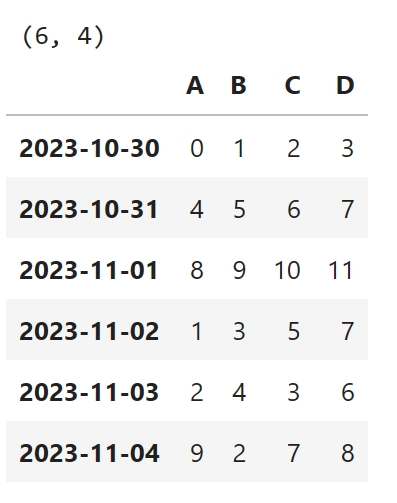
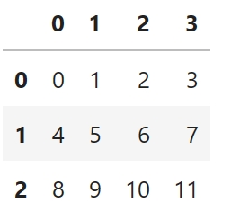
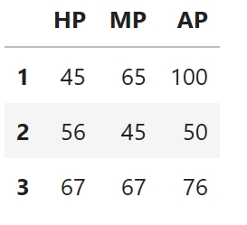
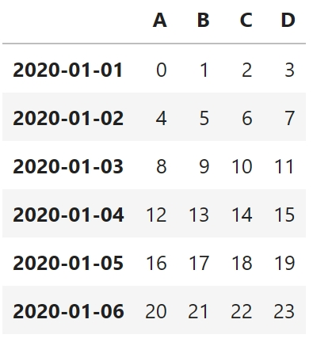
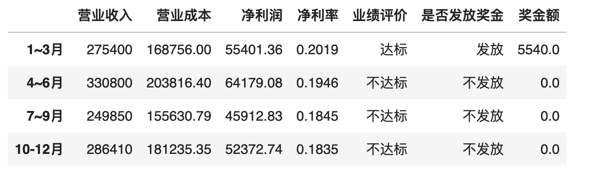
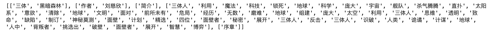
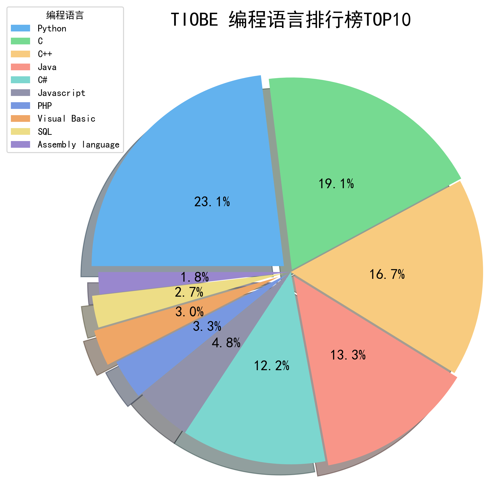
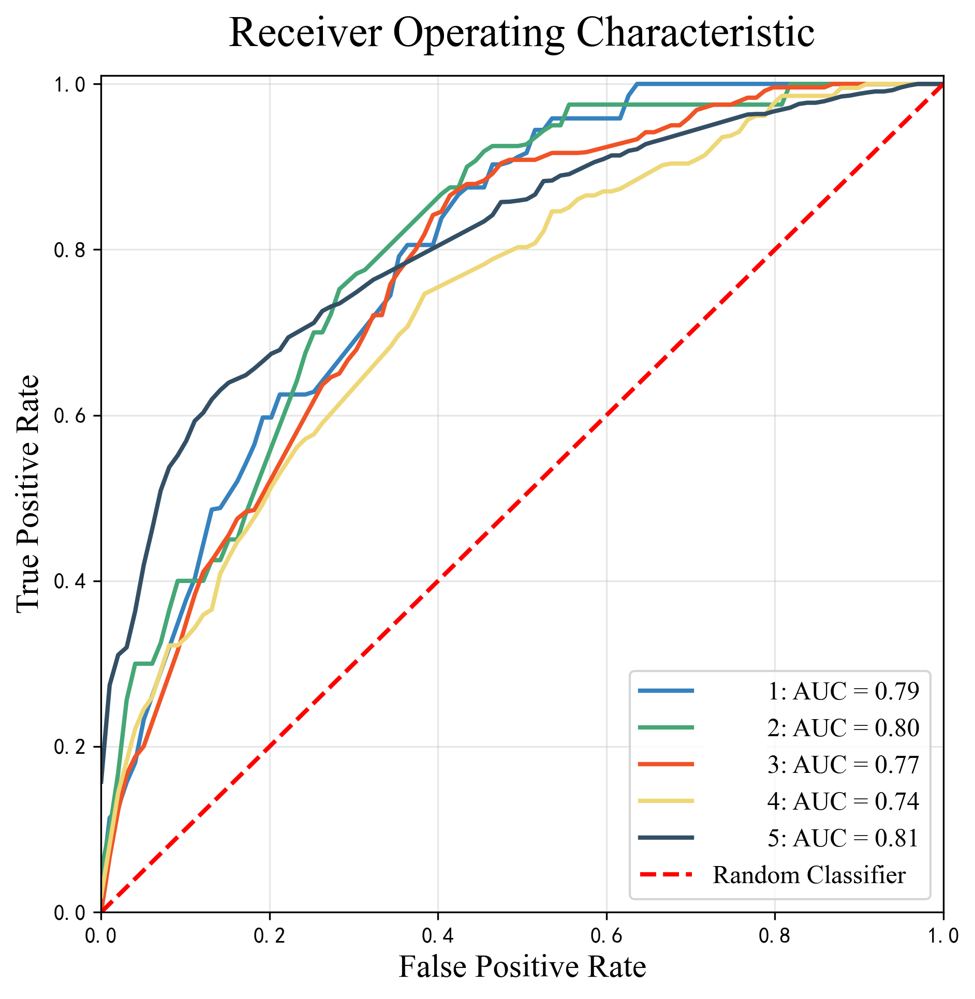

# Python数据分析


​	数据分析就是让数据数据产生价值，通过数据的筛选、汇总等等操作从而分析或预测出事件的变化规律。Python语言在数据分析领域同样扮演者比较强大的角色，其中被熟知的主要有三个扩展库用来做数据分析，分别是：`Pandas`、`Numpy`、`Matplotlib`，其中，`Pandas`主要是用作提炼数据使用、`Numpy`则提供强大的科学计算、`Matplotlib`负责数据可视化的操作，三者并成为**Python**数据分析界的三大剑客。接下来，开始入门数据分析三剑客。

## 1.Numpy库

Numpy是一个运行速度非常快的数学库，主要用于数组计算。它包含一个强大的N维数组对象，拥有广播功能函数、整个C/C++/Fortran代码的工具以及线性代数，傅里叶变换，随机数生成等功能。它最重要的一个特点是其N维数组对象`ndarray`，它是一系列同类型数据的集合。

### 1.1ndarray对象

ndarray是一个类，其默认构造函数是`ndarray()`。而array是一个函数，便于创建一个ndarray对象。这里用`.array()`方法创建对象

```python
import numpy as np
# 将python中的列表转换成numpy的矩阵
array = np.array([[1, 2, 3], [4, 5, 6]])
array()
```

```python
array([[1, 2, 3],
       [4, 5, 6]])
```

如果有需要把Pandas的`DataFrame`对象转换为ndarray，也可以直接使用`array()`函数:

```python
# 假设已经创建好一个DataFrame对象，其值如下:
print(df.shape)
df
```

 

```python
# 将这个6行4列的表格转换成numpy当中的矩阵
matrix = np.array(df3)
matrix
```

 

成功转换成ndarray对象。

### 1.2ndarray的基本属性

- `.ndim`： 输出矩阵的维度
- `.shape`: 输出行行数和列数，返回结果是一个元组
- `.size`: 输出矩阵中元素的数量
- `.dtype`: 输出矩阵的数据类型

```python
import numpy as np
array = np.array([[1, 2, 3], [4, 5, 6]])
print(array)  # 输出矩阵
print(array.ndim)  # 输出维度
print(array.shape)  # 输出行数和列数
print(array.size)  # 输出元素数量
```

```python
[[1 2 3]
 [4 5 6]]
2
(2, 3)
6
```

在Numpy当中，数据类型对象叫做`dtype`，`d`即维度(*`dimension`*)，常见的`dtype`有`int32`、`int64`、`float32`和`float64`，其中数字代表它们的精度。由于它们都是Numpy中新增加的数据类型，故如果需要手动修改数据类型，还需要通过Numpy的对象名`np`来调用：

```python
a = np.array([2, 4, 6], dtype=np.int64)
print(a.dtype)  # int64
```

> 注意array矩阵的元素使用空格分隔，而Python当中不同元素使用逗号分隔。

### 1.3不同的ndarray对象

- **创建一维序列**

```python
import numpy as np
a = np.array([2, 4, 6])
print(a)
```

```python
[2 4 6]
```

- **创建零矩阵**

```python
a = np.zeros(shape=(3, 4))  # 定义为3行4列
print(a)
```

```python
[[0. 0. 0. 0.]
 [0. 0. 0. 0.]
 [0. 0. 0. 0.]]
```

- **创建全部为1的矩阵**

`ones()`函数返回给定形状和数据类型的新数组，其中元素的值设置为1。此函数与`zeros()`函数非常相似。

```python
a = np.ones(shape=(3, 4)) # 创建3行4列的矩阵，其元素填充为1
print(a.dtype)  # 查看矩阵的数据类型
a
```

 

可看到该矩阵的数据类型是`float64`。如果需要该矩阵的数据类型为整型，可以这样定义：

```python
a = np.ones(shape=(3, 4), dtype=np.int16)  # 定义为3行4列
a
```

 

**创建空矩阵**

```python
a = np.empty((3, 4))
print(a)
```

```python
[[0. 0. 0. 0.]
 [0. 0. 0. 0.]
 [0. 0. 0. 0.]]
```

> 该矩阵的每个元素都是非常接近0的元素。

**创建有序序列**

使用`np.arange()`函数：

```python
a = np.arange(10, 20, 2)  # arange用法与python中range的用法一致
print(a)
```

```python
[10 12 14 16 18]
```

**创建有序矩阵**

使用`reshape()`函数，需要传入一个二元组，包括该矩阵的行和列长度：

```python
# 创建一个3行4列，元素从0到11的矩阵
a = np.arange(12).reshape((3, 4))
print(a)
```

```python
[[ 0  1  2  3]
 [ 4  5  6  7]
 [ 8  9 10 11]]
```

**创建一条线段**

使用`linspace()`函数，生成一个指定大小，指定数据区间的均匀分布序列。其原型如下：

```python
np.linspace(start, stop, num=50, endpoint=True, retstep=False, dtype=None)
```

常用参数介绍：

- `start`：序列中数据的下界

- `end`：序列中数据的上界

- `num`：生成序列包含num个元素；其值默认为50

- `endpoint`：取True时，序列包含最大值end；否则不包含；其值默认为True

- `retstep`：该值取True时，生成的序列中显示间距；否则不显示；其值默认为False

- `dtype`：数据类型，可以指定生成序列的数据类型；当为None时，根据其他输入推断数据类型

```python
a = np.linspace(1, 10, 6, dtype=np.int16).reshape((2, 3))  # 生成从1开始，到10结束，共6个数的数列(自动匹配步长)
print(a)
```

```python
[[ 1  2  4]
 [ 6  8 10]]
```

**创建随机矩阵**
在Numpy下的random模块中有很多可以产生随机数构成数组的函数，如：

- **randint**

`random.randint()`函数根据给定范围产生随机整数，其原型如下:

```python
np.random.randint(low, high=None, size=None, dtype='l')
```

常用参数介绍:

- `low`: 随机整数的最小值

- `high`: 随机整数的上限，最终产生的数会落在[low,high)内

- `size`: 输出的大小(传入整数n代表创建长度为n的序列，传入元组(a,b)代表创建a行b列的矩阵)

- `dtype`: 期望结果的数据类型

```python
# 创建一个长度为10，范围在[5,40)的随机序列
array = np.random.randint(5, 40, 10)
```

```python
array([30,  6, 15, 35, 39, 38, 32, 29, 26, 37])
```

```python
# 创建一个4行5列，范围在[5,40)的随机矩阵，
A = np.random.randint(5, 40, (4, 5))
```

 

- **rand**

`rand()`函数根据给定维度生成[0,1)之间的数据:

```python
# 创建一个长度为10的序列
np.random.rand(10)
```

 

```python
# 创建一个4行2列的随机矩阵
np.random.rand(4,2)
```

 

- **randn**

`randn()`函数返回一个或一组样本，具有标准正态分布:

```python
np.random.randn() # 当没有参数时，返回单个数据
```

```python
-0.6491720916258932
```

```python
# 创建一个2行4列，矩阵正态分布的随机矩阵
np.random.randn(2,4)
```

 

- **choice**

`choice()`函数从一个列表中随机抽取k个元素，并返回一个新列表或随机元素(k为1时):

```python
np.random.choice(original_list, k, replace=False)  # replace参数设置为False确保不重复抽取
```

```python
list = [1, 2, 3, 4, 5, 6, 7, 8, 9, 10]
np.random.choice(list, 3, replace=False)
```

 

### 1.4Numpy数学与统计函数

**一维数组**

对于一维数组，运算就是对应元素进行运算：

```python
import numpy as np

a = np.array([10, 20, 30, 40])
b = np.arange(4)
# 减法
c = a - b
print(a, b)
print(c)
 
# 加法
c = a + b
print(c)
 
# 乘法
c = a * b
print(c)
```

```python
[10 20 30 40] [0 1 2 3]
[10 19 28 37]

[10 21 32 43]

[  0  20  60 120]
```


**其他运算**

```python
c = 10 * np.sin(a)  # 正弦
print(c)
 
# 筛选
b = np.arange(4)
print(b)
print(b < 3)  # 返回一个列表，该列表对应原数组该条件的满足情况
```

```python
[-5.44021111  9.12945251 -9.88031624  7.4511316 ]

[0 1 2 3]
[ True  True  True False]
```

**矩阵**

```python
a = np.array([[1, 1], [0, 1]])
b = np.arange(4).reshape((2, 2))
print(a)
print(b)
```

```python
[[1 1]
 [0 1]]
[[0 1]
 [2 3]]
```

**矩阵中元素对应相乘(数乘)**

```python
c = a * b
print(c)
```

```python
[[0 1]
 [0 3]]
```

**矩阵中的乘法(点乘)**

```python
c = np.dot(a, b)
print(c)
 
# 等价为
c = a.dot(b)
print(c)
```

```python
[[2 4]
 [2 3]]

[[2 4]
 [2 3]]
```

**统计函数**

```python
# 查找最值、平均值、求和
a = np.random.random((2, 4))  # 随机生成2行4列的矩阵
print(a)
print(np.sum(a))  # 等价于a.sum()
print(np.min(a))  # 等价于a.min()
print(np.max(a))  # 等价于a.max()
print(np.average(a))  # 等价于np.mean(A)
```

```python
[[0.32178851 0.36945906 0.47043426 0.97250985]
 [0.40558691 0.91389345 0.58745997 0.60485456]]
4.64598655147112
0.32178850886343635
0.9725098455008124
0.58074831893389
```

如果只需要对行或者列进行上述运算，则可以指定参数`axis`。其中`axis=0`表示对行求和，`axis=1`对列求和，结果返回一个数组或矩阵。

```python
print(np.sum(a, axis=1))  # axis=0对行进行求和，axis=1对列求和，结果返回一个数组或矩阵
```

```python
[2.13419167 2.51179488]
```

**常用运算2**

```python
import numpy as np
A = np.arange(2, 14).reshape((3, 4))
print(A)
```

```python
[[ 2  3  4  5]
 [ 6  7  8  9]
 [10 11 12 13]]
```

**查找索引**

```python
# 寻找最小值索引
print(np.argmin(A))  # 0
# 寻找最大值索引
print(np.argmax(A))  # 11
```


**计算平均值**

```python
print(np.mean(A))  # 或np.average(A)
# 等价于
print(A.mean())  # 7.5
```

**计算中位数**

```python
print(np.median(A))  # 7.5
```

**累加**

```python
# 返回一个数组，数组中第n个数的值对应矩阵中前n个数相加
print(np.cumsum(A))  
```

```python
[ 2  5  9 14 20 27 35 44 54 65 77 90]
```

**累差**

```python
# 返回一个新矩阵，矩阵中某一元素等于原矩阵中后一个元素减前一个元素的差值
print(np.diff(A))  
```

```python
[[1 1 1]
 [1 1 1]
 [1 1 1]]
```

**查找非零数**

 返回两个数组，第一个数组代表原矩阵的每一行，第二个数组代表原矩阵的每一列，两个数组对应看即可查找到原矩阵中非零项元素

```python
print(list(np.nonzero(A)))  
```

```python
[array([0, 0, 0, 0, 1, 1, 1, 1, 2, 2, 2, 2], dtype=int64), array([0, 1, 2, 3, 0, 1, 2, 3, 0, 1, 2, 3], dtype=int64)]
```

**矩阵的转置**

```python
print(np.transpose(A))
# 等效于
print(A.T)
```

```python
[[14 10  6]
 [13  9  5]
 [12  8  4]
 [11  7  3]]
[[14 10  6]
 [13  9  5]
 [12  8  4]
 [11  7  3]]
```

**截取矩阵**

```python
print(np.clip(A, 5, 9))  # 所有小于5的数都使其等于5，所有大于9的数都使其等于9，在5和9之前的数不变
```

```python
[[9 9 9 9]
 [9 9 8 7]
 [6 5 5 5]]
```

**计算行或列的平均值**

```python
A = np.arange(14, 2, -1).reshape((3, 4))
print(A)
print(np.mean(A, axis=1))  # 计算行的平均值
print(np.mean(A, axis=0))  # 计算列的平均值
```

```python
[12.5  8.5  4.5]
[10.  9.  8.  7.]
```

### 1.5通过索引访问元素

```python
# 对于一维数组数组
A = np.arange(3, 15)
print(A)
# 根据索引访问元素
print(A[3])
```

```python
[ 3  4  5  6  7  8  9 10 11 12 13 14]
6
```

**根据一级索引访问行**

```python
# 对于矩阵
A = np.arange(3, 15).reshape((3, 4))
print(A)
print(A[2])
# 等效于
print(A[2, :])  
```

`[ ]`中可以写入两个整数，逗号前表示行，逗号后表示列；`':'`表示匹配某一行或某一列的所有书

```python
[[ 3  4  5  6]
 [ 7  8  9 10]
 [11 12 13 14]]
[11 12 13 14]
[11 12 13 14]
```

**两个索引确定要访问的元素**

```python
print(A[1][1])
# 等效于
print(A[1, 1])
```

```python
8
8
```

**访问连续的几个数**

```python
print(A[1, 1:3])  # 访问第一行的第2、3个数
```

```python
[8 9]
```

**与for循环有关的遍历**

```python
# for循环遍历每一个元素
print(A.flatten())  # 将矩阵A变成一个一维数组
for item in A.flat:  # flat是一个迭代器，flatten()是将矩阵变为一维数组
    print(item, end=" ")
print()
 
# for循环迭代行
for row in A:
    print(row)
 
# for循环迭代
for column in A.T:  # 通过转置实现
    print(column)
```

```python
[ 3  4  5  6  7  8  9 10 11 12 13 14]
3 4 5 6 7 8 9 10 11 12 13 14 

[3 4 5 6]
[ 7  8  9 10]
[11 12 13 14]

[ 3  7 11]
[ 4  8 12]
[ 5  9 13]
[ 6 10 14]
```

### 1.6合并array

准备好两个序列

```python
import numpy as np
A = np.array([1, 1, 1])
B = np.array([2, 2, 2])
```

**进行上下合并**

使用`vstack()`函数(*`vertical stack`*)垂直堆叠，输入的参数应该为一个元组对象，包括需要合并的array对象：

```python
C = np.vstack((A, B))
print(C)
print(C.shape)
```

```python
[[1 1 1]
 [2 2 2]]
(2, 3)
```

**左右合并**

使用`hstack()`函数(*`horizontal stack`*)水平堆叠:

```python
D = np.hstack((A, B))
print(D)
print(D.shape)
```

```python
[1 1 1 2 2 2]
(6,)
```

**将一维数组转换成列数为1的矩阵**

使用`newaxis`属性，在`[ , ]`逗号左侧代表给行新增一个维度，逗号右侧代表给列新增一个维度:

```python
print(A[np.newaxis, :])  # 给行新增一个维度
print(A[:, np.newaxis])  # 给列新增一个维度
A = A[:, np.newaxis]
B = B[:, np.newaxis]
# 对修改后的A,B进行左右合并
D = np.hstack((A, B))
print(D)
```

```python
[[1 1 1]]
[[1]
 [1]
 [1]]
[[1 2]
 [1 2]
 [1 2]]
```

**多个array进行纵向或横向合并:**

使用`concatenate()`函数，传入的参数有一个元组`tup`，里面包括需要合并的array对象，以及合并的方向`axis`:

```python
C = np.concatenate((A, B, B, A), axis=0)  # 0表示上下合并，1表示左右合并
print(C)
C = np.concatenate((A, B, B, A), axis=1)
print(C)
```

```python
[[1]
 [1]
 [1]
 [2]
 [2]
 [2]
 [2]
 [2]
 [2]
 [1]
 [1]
 [1]]

[[1 2 2 1]
 [1 2 2 1]
 [1 2 2 1]]
```

### 1.7分割array

```python
import numpy as np
A = np.arange(12).reshape((3, 4))
print(A)
```

```python
[[ 0  1  2  3]
 [ 4  5  6  7]
 [ 8  9 10 11]]
```

分割时需要用到`split()`函数，其原型如下：

```python
.split(ary, indices_or_sections, axis=0)
```

常用参数介绍：

- `ary`: 要切分的array对象 
- `indices_or_sections`: 要切分成几份；如果是一个整数，就用该数平均切分，如果是一个数组，为沿轴切分的位置（左开右闭） 
- `axis`： 沿着哪个维度进行切向，默认为0，横向切分；为1时，纵向切分

**纵向分割**

```python
print(np.split(A, 2, axis=1))  # 按列进行分割，分割成2列
```

```python
[array([[0, 1],
       [4, 5],
       [8, 9]]), array([[ 2,  3],
       [ 6,  7],
       [10, 11]])]
```

**横向分割**

```python
print(np.split(A, 3, axis=0))
```

```python
[array([[0, 1, 2, 3]]), array([[4, 5, 6, 7]]), array([[ 8,  9, 10, 11]])]
```

**不等样分割**

使用`split()`函数只能进行均等分割，否则会报错；如果需要进行不均等分割，需要用到`array_split()`函数:

```python
print(np.array_split(A, 3, axis=1)) 
```

```python
[array([[0, 1],
       [4, 5],
       [8, 9]]), array([[ 2],
       [ 6],
       [10]]), array([[ 3],
       [ 7],
       [11]])]
```

**另一种方法实现不等样分割**

另外，和合并时类似，可以通过指定`vertical`或`horizontal`的方式进行切割；这种方法不需要再传入`axis`参数:

```python
print(np.vsplit(A, 3))  # 纵向分割
print(np.hsplit(A, 2))  # 横向分割
```

```python
[array([[0, 1, 2, 3]]), array([[4, 5, 6, 7]]), array([[ 8,  9, 10, 11]])]
[array([[0, 1],
       [4, 5],
       [8, 9]]), array([[ 2,  3],
       [ 6,  7],
       [10, 11]])]
```

### 1.8复制array

```python
import numpy as np
a = np.arange(4)
print(a)
```

```python
[0 1 2 3]
```

**浅拷贝**

直接通过等号`'='`复制

```python
b = a
a[0] = 11
print(a)
print(b)
```

```
[11  1  2  3]
[11  1  2  3]
```

尝试修改b的值

```python
b[1:3] = [22, 33]
# 查看a的值是否会被修改
print(a)  # 
```

```python
[11 22 33  3]
```

发现a的值也随之被修改。发现a和b是相关联的，即a就是b。如果希望a和b不关联，则需要进行深拷贝。

**深拷贝**

```python
b = a.copy()  # 将a的值赋给b，但二者并不关联
a[3] = 44
print(a)
print(b)
```

```python
[11 22 33 44]
[11 22 33  3]
```

发现a、b不再关联。

---


## 2.Pandas库

`Pandas`是基于`NumPy`的一种工具，该工具是为解决数据分析任务而创建的。`Pandas`纳入了大量库和一些标准的数据模型，提供了高效地操作大型数据集所需的工具。此外，它还提供了大量能使我们快速便捷地处理数据的函数和方法。

### 2.1Pandas数据结构

#### 2.1.1Series对象

`Series`是Pandas库中的一组数据结构，类似于Python列表，能够保存任何数据类型，相当于Excel表中的一列由一组数据以及与这组数据有关的标签(索引)组成。原型为：

```python
pd.Series(data=None, index=None, dtype=None, name=None, copy=False, fastpath=False)
```

常用参数介绍：

- `data`: 需要处理的序列
- `index`: 指定索引名称(不指定时，索引从0开始，也称为原始索引)
- `dtype`: 数据类型

```python
import Pandas as pd
import numpy as np
s= pd.Series([1,3,6,np.nan,44,1])  #传入一个列表，其中nan表示为空
print(s)
```

```python
0     1.0
1     3.0
2     6.0
3     NaN
4    44.0
5     1.0
dtype: float64
```

#### 2.1.2date_range对象

date_range()是Pandas中常用的函数，用于生成一个固定频率的`DatetimeIndex`时间索引，其原型为：

```python
.date_range(start=None, end=None, periods=None, freq=None, tz=None, normalize=False, name=None, closed=None, **kwargs)
```

常用参数介绍：

- `start`： 指定生成时间序列的开始时间(基础格式为`'YYYY(年)mm(月)dd(日)'`，如'20220101'将会被识别成'2022-01-01')
- `end`： 指定生成时间序列的结束时间
- `periods`： 指定生成时间序列的数量

```python
# 生成一个从1月1日到1月6日的日期序列
dates=pd.date_range('20220101',periods=6)
print(dates)
```

```python
DatetimeIndex(['2022-01-01', '2022-01-02', '2022-01-03', '2022-01-04',
               '2022-01-05', '2022-01-06'],
              dtype='datetime64[ns]', freq='D')
```

### 2.2DataFrame对象

`DataFrame`是二维数据结构，相当于Excel表格，既有行索引，也有列索引。与Series一样支持多种数据类型：

```python
DataFrame(data=None,index=None,columns=None,dtype=None)
```

常用参数介绍

- `data`: 需要处理的数据
- `index`: 行索引标签
- `columns`: 列索引标签
- `dtype`: 数据类型

通常以二维数据创建DataFrame，例如，可以由以下数据类型创建：

1. 二维ndarray对象，二维列表、二维元组等
2.  一维ndarray对象、列表、字典、元组或Series构成的字典

#### 2.2.1Numpy提供数据源

*`i)`* **data的数据来源可以来自numpy：**

```python
df = pd.DataFrame(
    np.random.randn(6, 4), index=dates, columns=["a", "b", "c", "d"]
)  # 数据源由numpy的random函数随机生成
df
```

 

```python
# 使用默认行索引和列索引
df1 = pd.DataFrame(np.arange(12).reshape((3, 4)))
df1
```

 

#### 2.2.2字典匹配数据

*`ii)`* **可以来自字典：**

```python
df2 = pd.DataFrame(
    {
        # value可以是Pandas的series对象或者numpy的array对象或者其他形式的序列
        "A": 1.0,
        "B": pd.Timestamp("20130302"),
        "C": pd.Series(1, index=list(range(4)), dtype="float32"),
        "D": np.array([3] * 4, dtype="int32"),
        "E": pd.Categorical(["test", "train", "test", "train"]),
        "F": "foo",
    }
)
df2
```

 

> 当value只有一个值是，默认将这个值填充至整一列。

#### 2.2.3Python列表创建

*`iii)`* **可以来自Python的列表:**

```python
data = [["Tifa", 100, "F"], ["Cloud", 80, "M"], ["Aerith", 95, "F"]]
columns = ["名字", "成绩", "性别"]
df3 = pd.DataFrame(data=data, columns=columns)
df3
```

 

### 2.3基本属性和基本函数

- `values` 查看所有元素的值

- `dtypes` 查看所有元素的数据类型

- `index` 查看所有行名、重命名行名

- `columns` 查看所有列名、重命名列名

- `T` 行列数据转换

- `shape` 查看行数和列数；shape[0]表示行，shape[1]表示列

- `head()` 查看前N条数据，默认5条

- `tail()` 查看后N条数据，默认5条

- `rename()` 修改行索引/列名

- `insert()` 插入列

- `drop()` 删除行列

- `info()` 查看索引、数据类型和内存信息

以`df2`为例，查看各种属性：

```python
# 返回数据类型
df2.dtypes  # Index([0, 1, 2, 3], dtype='int64')
# 返回行的索引
df2.index  # Index([0, 1, 2, 3], dtype='int64')
# 返回列的索引
df2.columns  # Index(['A', 'B', 'C', 'D', 'E', 'F'], dtype='object')
# 返回所有的values
df2.values
```

 

```python
df2.T
```

 

基本函数的实际使用会在2.8数据处理中介绍，这里只讲解insert()函数和info()函数
```python
df2.insert(loc=1, column="G", value=range(4), allow_duplicates=False)
# 参数分别是插入列的索引，列名，插入的值，是否允许列名重复
df2
```
 

```python
df2.info()
```
 

另外，当读取到的行数较多时，Pandas默认只显示前后5行数据:

 

若想显示DataFrame的全部行列，则需要调用set_option()函数，它是用来设置DataFrame中一些指定的参数，如显示的最大行数，列数等等:
```python
pd.set_option(pat,value)
```
*常用参数介绍*
- `pat`: 需要设置的项目，数据类型为字符串
-  `value`: 新设置的值，Pandas默认设置有许多，下表列出了几个常用设置项

|常用设置|说明|
|-|-|
|display.max_rows|设置DataFrame显示最大行数|
|display.max_columns|设置DataFrame显示最大列数|
|display.max_colwidth|设置DataFrame显示最大列宽|
|display.precision|设置显示小数点后的位数|
|display.float_format|设置浮点数的显示格式|

重新设置为显示所有行:

```python
pd.set_option('display.max_rows',None)
df
```

 

### 2.4统计变量和排序

- **describe()**

上面已经了解到Pandas有两个核心数据结构`Series`和`DataFrame`，分别对应了一维的序列和二维的表结构。而describe()函数就是返回这两个核心数据结构的统计变量。继续以df2为例：

```python
# 描述方差、平均值等
df2.describe()
```

 

> 缺失值由NaN补上，如果为NaN，说明此列的信息不可以用这个统计变量进行统计的。

统计值变量说明：

-    `count`：数量统计，此列共有多少有效值
-    `std`：标准差
-    `min`：最小值
-    `25%`：四分之一分位数
-    `50%`：二分之一分位数
-    `75%`：四分之三分位数
-    `max`：最大值
-    `mean`：均值


-    **sort_index()**

`sort_index()`用来按索引排序，其原型为：

```python
.sort_index(
    axis=0, level=None,
    ascending=True, inplace=False,
    kind="quicksort", na_position="last",
    sort_remaining=True,
)
```

常用参数介绍：

上述方法中常用参数：

- `axis`：轴索引（排序的方向），0表示按行，1表示按列

- `level`：若不为None，则对指定索引级别的值进行排序

- `ascending`：是否升序排列，默认为True，表示升序

- `inplace`：默认为False，表示对数据表进行排序，不创建新的实例

- `kind`：选择排序算法

```python
df2.sort_index(axis=1, ascending=False)  # 按列排序，打开降序
```

 

```python
df2.sort_index(axis=0, ascending=False)  # 按照行排序，打开降序
```

 

对某一个列的元素进行排序

```python
df2.sort_values(by="E")
```

 

### 2.5数据读取

#### 2.5.1读取本地文件

- **读取excel文件**

使用`read_excel()`函数，其原型如下:

```python
.read_excel(
    io, sheet_name=0,
    header=0, names=None,
    usecols=None, dtype=None,
    skiprows=None, nrows=None,
    converters=None,
)
```

常用参数说明:

- `io`: `xls`或者`xlsx`的文件路径或类文件对象
- `sheet_name`: 表示工作表，取值如下表所示
- `header`: 默认值为0，取第一行的值为列名，数据为除列名以外的数据，如果数据不包含列名，则设置`header=None`
- `usecols`: 指定读取某一列或多列，参数需要传递一个字符串列表，每个字符串都是一个列
- `skiprows`: 用于跳过特定的函数，参数传递一个列表
- `nrows`: 用于读取前n行的数据
- `converters`: 强制规定列数据类型，形式为`converters={'col1':str[,'col2':float]}`，将col1列数据类型强制规定为字符串


| 值                          | 说明                                                         |
| --------------------------- | ------------------------------------------------------------ |
| `sheet_name=0`              | 第一个`Sheet`页中的数据作为DataFrame对象                     |
| `sheet_name=1`              | 第二个`Sheet`页中的数据作为DataFrame对象                     |
| `sheet_name='Sheet1'`       | 名称为`Sheet1`的`Sheet`页中的数据作为DataFrame对象           |
| `sheet_name=[0,1,'Sheet3']` | 第一个、第二个和名称为`Sheet3`的`Sheet`页中的数据作为DataFrame对象 |
| `sheet_name=None`           | 读取所有工作表                                               |

读取Excel表格
```python
import Pandas as pd
df = pd.read_excel('C:/.../data.xlsx',sheet_name=1,header=None)  # 读取本地excel文件
df = pd.read_excel('https://...data.xlsx',sheet_name=0)  # 读取网页excel文件
```
>注意，若`io`接收到的是URL链接，该链接必须是某个excel文件的下载链接，而不是在该网页下存在一个表格，这种情况下应使用read_html()读取表格。

导入指定列的数据

```python
import Pandas as pd
df = pd.read_excel('data.xlsx',sheet_name=3,usecols=[1])  # 只读取第二列的数据(通过索引或首列名称)
```

导入多列的数据

```python
import Pandas as pd
df = pd.read_excel('data.xlsx',sheet_name=3,usecols=[0,1])  # 只读取第一和第二列的数据
```

- **导入csv文件**

csv文件与xlsx文件相似，可以自定义分隔符，能从记事本打开。导入csv文件使用`read_csv()`函数，其原型如下:

```python
.read_csv(filepath_or_buffer,sep=',',header,encoding=None)
```

常用参数说明:

- `filepath_or_buffer`：字符串、文件路径，也可以是URL链接
- `sep`：字符串、分隔符
- `header`：指定作为列名的行，默认为0，即取第一行的值为列名。数据为除列名以外的数据，若数据不包含列表，则设置为`header=None`
- `encoding`：字符串、默认值为None，文件的编码格式(可以从记事本中查看)


```python
import Pandas as pd
df = pd.read_csv('xxx.csv',sep=',',encoding='gbk')
df.head()  # 输出前5条数据
```

- **导入txt文件**

```python
.read_txt(filepath_or_buffer,sep='\t',header,encoding=None)
```

#### 2.5.2读取html的表格

```python
.read_html(io,match='.+',flavor,header,encoding)
```

常用参数说明:

- `io`：字符串、文件路径，可以是URL链接
- `match`：正则表达式
- `flavor`：解释器默认为lxml
- `header`：指定列标题所在的行
- `encoding`：文件的编码格式


```python
import Pandas as pd
url = 'https://zhuanlan.zhihu.com/p/472053977'
df = pd.DataFrame()  # 创建一个空的DataFrame对象
# DataFrame添加数据
df = df._append(pd.read_html(url,header=0))
df
```

 

如果网页上存在多张表格，那么该函数会按照它们的出现顺序把表格存放到一个列表当中；列表中每一个元素都对应一个表格。

> 注意，使用该函数只能导入网页当中含有`<table>`标签的数据，其他的无法读取。

### 2.6数据提取

```python
import numpy as np
import Pandas as pd

dates = pd.date_range("20220101", periods=6)
df = pd.DataFrame(
    # 创建一张6行4列的表
    np.arange(24).reshape((6, 4)), index=dates, columns=["A", "B", "C", "D"]
)
df
```

 

#### 2.6.1指定查询

Pandas查询数据有很多种方式，比较常见的有`df[ ]`形式，`df.A`属性方式，`df.iloc[]`方式和`df.loc[]`方式。

- **获取某一列数据**

通过`df[标签名]`访问。`df[ ]`索引方式仅接收一个参数，对于获取整行整列的数据十分方便。*注意，使用`['label']`字符串形式仅接收**列标签***。

```python
print(df["A"])  # 获取列名为'A'的一列
```

```python
2022-01-01     0
2022-01-02     4
2022-01-03     8
2022-01-04    12
2022-01-05    16
2022-01-06    20
Freq: D, Name: A, dtype: int32
```

> 另外，如果`[ ]`当中是一个列表`['label1'，'label2'[，...]]`，则列表中的元素必须是列标识。简单地说，就是利用`df[ ]`形式时，如果里面的数据是(一个或多个)标签的话，只允许是列标签。		
>

- **获取连续的行或列的数据**

通过切片来访问。**使用切片形式的话，必须是行标签或者行索引**:

```python
print(df[0:3])  # 获取第一行到第三行的所有数据
# 等效于
print(df["20220101":"20220103"])
```

```python
# 运行结果一致
A  B   C   D
2022-01-01  0  1   2   3
2022-01-02  4  5   6   7
2022-01-03  8  9  10  11
```

> 注意，使用*位置索引包头不包尾*，使用*标签索引包头又包尾*。


另外，还可以通过`.loc[ ]`和`.iloc[ ]`属性访问到元素，二者的区别在于**前者通过标签选择，后者通过位置索引选择**。无论是`loc`还是`iloc`，在`[ ]`内可以写入一个或两个整数(或者是列表)，中间用逗号分隔，逗号前表示行，逗号后表示列。例如，`[num]`或者`['str']`代表查询某一行，`[:,num]`或者`[:,'str']`代表查询某一列。另外，如果是写入列表的话，表示匹配多个行或列。

- **使用标签选择某一行：**

通过`loc`访问：

```python
print(df.loc["20220102"])
# 等效于
print(df.loc["20220102", :]) 
```

```python
# 运行结果一致
A    4
B    5
C    6
D    7
Name: 2022-01-02 00:00:00, dtype: int32
```

- **使用位置选择某一行:**

通过`iloc`访问：

```python
print(df.iloc[3])  # 查看第四行
# 通过两个位置定位一个元素
print(df.iloc[3, 1])  # 查看第四行第二位数
# 定位连续的多个元素
print(df.iloc[3:5, 1:3])  # 查看第四行到第五行，第二列到第三列之间的元素
# 定位不连续的多个元素
print(df.iloc[[1, 3, 5], 1:3])
```

```python
A    12
B    13
C    14
D    15
Name: 2022-01-04 00:00:00, dtype: int32

13
             B   C
2022-01-04  13  14
2022-01-05  17  18

             B   C
2022-01-02   5   6
2022-01-04  13  14
2022-01-06  21  22
```

除了使用`df.loc(iloc)`或者`df[ ]`来查询行或列的数据外，如果只需要查询某一列的数据，`Pandas`还提供了一个更简洁的属性，即`df.列名`直接获取该列的数据。

> 注意，如果使用`df.列名`的方法，该标签名只能是**字符串(或单个字符)形式(允许接收中文和英文，但不能是数字、符号)**，不能是其他形式。

```python
import numpy as np
import Pandas as pd

data = np.arange(12).reshape((3, 4))
columns = ["第一列", "b", "third", 4]
df = pd.DataFrame(data=data, columns=columns, index=[1, 2, 3])
df
```

 

```python
# 尝试获取第一列数据
df.第一列
```

```python
# 成功运行
1    0
2    4
3    8
Name: 第一列, dtype: int32
```

```python
#尝试获取第二列数据
df.b
```

```python
# 成功运行
1    1
2    5
3    9
Name: b, dtype: int32
```

```python
#尝试获取第三列数据
df.third
```

```python
# 成功运行
1     2
2     6
3    10
Name: third, dtype: int32
```

```python
#尝试获取第四列数据
df.4
```

```python
# 获取失败
 Cell In[5], line 1
    df.4
      ^
SyntaxError: invalid syntax
```

也就是说，当只需要查询某一列的数据，且该列的列名是一个不包含浮点和数字的中文或英文字符串时，可以使用`df.列标签名`的方法。

#### 2.6.2条件筛选
条件筛选也称为布尔索引或带条件判断的索引，根据布尔条件选择对应的行。根据选择条件数量可分为以下两种:
- 单列布尔选择: 
```python
df[(df['列']==条件)]  # 选取某列满足一定条件的行
```
- 多列布尔选择:
```python
df[(df['列1']==条件1)&(df['列2']>条件2)]  # 选取多列满足一定条件的行
```
>- 索引列表中可以使用操作符(&、|、~)，但是不能使用关键字(and、or、not)。
> - 布尔选择的结果还是DataFrame，所以对于结果可以进行切片、索引器等访问。
```python
df = pd.DataFrame(
    [np.random.randint(10, 100, 10) for _ in range(5)],
    index=range(1, 6),
    columns=[chr(ord("A") + e) for e in range(0, 10)],
)
```

 

```python
df[df["B"] > 40]  # 等价于 df[df.B>40]
```

 

```python
df[(df["F"] < 60) & (df["C"] % 2 == 0)]  #等价于df[(df.F < 60) & (df.C % 2 == 0)]
```

 

> *注意，只要该列的行数被确定下来，其他列的行数会保持和这个列一致。*

#### 2.6.3模糊匹配

数据处理中往往会遇到筛选出符合条件或者包含某个字符的记录，pandas已经提供了这样的函数进行模糊匹配。

场景假设：假设我们有一份亚马逊智能产品评论的信息表（数据来源于[Consumer Reviews of Amazon Products](https://www.kaggle.com/datasets/datafiniti/consumer-reviews-of-amazon-products/data)），里面包含的数据如下


其中，*asins*是产品编号，*date*是评论时间，*rating*是评分，*text*是评论文字内容，*username*是用户名。

- 在“text”中查询包含“good”的评论

```py
# 假设表格叫df
df[df['reviews.text'].str.contains('good')]
```


另外，该方法支持正则表达式。我们可以通过设置`re.I`忽略大小，从而匹配任意大小写的“good”

```py
import re
df[df['reviews.text'].str.contains('good',flags=re.I)]
```


- 查询“text”中包含“good”<u>并且</u>“date”在2017年1月1日的评论

```py
# 如果“并且”改成“或者”，则符号“&”改成“|”即可
df[df['reviews.text'].str.contains('good',flags=re.I) & df['reviews.date'].str.contains('2017-01-01')]
```


- 在“text”中查询到更多有关“好”的评论

```py
df[df['reviews.text'].str.contains('good|great|awesome|amazing|excellent|fantastic',flags=re.I)]
```


- 查询“text”中不包含“good”的评论

```py
# 在最前面添加一个“~”
df[~df['reviews.text'].str.contains('good',flags=re.I)]
```


- 查询“text”中包含数字信息的评论

```py
# 可以通过正则表达式的模式串进行匹配
pattern=r'\d+'
df[df['reviews.text'].str.contains(pattern)]
```


### 2.7数据清洗

由于我们获取的数据往往存在着许多问题，如数据缺失、数据重复、数据异常等等，直接对这些数据进行统计分析，会导致分析结论偏离实际。因此，在数据分析之前通常需要对数据进行清洗。

场景假设:假设我们需要分析下图的财务表（数据来源于[《财务大数据分析》编者：程淮中 王浩](https://product.dangdang.com/11310080177.html))

 

#### 2.7.1重复值处理
Pandas提供了两种专门处理重复值的函数，分别是查找重复项`duplicated()`和删除重复项`drop_duplicated()`。
```python
# 查找所有重复项
df.duplicated()
```

 

```python
# 删除重复项
df.drop_duplicates(inplace=True)  # inplace:在原数据上删除
df
```

 

如果只想查看某一列或者多列的重复项，可以添加参数`subset`，以产品评论表为例


```py
# 删除“username”列重复的行，以保留每位用户首次对产品评论的信息
df.drop_duplicates(subset='reviews.username', inplace=True)
df
```


#### 2.7.2缺失值处理

处理缺失值的函数如下:
- `isna()`: 检测缺失值
- `dropna()`: 删除缺失值，可选参数`subset`删除某列包含空值的行
- `fillna()`: 使用指定的方法填充NaN值

```python
# 检测缺失值
df.isna()
```

 

```python
# 在原数据上删除全为NaN的列
df.dropna(axis=1, how="all", inplace=True)  # how参数接收all或any，any时表示删除含有缺失值的行或列，all时表示删除全为缺失值的行或列
df
```

 

```python
# 以0填充所有缺失值
df.fillna(0)
```

 

#### 2.7.3其他异常处理
常见的异常情况处理如下：
- 特殊字符删除：将所有数据转换为字符串，再使用`replace()`函数进行替换
- 数据类型更改：根据需求使用`astype()`函数更改数据类型
- 无法识别数据类型：替换默认值或替换为`NaN`再进行处理
- 大小写转换：`upper()`、`lower()`函数

```python
# 想以每一列的平均值填充缺失值
df.fillna(df.mean())
# 运行时报错
--------------------------------------------
TypeError    Traceback (most recent call last)
Cell In[521], line 1
----> 1 df.fillna(df.mean())
TypeError: can only concatenate str (not "int") to str
```
这是因为有几列数据并非数值类型，无法计算出平均值。
```python
# 查看个元素的数据类型
df.applymap(type)  # applymap函数具体内容请看2.8.4
```
 

可以看到DateFrame中包含多种数据类型，且金额类型的数据中也有字符串，导致无法求得平均值。
```python
# 处理数据中的特殊字符，将所有金额转换为浮点型数据，并以列的平均值填充所有缺失值
import re

df = df.applymap(lambda x: re.sub(r"[\s,￥]", "", str(x)))
# 将“期间”设置为索引，其余数据转换为浮点数
df = df.set_index("期间").astype("float")
df.fillna(df.mean())
```

 

>上述代码中用到的`set_index()`函数可以将某一列设置为行索引，与之对应的就是`reset_index()`函数，用于重置并使用原始索引。
### 2.8数据处理

#### 2.8.1修改数据

**根据位置修改：**

```python
df.iloc[2, 2] = 1111 
df
```

 

**根据标签修改:**

```python
df.loc["20220101", "B"] = 2222
df
```

 

**根据条件修改:**

观察以下代码:

```python
# 尝试将列名为'A'的列所有大于8的元素都替换为0
df[df.A > 8] = 0
df
```

 

发现不仅仅是A列满足情况的元素被替修改了，并且和它们同一行的其他列的元素也随之被修改了。为了避免类似情况，修改对代码进行调整:

```python
# 需要调用两次A
df.A[df.A > 4] = 0  
df
```

 

**修改标题:**

使用`columns`属性修改列标题:

```python
import Pandas as pd

pd.set_option("display.unicode.east_asian_width", True)
data = [[45, 65, 100], [56, 45, 50], [67, 67, 76]]
index = ["Tifa", "Cloud", "Aerith"]
df = pd.DataFrame(data=data, index=index)
df
```

 

```python
df.columns = ["HP", "MP", "AP"]
df
```

 

使用`index`属性修改列标题:

```python
df.index = [1, 2, 3]
```

 

使用`rename()`函数修改:

```python
df.rename(
    # 使用字典的形式，原名、修改后的名称进行匹配
    columns={"HP": "AP", "MP": "HP", "AP": "MP"},
    index={1: "Zack", 2: "Red VIII", 3: "Cloud"}
) 
```

 

#### 2.8.2新增行列

新增列可以使用`df[ ]`或者`df.loc[ ]`来实现。有时新增的数据可能与原表中的数据数据类型不兼容，Pandas会默认转换表格的数据类型，最常见的就是`int`转换成`float`，但有时也会错误地转换。如果不希望这类情况发生，可以使用`astype()`函数强制转换数据的类型。

**通过numpy初始化:**

```python
# 新增一列并初始化
df["E"] = np.nan
df
```

 

**通过列表初始化:**

```python
# 使用列表初始化时，元素默认对齐表格
df['F']=[4,5,23,6,49,11]
df
```

 

**通过Pandas初始化:**

```python
df["G"] = pd.Series(
    # 索引要与原表格的一致，这样才能与原表格对齐
    [1, 2, 3, 4, 5, 6], index=pd.date_range("20220101", periods=6)
)  
df
```

 

除了使用`df[ ]`属性外，还可以使用`loc[ ]`新增一列:

```python
data = np.arange(24).reshape((6, 4))
index = pd.date_range("20200101", periods=6)
columns = ["A", "B", "C", "D"]
df = pd.DataFrame(data=data, index=index, columns=columns)
df.loc[:,"E"]=pd.Series([1,3,6,2,7,9],index=pd.date_range('20200101',periods=6))
# 等效于 df['E']=pd.Series([1,3,6,2,7,9],index=pd.date_range('20200101',periods=6))
df
```

 

另外的`df.列标签`和`df.iloc[ ]`不可用于新增列。

同理，新增一行时还是使用`.loc[ ]`实现:

```python
data = np.arange(24).reshape((6, 4))
index = pd.date_range("20200101", periods=6)
columns = ["A", "B", "C", "D"]
df = pd.DataFrame(data=data, index=index, columns=columns)
df
```

 

**新增一行**

```python
df.loc['2020-01-07',:] = [17,3,42,71]
# 等效于
df.loc['2020-01-07',:] = pd.Series([17,3,42,71],dtype=np.int32,index=columns)
df = df.astype(np.int32)  # 保持数据类型是int32
df
```

 

#### 2.8.3删除行列

通过`drop()`函数删除某行或某列数据，其原型如下:

```python
.drop(labels=None,axis=0,index=None,columns=None,inplace=False)
```

常用参数介绍：

- `label`: 行标签或列标签

- `axis`: 等于0按行删除，等于1按列删除

- `index`: 删除行(按行标签名删除)，默认值为None

- `columns`: 删除列(按列标签名删除)，默认值为None

- `inplace`: 对原数组做出修改并返回一个新数组；默认值为False，如果值为True，原数组直接被替换

```python
import Pandas as pd
pd.set_option("display.unicode.east_asian_width", True)
data = [[45, 65, 100], [56, 45, 50], [67, 67, 76]]
index = ["Tifa", "Cloud", "Aerith"]
columns = ["HP", "MP", "AP"]
df = pd.DataFrame(data=data, index=index, columns=columns)
df
```

 

**直接删除:**

```python
# 删除行名为'Cloud'的数据
df.drop("Cloud", axis=0)
# 等效于
df.drop(index="Cloud")
```

 

> 当已经指明是删除行`index`还是列`columns`时，不需要添加参数`axis`。

**通过标签删除:**

```python
df.drop(labels="Aerith", axis=0)
```

 

> 注意，关键字参数`index=`和`columns=`的实参都应该是标签名，而不是索引值。

**带条件地删除数据:**

在前面的学习中，我们已经知道可以通过对某一列进行条件判断得到一个关于每个行关于这个条件的真假值列表，如:

```python
import Pandas as pd
pd.set_option("display.unicode.east_asian_width", True)
data = [[45, 65, 100], [56, 45, 50], [67, 67, 76]]
index = ["Tifa", "Cloud", "Aerith"]
columns = ["HP", "MP", "AP"]
df = pd.DataFrame(data=data, index=index, columns=columns)
df
```

 

```python
# 查看 HP<60 的满足情况
df["HP"] < 60
```

 

如果我们想要查看筛选后的表格，还需要在外围嵌套一层`df`，即

```python
df[df["HP"] < 60]
```

 

如果我们需要把满足条件的元素删除，还需要通过筛选后的表格调用`.index`方法获取到它们的行索引信息:

```python
df[df["HP"] < 60].index
```

```
Index(['Tifa', 'Cloud'], dtype='object')
```

最后把这个整体传入`.drop()`函数即可完成删除:

```python
df.drop(df[df["HP"] < 60].index)  # 删除列名为'HP',且值小于60的行
```

 

#### 2.8.4映射处理

数据处理时，经常需要对DataFrame进行逐行、逐列、逐元素的操作，Pandas提供了`map()`、`apply()`、`applymap()`函数处理此类问题。
场景假设:假设我们需要分析下图的财务表

 

- `map()`函数

`map()`函数用于Series，它与Python内置的map()一样，根据提供的函数对指定序列逐一做映射，可以接受一个函数或含有映射关系的字典型对象:

```python
Series.map(function or dict,na_action=None)
```
现对财务表做以下处理:
1.新增一行“业绩评价”，规则如下：当净利率>0.2时，视为达标，否则为不达标。

```python
df["业绩评价"] = df["净利率"].map(lambda x: "达标" if x > 0.2 else "不达标")
```

 

2.根据“业绩评价”结果确定是否发放奖金。
```python
df["是否发放奖金"] = df["业绩评价"].map({"达标": "发放", "不达标": "不发放"})
```

 

- `apply()`函数

`apply()`函数可用作Series或者DataFrame，其功能是遍历整个Series或者DataFrame，对Series或DataFrame每行、每列运行指定的函数:

```python
Series.apply(function,args,axis=0)
```
>与map()函数类似，区别在于apply能够传入功能更复杂的函数，即当自定义函数需要增加参数时，可以使用apply()函数。

现在继续对财务表进行处理：
1.调整营业收入的金额，而具体调整的金额未知，可自定义函数，在调用apply()函数时，将具体调整的金额传入args参数中。
```python
def f(x, y):
    return x + y

# 每季度营收调增1000
df["营业收入"] = df["营业收入"].apply(f, args=(1000,))  # args参数接收元组，单个元素需要添加逗号
df
```

 

2.将营业收入、营业成本、净利润以“万元”为单位展示。

```python
df1 = df[["营业收入", "营业成本", "净利润"]]
df1 = df1.apply(lambda x: round(x / 10000, 2))
df1
```
 


3.根据业绩评价结果，计算每季度奖金额，业绩达标发放奖金的标准为净利润的10%。
```python
def cal(x):
    if x["是否发放奖金"] == "发放":
        x["奖金额"] = round(x["净利润"] * 0.1, 0)
    else:
        x["奖金额"] = 0
    return x

df = df.apply(cal, axis=1)
```

 

- `applymap()`函数

`applymap()`函数可对DataFrame中的每个元素执行指定方法:

```python
DataFrame.applymap(function)
```
先对财务表进行处理：在所有数据前加上“#”
```python
df = df.applymap(lambda x: f"#{str(x)}")
```

 

#### 2.8.5遍历数据

DateFrame对象提供了一种逐行遍历数据的函数`iterrows()`，以产品评论表为例，输出每行的*asins*(产品编号)


1. 基于行索引

   ```py
   for index, row in df.iterrows():  # 用index和row分别接收行和列
       print(df.loc[index, "asins"])
   ```

   

2. 基于列索引

   ```py
   for index, row in df.iterrows():
       print(row["asins"])
   ```

   

####  2.8.6表格分组

根据研究目的，将所有样本按照一个或多个属性划分为多个组，就是分组。

`Pandas`中用于分组的方法就是就是`groupby`。将DataFrame中所有行按照一列或多列来划分，分为多个组，列值相同的在同一组，列值不同的在不同组。

场景假设：假设有以下学生成绩单：

 

1. 按照“课程”给表格进行分组并分别输出

   ```py
   for item in df.groupby('课程'):
       print(*item)
   ```

    

2. 输出不同课程的最高分、最低分和平均分

   ```py
   print(df.groupby('课程')['成绩'].min())
   print(df.groupby('课程')['成绩'].max())
   print(df.groupby('课程')['成绩'].mean())
   ```

    

#### 2.8.7列表转化

pandas提供了属性`values`用于将表格转化为numpy数组，以产品评论表为例：


```py
df.values
```


结果返回一个二维的矩阵，每一行都是原表格的行，用不同的字符串区分在不同列上的取值。

如果进一步想把numpy数组转化为python列表，可用`tolist()`函数：

```py
df.values.tolist()
```


如果只想把其中一列转换为列表，可以使用`to_list()`函数：

```py
# 转换为python列表
df['reviews.text'].to_list()
```


```py
# 转换为numpy数组
df['reviews.text'].values
# df['reviews.text'].values.tolist()再次转换为python列表
```


### 2.9数据储存

#### 2.9.1写入单个表单
以二维表格为例，当处理后的表格写入一个新的Excel需要用到函数:
```python
pd.to_excel(excel_writer,sheet_name='Sheet1',na_rep='',header=True,index=True,encoding=None)
```
*常用参数介绍:*

- `excel_writer`: 文件路径
- `sheet_name`: 导出的excel表名
- `index`: 是否输出行索引
- `na_rep`: 设置空值替换的值
- `header`: 是否输出表头
- `encoding`: 编码方式(建议UTF-8)

加工过的表格写入一个新的Excel:

```python
df.to_excel('data.xlsx',index=False,sheet_name='项目1')
```
#### 2.9.2写入多个表单
如果使用to_excel()函数写入一个已经存在的Excel()，会将原有的Excel表格中的数据全部覆盖掉。要解决这个问题，可以使用ExcelWriter()函数:
```PYTHON
ExcelWriter(path,engine=None,mode='w')
```
*常用参数介绍*

- `path`: xls或xlsx文件的路径
- `engine`: 写入的引擎
- `mode`: 写入的模式，其中`w`为写入，`a`为追加

在data.xlsx文件中追加新表单“项目2”:

```python
# 使用with进行上下文管理
with pd.ExcelWriter('data.xlsx',mode='a') as writer:
    df.to_excel(writer,sheet_name='项目2',index=False)
```
此时就完成了对data.xlsx中新增表达的操作。

#### 2.9.3按照分组写入表单

如果利用了`group by`函数将一个表格分为了几组，可以遍历每个分组，将每个分组保存为单独的表格

 

```py
grouped = df.groupby("课程")

for course_name, group in grouped:  # 分别获取每个分组名和分组内容，并以分组名给excel命名
    group.to_excel(f"{course_name}.xlsx", index=False) 
```

---


## 3.NLP自然语言处理

上面讨论的情况都是基于数值型数据的数据分析，但是在实际分析当中，经常会遇到非数值型数据，也就是文本型数据。这一部分的数据无法直接运用Numpy库进行处理，还需要经过自然语言处理（Natural Language Processing），简称`NLP`，让计算机理解非结构化的文本并从中获取有价值的信息片段。

### 3.1文本分词

对于长文本，我们首先需要将它切分为多个单词，这样才能提取出有用的数据。

#### 3.1.1re模块

Python标准库提供了正则表达式re模块，用于对字符串进⾏匹配，需要导入库

```python
import re
```

对于英文文本，我们一般会以每个单词之间的空格进行分割，这样切分得到的每一个元素就是一个单词。现在以Numpy的官方介绍文档为例，对其进行分词操作:

```python
# 由于文本过长，在每一行的结尾以'\'续一行继续写
text = "NumPy is the fundamental package for scientific computing in Python. \
It is a Python library that provides a multidimensional array object, \
various derived objects (such as masked arrays and matrices), \
and an assortment of routines for fast operations on arrays, \
including mathematical, logical, shape manipulation, sorting, selecting, I/O, \
discrete Fourier transforms, basic linear algebra, basic statistical operations, random simulation and much more."
```

**split()函数分割文本**

```python
re.split(pattern, string[, maxsplit=0, flags=0])
```

常用参数介绍:

- `pattern`: 字符串模板
- `string`: 需要切分的字符串
- `maxsplit`: 分隔次数，默认为0(即不限次数)
- `flags`: 标志位，用于控制正则表达式的匹配方式，比如`re.I`不区分大小写等

```python
# 以空格、括号、逗号、句号作为分隔符
cut_words = re.split(r"[\s,.\(\)]", text)  # 由于模式字符串拥有特殊的语法，需要在引号前添加'r'取消'\'转移字符作用
print(cut_words)
```


可以发现，列表中出现了多个长度为0的字符串，这些是我们定义好的分割符，在分割后残余的占位符，所以我们可以重新创建一个列表，接收所有空字符以外的字符串:

```python
words = []
for word in cut_words:
    if word != "":
        words.append(word)
print(words)
```


在这个新创建的列表中，就不存在空字符串了。

而对于中文文本，虽然我们无法通过空格进行分词，但可以借助第三方中文分词库实现。

#### 3.1.2jieba库

jieba是一个强大的Python中文分词库，主要功能就是做中文分词，可以进行简单分词、并行分词、命令行分词:

```python
import jieba
```

继续以Numpy官方的中文介绍文档为例:

```python
text = "NumPy是Python中科学计算的基础包。这是一个Python库，提供多维数组对象，各种派生对象（例如屏蔽数组和矩阵），\
以及用于数组的快速运算，包括数学、逻辑、形状操作、排序、选择、I/O、离散傅里叶变换、基本线性代数、基本的统计运算、随机模拟等等。"
```

**cut()与lcut()函数分词**

i) `.cut`生成的是一个生成器对象，可以通过for循环来取里面的每一个词，通过print输出得到的是封装的数据

ii) `.lcut` 直接生成的就是一个列表对象，通过print输出得到的是一个列表

```python
# 使用cut函数，参数选择采用全模式分词
seg_list = jieba.cut(text,cut_all=True)
print(type(seg_list),list(seg_list),sep='\n')
```


>所谓**全模式**，就是指`jieba`把所有的切分情况都输出，如“Python中科学计算的基础包”将被切分为“Python”,”中科”,”科学”,“科学计算”,“计算”,“的”,“基础”,“包”。

```python
# 使用lcut函数，默认不采用全模式
cut_words = jieba.lcut(text)
print(cut_words)
```


在这个列表中，发现`jieba`有可能误把一个完整的词语拆分成多个字词，如“多维数组”、“快速运算”、“离散傅里叶变换”、“基本线性代数”等等，我们可以手动添加自定义词典，已达到精准分词的目的:

**load_userdict()**添加自定义词典

```python
jieba.load_userdict(file_name)
```

filename接收一个文本文件(txt,csv)的路径。该文本文件的词汇格式是**一个词占一行，每一行分三部分：词语、词频（可省略）、词性（可省略），用空格隔开，顺序不可颠倒**。现在将上述提到的需要额外补充的分词按照格式添加并保存到“自定义词典.txt”后，再次输出列表:

```python
jieba.load_userdict("自定义词典.txt")
cut_words = jieba.lcut(text)
print(cut_words)
```


在确定精准分词后，需要将列表中无意义的字符去除，该过程与英文分词中去除空字符类似:

```python
words = []
for word in cut_words:
    if word not in ["，", "。", "、"]:
        words.append(word)
print(words)
```


虽然已经去除了字符，但实际上某些词语在分析时也是无意义的，比如“是”、“的”等，我们需要把这部分的词语当做停用词。

### 3.2去除停用词

若一个文本中包含的停用词比较少，则我们可以直接利用与去除字符相同的方法去除停用词:

```python
words = []
for word in cut_words:
    if word not in ["是", "的"]:
        words.append(word)
```

若一个文本中包含多种停用词，我们可以先将所有的停用词按照自定义词典的格式写入文本文件中，再使用python读取这个文件，后进行判断。在本例中，先创建如下停用词库:

 

在python中读取这个文件:

```python
stop_words = set()  # 创建一个集合，用于存储停用词
with open("停用词库.txt", encoding="utf-8") as f:
    for line in f.readlines():  # 遍历文件的每一行
        if line.strip():  # 判断当前行是否为空
            stop_words.add(line.strip())  # 去除该行的换行符后添加进集合
print(stop_words)

# 如果确保该停用词库不存在相同的行和空行时，也可以将停用词用列表储存:
stop_words = []
with open("停用词库.txt", encoding="utf-8") as f:
    stop_words.extend(line.strip() for line in f.readlines())  # 这种写法可以简化代码
print(stop_words)
```

```python
{'和', '是', '的', '中', '等等', '以及', '这是', '一个'}
['是', '中', '的', '这是', '一个', '和', '以及', '等等']
```

```python
# 去除停用词
filter_words = []
for word in words:
    if word not in stop_words:
        filter_words.append(word)
print(filter_words)
```


当需要处理的文本很长时，手动定义停用词就会显得及其麻烦，可以选择引用网上开源的中文停用词库，一般包含了大部分无法提供价值的词语以及各种符号。

当引用到的停用词库不止一个时，可以在python中定义多个集合变量，如:

```python
set1 = set()
with open("停用词1.txt") as f:
# 添加停用词的操作
set2 = set()
with open("停用词2.txt") as f:
...

# 合并所有的停用词集合
stop_words = set1 | set2 | ... | setn  # '|'代表取并集
```

> 由于集合具有去重的功能，所以即使不同停用词集合之间存在相同的停用词，在`stop_words`当中只会保留其中一个，不会重复添加。

### 3.3词频统计

在文本清洗之后，我们有时候需要对词语出现的频次进行统计，可以通过python字典的形式实现:

```python
# 假设存在一个分词列表words
count = {}  # 创建一个统计字典
for word in words:  # 遍历这一个列表
    count[word] = count.get(word, 0) + 1  # 如果当前字典不存在这个分词，就创建键值对，值的初值为0，再自增1；否则直接自增
```

这样就获得了一个统计字典，每一个键值对就是这个词和它对应出现的次数。<u>以《三体2》小说为例</u>，统计它排名前10的词语结果:

```python
import jieba as jb
jb.load_userdict("分词词库.txt")
with open("三体II-黑暗森林.txt") as f:
    text = f.read()  # 直接读取文本文件的所有内容并以字符串的形式接收
stop_words = []  # 创建停用词列表
with open("停用词表.txt", encoding="utf-8") as f:  # 自定义或是网上下载的停用词文件
    stop_words.extend(word.strip() for word in f.readlines())   
words = [  # 创建列表接收清洗后的文本数据
    word.strip()  # 去除该文本前后的空格和换行符
    for word in jb.lcut(text)  # 调用jieba对文本进行分词
    if word.strip() and word not in stop_words and len(word) > 1  # 去除停用词和分词后字符串长度小于1的无效词
]
```

其中，分词词库是我们自定义不希望切分开的词：

 

这样，我们就得到了一个分词列表

```python
print(words[:20])
```


开始统计词频

```python
count = {}
for word in words:
    count[word] = count.get(word, 0) + 1
```

由于**字典不支持索引和切片操作以及字典无序**，基于这几点原因，我们还需要把这个统计字典转换为一个列表进行操作

```python
count_list = list(count.items())  # 调用items函数将字典的键值对转换为二元组，并储存在列表中
print(count_list[:10])  # 查看排名前10的词语
```


虽然这样确实得到了10个文本统计数据，但是这并不是前10的数据，换言之，我们还需要对这个列表进行排序

```python
print(sorted(count_list, key=lambda x: x[1], reverse=True)[:10])  # 根据二元组的第二个值由大到小排序
```


完成。实际上，在python标准库中，提供了一个用于统计频数的模块`Counter`，存在于`Collections`库下

```python
from collections import Counter
```

#### 3.3.1Counter函数

直接调用`Counter`函数，并把需要统计的数据传入即可

```python
print(Counter(words))
```


返回一个Counter对象形式的字典。若想把它转换为嵌套二元组的列表，只需要补充上`most_common()`即可

```python
print(Counter(words).most_common())
```


不传参时，默认返回所有的二元组统计结果，如果我们只需要它返回排名前十的词语，就在括号内填入10:

```python
print("出现频次最高的10个词分别是:", *Counter(words).most_common(10))
```


这与我们不借助模块时得到的结果完全一致且过程更为简洁。

### 3.4文本可视化

在获取到频次数据后，我们可以将这些数据以图的形式呈现，即文本数据的可视化。在python中实现可视化的工具有多种，比较常用的有`Pyecharts`和`Matplotlib`等。Matplotlib是更为专业的绘图库，在数据分析时常与Pandas和Numpy连用，在下一章节中介绍。这是先简单介绍一下Pyecharts。

#### 3.4.1Pyecharts库

`Pyecharts`是由百度开源的用于生成Echarts图表的类库，可以为用户提供直观生动，可交互，可高度个性化定制的数据可视化图表。在Pyecharts官方网站中，可以查询到各种配置项和参数介绍以及大量的模板。对可视化不做要求时，可以**借用官方提供的模板进行修改，绘制出我们想要的图**。

**快速上手:**

根据以下数据绘制出GDP排名折线图

```python
data = [
    ("美国", 26.94),
    ("中国", 17.70),
    ("德国", 4.42),
    ("日本", 4.23),
    ("印度", 3.73),
    ("英国", 3.33),
    ("法国", 3.04),
    ("意大利", 2.18),
]
```

绘制基础折线图

```python
# 导包，导入Line功能构建折线图对象和可配置选项
from pyecharts.charts import Line  # 用来导入折线图模块
from pyecharts.options import *  # 用来导入配置相关的模块

# 实例化折线图对象
line = Line()
# 添加x轴数据
line.add_xaxis([nation[0] for nation in data])  
# 给出y轴名称并添加y轴数据
line.add_yaxis("GDP总量(单位：万亿)", [gdp[1] for gdp in data]) 
# 全局配置项的设置(更多设置参考官网配置 - 全局配置项)
line.set_global_opts(
    # 设置图表的标题和位置
    title_opts=TitleOpts(title="2023年全球GDP排名前10国家（美元）", pos_left="center", pos_bottom="1%"),
    legend_opts=LegendOpts(is_show=True),  # 图例
    toolbox_opts=ToolboxOpts(is_show=True),  # 工具箱
    visualmap_opts=VisualMapOpts(is_show=True)  # 视觉映射配置
)
# 生成图表(保存在同根目录下,文件默认名为render.html，可以通过浏览器查看)
line.render()
```


> 注意，要想在Jupyter_lab中显示出图表，还需要在顶部声明Notebook类型，必须在引入`pyecharts.charts`等模块前声明：
>
> ```python
> from pyecharts.globals import CurrentConfig, NotebookType
> CurrentConfig.NOTEBOOK_TYPE = NotebookType.JUPYTER_LAB  # 以Jupyter-lab为例
> ```
>
> 需要在第一次渲染前首先加载javascript文件
>
> ```python
> 被渲染对象.load_javascript()
> ```
>
> 才可以正常渲染图片
>
> ```python
> 被渲染对象.render_notebook()
> ```


#### 3.4.2词频柱状和词云图

现对《三体2》中出现频次最高的20个词绘制词频柱状图，先在*pyecharts官方演示文档*中**找出合适的模板**

```python
# 在notebook中，记得声明jupyterlab环境
# 需要用到Pyecharts库中的bar模块,options模块用于修改全局配置,ThemeType模块用于修改主题色
from pyecharts import options as opts
from pyecharts.charts import Bar
from pyecharts.globals import ThemeType

# 定义两个列表分别代表x轴和y轴数据
x_axis, y_axis = [], []
for binary in Counter(words).most_common(20):
    x_axis.append(binary[0])  # x轴用于显示词语
    y_axis.append(binary[1])  # y轴用于显示词频
bar = (
    Bar(init_opts=opts.InitOpts(theme=ThemeType.MACARONS))
    .add_xaxis(x_axis)
    .add_yaxis("排名前20词条", y_axis)
    .set_global_opts(
        # 防止x轴数据名太长，使其向下旋转45度
        xaxis_opts=opts.AxisOpts(axislabel_opts=opts.LabelOpts(rotate=-45)),
        title_opts=opts.TitleOpts(title="三体II-黑暗森林", subtitle="词频柱状图"),
    )
)
bar.load_javascript()
```

```python
# 渲染图片
bar.render_notebook()  # 直接在notebook上显示
# 或者保存到本地`bar.render('三体II-黑暗森林.html')
```

 

另外，还可以借助pyecharts库，绘制出词云图

```python
import pyecharts.options as opts
from pyecharts.charts import WordCloud

data = Counter(words).most_common()  # 获取到所有词语的频次
cloud = (
    WordCloud()
    .add(series_name="词云图", data_pair=data, word_size_range=[20, 120], shape="circle")
    .set_global_opts(
        title_opts=opts.TitleOpts(
            title="三体II·黑暗森林-词云图", title_textstyle_opts=opts.TextStyleOpts(font_size=30)
        ),
        tooltip_opts=opts.TooltipOpts(is_show=True),
    )
)
cloud.render_notebook()
```

 

### 3.5词向量

在`NLP`领域，词向量是一项非常重要的技术。它能完成**主题聚类**、**情感分析**、**信息检索**等任务。在NLP任务中，首先需要考虑词如何在计算机中表示。词向量表示中最简单最有名的是独热编码(`One-Hot`)，它的原理如下:

1.提取出一个不重复的词库

```python
text = "在NLP任务中，首先需要考虑词如何在计算机中表示。"
cut_words = jb.lcut(text)
words = [word for word in cut_words if word not in ["，", "。"]]
print(set(words)) 
```

 

2.在这些词语对应词库的标记“1”,其他位置标记“0”

```PYTHON
import numpy as np
import pandas as pd

matrix = np.zeros(shape=(11, 11))  # 创建一个与词库大小相同维度的矩阵
df = pd.DataFrame(matrix, index=words, columns=range(1, 12), dtype=np.int16)  # 行标签设置为词库中出现的所有词语
for index, _ in df.T.iterrows():
    df.iloc[index - 1, index - 1] = 1  # 使得每个词语对应词库位置标记“1”
df
```

 

不难发现，one-hot的维度由词库的大小决定。在填充数值时，所有频率$\geq 1$的词语标记为“1”，其他位置统一标记为“0”。这种表示方法虽然直观，但也带来了一些问题:

- 维度灾难：有多少个词语，矩阵就需要扩大到几维，这对于庞大的语料库而言，计算量和存储量都是很大的问题
- 无法度量词语之间的相似性：利用**余弦相似度**来计算任意两个词语之间的相似度结果都会是0

> 所谓余弦相似度，就是当两个向量的夹角越接近于0时，其余弦值越接近于1，表面两个向量越相似。向量夹角余弦计算：
> $$
> cos\alpha=\frac{x_1\cdot x_2+y_1\cdot y_2}{\sqrt{x_1^2+y_1^2}\times\sqrt{x_2^2+y_2^2}}
> $$
> 这个结论可以应用到NLP中，此时向量即指词向量。

基于以上问题我们提出了用词向量来表示词语,具体表示为一串数字，这些数字可以取任意实数

```python
import numpy as np
import pandas as pd
# 采用随机数只是方便理解，实际上每一个数的取值都是有实际意义的
random_matrix = np.random.uniform(low=-5, high=5, size=11 * 11).reshape((11, 11))
df = pd.DataFrame(random_matrix, index=words, columns=range(1, 12))
df
```

 

这样一来，有限维度的词向量就可以表示出无数个词语(11维的ont-hot只可以表示11个词语，但11维的词向量却可以表示无数个词语)。那么应该如何获取词向量的这段数字？这里介绍一下word2vec的思想。

#### 3.5.1Word2Vec模型

在word2vec当中，重要的假设是**文本中离得越近的词语相似度越高**。基于这个假设，word2vec用`CBOW`和`skip-gram`来计算词向量矩阵。

- `CBOW`: 使用上下文词来预测中心词
- `skip-gram`: 使用中心词来预测上下文词

其中，针对某个中心词，我们还需要定义一个窗口大小，指定每个中心词周围上下文词包含哪些词语，最大化这些中心词语和上下文词语共同出现的概率就能得到词向量。

当窗口大小为2时:

```python
for index, word in enumerate(words):
    prev_words = words[max(0, index - 2) : index]
    next_words = words[index + 1 : index + 3]
    print('"{}" 的上下文词是: {} {} {} {}'.format(word, *prev_words, *next_words, "", ""))
```

 

此时中心词语的前后两个词语就是它的上下文词。为了方便优化目标函数，还需要综合考虑上下文词和非上下文词。而当语料库非常大时，非上下文词远远超过上下文词，会导致计算灾难，所以只需要采样部分负样本。

- **模型训练**

继续以《三体2》为例，建立`word2vec`模型

```python
# 读取文本
contents = []
with open("三体II-黑暗森林.txt") as f:
    for line in f.readlines():
        if line.strip():
            contents.append(line.strip())
```

与之前读取方式不同的是，这次不再是用字符串接收，而是通过一个列表，列表中的每一个元素是文本中的每一行(以换行符分隔)。

```python
# 文本清洗
stop_words = []
with open("停用词表.txt", encoding="utf-8") as f:
    stop_words.extend(word.strip() for word in f.readlines())
import jieba as jb

jb.load_userdict("分词词库.txt")
lines = [
    [word for word in jb.lcut(content) if word not in stop_words and len(word) > 1]
    for content in contents
]
print(lines[:5])
```



调用Word2Vec训练，如果模型评估结果不佳，需要重新训练模型，再返回模型评估，如此反复迭代得到效果理想的模型。

```python
from gensim.models import Word2Vec
model = Word2Vec(lines, vector_size=20, window=2, min_count=3, epochs=7, negative=10, sg=1)
```

参数介绍:

- `lines`: 产生句子的迭代器对象，用于训练Word2Vec模型的输入数据，每个句子应该是一个**单词列表**
- `vector_size`: 指定词向量的维度大小
- `window`: 指定**上下文**窗口的宽度，它指定了在训练过程中模型应该考虑到目标词汇周围的词汇数量
- `min_count`: 指定考虑在模型训练中的**最低词频阈值**的参数，只有出现次数超过此阈值的单词才会被保留在词汇表中进行训练
- `epochs`: 指定模型进行训练的**迭代次数**
- `negative`: 指定用于负采样的**负样本数量**，在Word2Vec模型中，负样本用于与目标词汇进行对比，从而提高模型的训练效果
- `sg`: 指定训练算法的选择。当设置为1时，使用的是`Skip-gram`算法；为0时，使用的是默认的`CBOW`算法

> 为了评估词向量的效果，可以输出与特定词语的相关度比较高的词语与我们预期的是否接近。

训练好模型后，可以查看`model.wv`属性，它提供了训练后的词向量，如

1.获取某个单词单词词向量`model.wv.get_vector()`

```python
print("罗辑的词向量：\n", model.wv.get_vector("罗辑"))
```


2.获取与某个单词相关性最高的前10个词语`model.wv.most_similar()`

```python
print("\n和罗辑相关性最高的前10个词语：")
model.wv.most_similar("罗辑", topn=10)  
```

 

3.两个单词计算余弦相似度`model.wv.similarity()`

```python
print('三体人与黑暗森林的余弦相似度:',model.wv.similarity('三体人', '黑暗森林'))
```


#### 3.5.2降维可视化

评估词向量效果时，除了输出查看相关度比较高的词语外，还可以通过可视化的方式查看相似度较高的词语是否聚在一起。

在本例中，由于我们前面词向量定义的是20维，很难将它可视化。因此为了实现可视化，首先需要把词向量进行降维:

```python
# 降维选取PCA主成分分析
import numpy as np
from sklearn.decomposition import PCA

# 将词向量投影到二维空间
rawWordVec = []
word2ind = {}  # word2vec index
for i, w in enumerate(model.wv.index_to_key):
    rawWordVec.append(model.wv[w])  # 将词向量添加进列表
    word2ind[w] = i  # key: 单词 value: 索引
rawWordVec = np.array(rawWordVec)  # 将二维列表转换为Numpy矩阵
X_reduced = PCA(n_components=2).fit_transform(rawWordVec)
```

属性介绍:

- `model.wv.index_to_key`: 返回一个列表，该列表的元素是模型训练时用到的所有单词
- `model.wv[w]`: 括号内是某个单词，返回这个单词的词向量
- `PCA(n_components=2).fit_transform(rawWordVec)`: 将原始词向量的维度降至2维

查看降维之前的矩阵

```python
rawWordVec
```

 

降维之后

```python
X_reduced
```

 

这样我们就可以把一列作为$x$，一列作为$y$​，把这些词语映射到二维星空图中

>绘制星空图导入了matplotlib库，会在第4章中介绍，现在了解即可

```python
import matplotlib.pyplot as plt

plt.rcParams["font.sans-serif"] = ["SimHei"]
plt.rcParams["axes.unicode_minus"] = False
# 降维后的词向量在第一个主成分方向上的取值作为x轴，第二个主成分方向上的取值作为y轴
plt.plot(X_reduced[:, 0], X_reduced[:, 1], ".", markersize=2)

# 绘制几个特殊单词的向量
words = ["罗辑", "史强", "庄颜", "三体", "地球", "舰队", "大史", "黑暗森林", "三体人", "eto", "破壁", "人工智能"]

for w in words:  
    if w in word2ind:  # 判断单词是否存在于模型的训练集
        ind = word2ind[w]  # 获取这个单词对应原始语库的索引
        xy = X_reduced[ind]  # 根据索引在降维词向量矩阵中找到对应的词向量
        plt.plot(xy[0], xy[1], ".", markersize=10)  # 取PCA第一主成分为x轴，第二主成分为y轴
        plt.text(xy[0], xy[1], w)  # 在对应位置添加文本，即单词名

plt.axis("off")  # 隐藏边框
plt.show()
```

 

其中蓝点代表所有的词，红点是突出显示的词，也就是列表`words`所包含的字符串。

> 如果想查看所有点对应的词语，可以把循环语句改成:
>
> ```python
> for w in model.wv.index_to_key:
>     ind = word2ind[w]
>     xy = X_reduced[ind]
>     plt.plot(xy[0], xy[1], '.', markersize=6)
>     plt.text(xy[0], xy[1], w, fontsize=8)
> ```

不过，word2vec也存在一些缺点，如没有考虑多义词，窗口长度有限，没有考虑全局的文本信息等等，它没有办法根据语境的变化来动态调整词向量。

---


## 4.Matplotlib库

`Matplotlib`是一个Python的2D绘图库，利用它可以画出许多高质量的图像。`Matplotlib`是可视化的表达，在图形的绘制前会涉及一些数据处理，而`Pandas`和`Numpy`则是Python中最好用的两个数据分析库，使用它们，能够解决大部分的数据分析问题。

**快速上手**

```python
import matplotlib.pyplot as plt # 一般需要用到的函数都在pylot当中
import numpy as np
# 设置自变量和因变量
x = np.linspace(-1, 1, 50)  # 从-1到1生成50个点
y = x**2
plt.plot(x, y)  # 绘制线条
plt.show()  # 展示图像
```

 

> 其中，生成线图需要函数`.plot()`；显示图形需要函数`.show()`。

- `plot()`: 绘制线条

- `show()`： 显示所有打开的图形

### 4.1设置基本信息

**创建图形**

`figure()`函数的功能就是为了创建一个图形figure，或者激活一个已经存在的图形figure，其原型如下:

```python
.figure(num=None, figsize=None, dpi=None, facecolor=None, edgecolor=None, frameon=True)
```

常用参数介绍:

- `num`: 传入一个整数或字符串，作为该figure独一无二的ID标识
- `figsize`: 传入一个二元组，分别表示该figure宽高
- `facecolor`: 设置背景色，默认白色
- `edgecolor`: 设置边框颜色

```python
x = np.linspace(-np.pi, np.pi, 256)
y1 = np.sin(x)
y2 = np.cos(x)
# 创建第一个figure对象
plt.figure(num='first')
plt.plot(x, y1)
 # 创建第二个figure对象
plt.figure(num='second')
# 该figure包含两个数学函数
plt.plot(x, y1)
plt.plot(x, y2)
plt.show()
```

 

> *注意，在创建第一个figure对象直至第二个figure对象出现前，绘制出的线条都属于该figure对象。*

**设置标题**

使用`title()`设置图像标题，其原型为:

```python
.title(label, fontdict=None, loc=None, pad=None, *, y=None, **kwargs)
```

常用参数介绍:

- `label`：设置标题文本
- `fontdict`：控制文本的字体属性，参数类型为字典，包含`fontsize`、`fontweight`、`color`、`verticalalignment`、`horizontalalignment`等等
- `loc`：设置标题位置，可选参数包括`left`, `center`, `right`，默认值为`center`
- `y`: 设置高度

```python
plt.title("Logarithmic function")
x = np.arange(0.000000001, 1, 0.001)
y = np.log10(x)
plt.plot(x, y)
plt.ylim((-2, 1))
plt.show()
```

 

> 参数`fontsize`是字体设置参数，可在`xlabel`,`ylabel`,`title`中设置，如
>
> ```py
> plt.title(
>     "your title",
>     fontdict={
>         "size": 18,
>         "color": "b",
>         "family": "Times New Roman",
>         "weight": "light|normal|bold",
>         "style": "italic"
>     }
> )
> ```

**绘制线条**

绘制线条使用`plot()`函数，其原型如下:

```python
.plot([x], y, [fmt], data=None, label, alpha, **kwargs)
```

最简洁的调用方式是直接传入一个数组对象y。可选参数`[fmt]`是一个字符串来定义图的基本属性如：颜色`color`，粗细`linewidth`，线型`linestyle`。

其中，`color`的可选参数有`blue`、`green`、`red`、`cyan`、`yellow`、`black`、`white`等常见颜色；

`linewidth`默认值是1.0；`linestyle`默认值是实线,`linestyle='--'`则代表虚线。

`label`设置图例，`alpha`设置透明度。

```python
x = np.linspace(-3, 3, 50)
y1 = 2 * x + 1
y2 = x**2
plt.figure()
plt.plot(x, y1)
plt.plot(x, y2, color="red", linewidth=1.0, linestyle="--") 
plt.show()
```

 

**设置坐标信息**

- **限定取值范围**

一般地，我们可以通过设置`xlim`或者`ylim`来限制$x$轴和$y$轴的取值，参数传递一个包含最小值和最大值的二元组:

```python
.xlim((min_x,max_x))  # x取值范围
.ylim((min_y, max_y))  # y取值范围
```

这样设置后，$x$的取值会被限定在$min_x\leq x\leq max_x$，$y$的取值会被限定在$min_y\leq y\leq max_y$。

- **设置标签**

有时我们需要描述$x$，$y$轴的含义，使用`xlabel`或`ylabel`:

```python
.xlabel("x_axis")  # 描述x轴
.ylabel("y_axis")  # 描述y轴
```

> *注意，matplotlib 并不支持中文显示，如果标签存在中文字符串，可能会导致报错。如果确实需要使用中文，需要另外添加额外参数，这里不多赘述。*

综合上述代码，我们可以获得以下图像:

```python
plt.plot(x, y1)
plt.plot(x, y2, color="red", linewidth=1.0, linestyle="--")

plt.xlim((-1, 2))  # x取值范围
plt.ylim((-2, 3))  # y取值范围

plt.xlabel("x_axis")  # 描述x轴
plt.ylabel("y_axis")  # 描述y轴

plt.show()
```

 

> `xlabel`和`ylabel`都具有`loc`参数用于设置标签所在位置
>
> `xlabel` 提供`loc`参数可以设置为: "left", 'right'，和 'center'， 默认值为 'center'。
> `ylabel`提供`loc` 参数可以设置为: 'bottom', 'top'，和 'center'， 默认值为 'center'。

- **设置x轴刻度间隔**

如上图，目前$x$轴从-1到2之间间隔为7，我们可以通过`xticks`手动修改间隔，其原型为:

```python
.xticks(ticks=None, fontsize,fontweight,color,alpha,rotation,verticalalignment,horizontalalignment)
```

常用参数介绍:

- `ticks`: 可传递数组，x轴刻度位置的列表；传入空列表移除所有x轴刻度

- `fontsize`：设置标签的字体大小
- `fontweight`：设置标签的字体粗细，可选值为 `'normal'`、`'bold'`、`'light'`、`'ultrabold'`、`'heavy'`
- `color`：设置标签的颜色
- `alpha`：设置标签的透明度，取值范围为0到1
- `rotation`: 设置旋转度数
- `verticalalignment`：垂直对齐方式，可选值为 `'center'`、`'top'`、`'bottom'`、`'baseline'`
- `horizontalalignment`：水平对齐方式，可选值为 `'center'`、`'right'`、`"left"`

```python
# 调用linspace函数，包含5个元素
new_ticks = np.linspace(-1, 2, 5)
plt.xticks(new_ticks)
plt.show()
```

 

修改后$x$轴的间隔变成5。

> 注意，如果$x$轴刻度过密，可能会导致坐标重叠，此时需要添加参数`rotaion`旋转角度即可，推荐`rotaion=-45`。

同理，如果需要调整$y$轴的间隔，使用`yticks()`即可。

- **设置y轴刻度为标签**

有时候我们希望y轴显示的并不是具体的数，而是数值的一个标签，可以调用`yticks`，并传入两个元素数量相等的列表作为对应:

```python
# 第一个列表是在y的取值范围中，需要变成标签的值，第二个列表就是对应的标签
plt.yticks([-2, -1.8, -1, 1.22, 3], ["common", "ok", "not bad", "good", "excellent"])
plt.show()
```

 

- **设置子图**

在matplotlib中提供了`subplot()`函数用于绘制子图，原型如下：

```py
.subplot(nrows, ncols, index)
```

- `nrows`:  设置图的行数
- `ncols`: 设置图的列数
- `index`: 设置当前是第几张图

```py
import numpy as np
import matplotlib.pyplot as plt

# 定义不同的线段
z = np.linspace(-10, 10, 1000)
g1 = z
g2 = 1 / (1 + np.exp(-z))
g3 = np.maximum(0, z)
# 设置画布大小，尽量与subplot对应
plt.figure(figsize=(9, 3))
X = z
# 绘制第一个图
plt.subplot(1, 3, 1)
plt.plot(X, g1,label='g(z)=z')
plt.legend(prop={"family": "Times New Roman"})
plt.title("Linear activation function", fontdict={"family": "Times New Roman"})
plt.grid(alpha=0.3)
# 绘制第二个图
plt.subplot(1, 3, 2)
plt.plot(X, g2,label=r'$g(z)=\frac{1}{1+e^{-z}}$')
plt.title("Sigmoid", fontdict={"family": "Times New Roman"})
plt.legend(prop={"family": "Times New Roman"})
plt.grid(alpha=0.3)
# 绘制第三个图
plt.subplot(1, 3, 3)
plt.plot(X, g3,label='g(z)=max(0,z)')
plt.legend(prop={"family": "Times New Roman"})
plt.title("ReLu", fontdict={"family": "Times New Roman"})
plt.grid(alpha=0.3)
plt.tight_layout()  # 调整子图之间的间距，使它们更紧凑
plt.show()
```


### 4.2图像坐标化

在`Matplotlib`中与坐标轴相关的常用操作中，最终的成图还是留有瑕疵。图中的坐标轴看起来不那么舒服，原因在于不是日常所用的过原点$(0,0)$的坐标系，那么现在进行坐标轴位置优化。

> *这部分代码都是标准化流程，不需要做出修改的，复制粘贴即可。*

在这整个过程里，我们需要使用`gca()`函数(get current axis)来实现对坐标轴的操作。

- 第一步，我们首先需要取消坐标轴上方和右侧的边框。

```python
ax = plt.gca()
# 将坐标轴的上方边框和右侧边框取消设置
ax.spines["right"].set_color("None")
ax.spines["top"].set_color("None")
plt.show()
```

 

现在，只有两个坐标轴有黑色实线了，与数学的坐标系更为接近了。

- 第二，使$x$轴与$y$轴交汇于原点(0,0):

获取想要挪动的坐标轴，可选参数为顶部`top`、底部`bottom`、左`left`、右`right`四个方向参数。

```python
ax.xaxis.set_ticks_position('bottom')  #  要挪动底部的X轴，所以先目光锁定底部
# position位置参数有三种，这里用到了“按Y轴刻度位置挪动”
# 'data'表示按数值挪动，其后数字代表挪动到Y轴的刻度值
ax.spines['bottom'].set_position(('data',0))  # 使x轴交于y轴等于0的位置
```

同理设置$y$轴:

```python
ax.yaxis.set_ticks_position("left")
ax.spines["left"].set_position(('data',0))
plt.show()
```

 

### 4.3图例和注解

有些时候需要添加一些图例来描述线条的简单信息，需要用到`legend()`函数。

- 在使用`plot`绘制线条时，添加参数`label`:

```python
# 使用'$'符号，采用Latex的语法:
plt.plot(x, y1, label="$2x+1$")
plt.plot(x, y2, color="red", linewidth=1.0, linestyle="--", label="$x^2$")
```

添加`legend()`显示图例:

```python
plt.legend()  # 不传参时，默认将图例放在数据量较少的位置显示
plt.show()
```

 

> 如果需要设置图例的字体大小和字体样式，需要用到参数`prop`
>
> ```py
> plt.legend(prop={'size':10,'family':'Times New Roman'})
> ```

如果我们需要精准的描述一个点或者输入较长的文本内容，还需要使用注解`annotate`或文本`text`。

#### 4.3.1设置注解

```python
.annotate(
    text, xy,
    xytext=None, xycoords="data",
    textcoords=None, arrowprops=None,
    annotation_clip=None, **kwargs
)
```

常用参数介绍:

- `text`: 注解的文本内容
- `xy`: 注解的目标点坐标（$x_0, y_0$）
- `xycoords`: 目标点坐标的参考系，默认为"$data$"，表示使用数据坐标系
- `xytext`: 注解文本的偏移量（相对于目标点坐标），坐标系由*`textcoords`*确定
- `textcoords`: 注解文本坐标的参考系，默认为"offset points"，与$xy$值的偏移量
- `fontsize`: 注解文本的字体大小
- `weight`: 设置字体线型
- `color`: 设置字体颜色
- `arrowprops`: 用于绘制箭头的属性，比如箭头样式、连接样式等；参数类型为字典
- `bbox`: 给标题增加外框 

- 先优化坐标轴位置并绘制一条线

```python
x = np.linspace(-3, 3, 50)
y = 2 * x + 1
plt.figure(num=1, figsize=(8, 5))
plt.plot(x, y)
ax = plt.gca()
ax.spines["right"].set_color("none")
ax.spines["top"].set_color("none")

ax.xaxis.set_ticks_position("bottom")
ax.spines["bottom"].set_position(("data", 0))
ax.yaxis.set_ticks_position("left")
ax.spines["left"].set_position(("data", 0))
```

- **再添加一个点(注解的对象)**

```python
x0 = 1
y0 = 2 * x0 + 1
# 借助散点图绘制一个点
plt.scatter(x0, y0, s=50, color="r")  # s代表size r代表red
plt.plot([x0, x0], [y0, 0], "k--", lw="2.5")  # k代表黑色black -- 代表使用虚线 lw代表linewidth
plt.show()
```

 

- **添加注解**

```python
plt.annotate(
    # 文本使用Latex语法，使用'r'取消转义字符
    text=r"$while\,x=1,then\,y=3$",
    # 目标点和目标点的参考系
    xy=(x0, y0),
    xycoords="data",
    # 注解偏移量
    xytext=(+30, -30),
    textcoords="offset points",
    fontsize=16,
    # 设置箭头属性 箭头样式arrowstyle有'-'、'->'、'<-'、'<->'等等;连接样式connectionstyle有弧形连接arc3、直角连接angle、angle3等等
    arrowprops=dict(arrowstyle="->", connectionstyle="arc3,rad=.2")
)
plt.show()
```

 

#### 4.3.2设置文本

```python
.text(
    x,
    y,
    string,
    fontsize,
    fontdict=None,
    verticalalignment,
    horizontalalignment,
    rotation,
    alpha,
    backgroundcolor,
    bbox,
)
```

常用参数介绍:

- `x,y`: 文本在坐标轴上的位置
- `string`: 设置文本内容
- `fontsize`: 设置字体大小
- `fontdict`:参数类型是字典，可以设置字体size、color等信息
- `horizontalalignment`: 设置水平对齐方式 ，可选参数包括`center` , `top` , `bottom` ,`baseline`
- `verticalalignment`: 设置垂直对齐方式，可选参数包括`left`,`right`,`center`
- `rotation`: 设置旋转角度，可选参数为`vertical`,`horizontal`也可以为数字
- `alpha`: 设置透明度，参数值0至1之间
- `backgroundcolor`: 设置标题背景颜色
- `bbox`: 给标题增加外框 

**添加文本**

```python
plt.text(
    -3,
    3,
    r"$This\,is\,a\,text.\,\mu\,\sigma_i\quad\alpha_t$",
    fontdict={"size": 16, "color": "r"}
)  
plt.show()
```

 

### 4.4图像生成设置

在实际生成图像时，往往会碰到几类问题，如中文乱码，图像不清晰，图像生成不完整等等。

- **解决中文乱码**

由于在matplotlib默认的字体字典当中不包含支持汉字的字典，会导致图像生成时中文不显示:

```python
import matplotlib.pyplot as plt
import numpy as np

plt.title("绘制函数曲线")
x = np.arange(1, 10, 1)

plt.plot(x, [i * i for i in x])
plt.plot(x, [i**3 for i in x])

plt.show()
```

 

要解决这个问题，只需要在调用show函数之前补充以下两行代码:

```python
plt.rcParams["font.sans-serif"] = ["SimHei"]  # 用来正常显示中文标签
plt.rcParams["axes.unicode_minus"] = False  # 用来正常显示负号
```

完整代码为:

```python
import matplotlib.pyplot as plt
import numpy as np

plt.rcParams["font.sans-serif"] = ["SimHei"]  
plt.rcParams["axes.unicode_minus"] = False  

plt.title("绘制函数曲线")
x = np.arange(1, 10, 1)

plt.plot(x, [i * i for i in x])
plt.plot(x, [i**3 for i in x])

plt.show()
```

 

此时中文可以正常显示。

- **解决图像模糊**

另外，如果是在notebook环境下生成的图像可能会产生图像不清晰的问题，虽然可以通过调整`figsize`参数，但是这样图像的尺寸也会发生变化。正确的做法是补充以下两行:

```python
%matplotlib inline
%config InlineBackend.figure_format = 'svg'
```

> 注意，这属于notebook中的魔法命令 ，用于设定显示图片的分辨率，如果当前环境不是notebook，不需要写这两行指令。

再次生成图片

```python
import matplotlib.pyplot as plt
import numpy as np

%matplotlib inline
%config InlineBackend.figure_format = 'svg'

plt.rcParams["font.sans-serif"] = ["SimHei"]  
plt.rcParams["axes.unicode_minus"] = False  

plt.title("绘制函数曲线")
x = np.arange(1, 10, 1)

plt.plot(x, [i * i for i in x])
plt.plot(x, [i**3 for i in x])

plt.show()
```

 

图像变清晰了。

- **解决图像生成不完整**

如果是notebook(或lab)以外的环境生成图片，可以选择将图片保存本地，函数原型为

```python
.savefig(fname, dpi=None, facecolor='w', edgecolor='w',transparent=False, bbox_inches=None)
```

参数介绍:

- `fname`: 文件保存路径
- `dpi`: 分辨率，每英寸的点数
- `facecolor`：图形前景色，默认使用当前图形的表面颜色
- `edgecolor`：图形背景色，默认使用当就前图形的边缘颜色
- `transparent`: 是否将背景设置为透明
- `bbox_inches`: 只有图形给定部分会被保存

正常保存图像

```python
plt.savefig('./file_name.png')
```

如果图片清晰度不理想，可以手动修改dpi值

```python
plt.savefig('./file_name.png',dpi=300)
```

如果图片不完整，可以修改bbox_inches参数为`tight`

```python
plt.savefig('./file_name.png',dpi=300,bbox_inches='tight')
```

> 保存图像的代码需要写在`show`函数之前

### 4.5绘制折线图

折线图使用`plot()`函数，原型如下：

```python
.plot(x, y, maker, color, format_string, linewidth)
```

- `x`:  $x$轴的数据，列表或数组（可选）
- `y`:  $y$​轴的数据，列表或数组
- `maker`: 点的样式，支持`o`（圆圈）、`.`（点）、`x`（叉）
- `color`: 点的颜色
- `format_string`: 控制曲线的格式字符串(可选)
- `linewidth`: 线宽

> `format_string` 由颜色字符、风格字符、标记字符组成：
>
> 1. 颜色字符
>
>    `'b'` 蓝色  `'m'` 洋红色 magenta
>
>    `'g'` 绿色   `'y'`  黄色
>
>    `'r'` 红色   `'k'` 黑色
>
>    `'w'` 白色      `'c'` 青绿色 cyan
>
>    `'#008000'` RGB某颜色 `'0.8'` 灰度值字符串
>
>    *多条曲线不指定颜色时，会自动选择不同颜色*
>
> 2. 风格字符
>
>    `'‐'` 实线 `'‐‐'` 破折线 `'‐.'` 点划线 `':'` 虚线 `'' ' '` 无线条
>
> 3. 标记字符
>
>    `'.'` 点标记 `','` 像素标记(极小点) `'o'` 实心圈标记
>
>    `'v'` 倒三角标记 `'^'` 上三角标记 `'>'` 右三角标记
>
>    `'<'` 左三角标记

演示：利用一元线性回归方程分析房子大小和房价的关系

先随机给出一组数据作为实际值:

```python
import numpy as np
X = np.array([1, 2, 3, 4, 5, 6, 7, 8, 9, 10])
y_act = np.array([5, 7, 13, 14, 20, 23, 25, 32, 37, 44])
# 分别对应(1,5),(2,7),(3,13)...
```

在图像上绘制这些点：

```python
import matplotlib.pyplot as plt
plt.xlabel("size", fontdict={"family": "serif", "size": 17})  # 设置x轴标签
plt.ylabel("price", fontdict={"family": "serif", "size": 17})  # 设置y轴标签

for dot in zip(X, y_act):
    plt.plot(dot[0], dot[1], "x", color="r")  # 绘制每一个点，点的样式为×，颜色为红色
plt.grid(alpha=0.3)  # 添加网格
plt.show()
```

 

现在开始绘制直线，先随机初始参数：

```python
w = np.random.randint(1,10)  # w和b的初始值都是0-10的随机数
b = np.random.randint(1,10)
x = np.linspace(1, 10, 10)
y = w * x + b
plt.plot(x, y)  # 绘制预测直线
plt.show()
```

 

构造代价函数：
$$
J(w,b)=\frac{1}{2m}\sum^m_{i=1}(f(x^{(i)})-y^{(i)})^2
$$

```python
def cost(y_pre, y_act):
    sum = 0
    for i in zip(y_pre, y_act):  # y_hat & y
        sum += pow(i[0] - i[1], 2)
    return (1 / 2 * len(y_pre)) * sum

print("presently cost:", cost(y, y_act))
```

```python
presently cost: 4220.0
```

利用梯度下降(具体内容将在5.8介绍)更新$w$和$b$，使代价函数最小化：
$$
\frac{∂J}{∂w}=\frac{1}{m}\sum_{i=1}^m(f(x^{(i)})-y^{(i)})x^{(i)}
\\\frac{∂J}{∂b}=\frac{1}{m}\sum_{i=1}^m(f(x^{(i)})-y^{(i)})
$$

```python
def gradient_descent(x, y, y_act, w, b, alpha=0.001):  # alpha为学习率
    f_cost=[]
    while True:
        y = w * x + b
        f_cost.append([w,b,cost(y, y_act)])  # f_cost用于储存每次迭代后的w,b以及对应的代价函数
        sum1 = sum2 = count = 0
        for i in zip(y, y_list):
            count += 1
            sum1 += (i[0] - i[1]) * count
            sum2 += i[0] - i[1]
        w_partial = (1 / len(y)) * sum1
        b_partial = (1 / len(y)) * sum2
        if w == w - alpha * w_partial:
            print('w =',w,'; b =',b)
            return w, b,f_cost
        w = w - alpha * w_partial
        b = b - alpha * b_partial
```

```python
w_renew, b_renew,f_cost = gradient_descent(x, y, y_list, w, b)
```

```python
w = 4.19393939393557; b = -1.066666666639977
```

记录$x$和$y$的数据：

```python
x_cost=x = [dot[0] for dot in f_cost]
y_cost = [dot[2] for dot in f_cost]
```

绘制$cost-w$曲线：

```python
plt.figure()
plt.xlabel("w", fontdict={"family": "serif", "size": 17})
plt.ylabel("Cost", fontdict={"family": "serif", "size": 17})
plt.plot(x_cost, y_cost, '-')
plt.grid(alpha=0.3)
plt.show()
```

 

拟合回归直线：

```python
y = w_renew * x + b_renew
plt.plot(x, y)
plt.show()
```

 

完成。

### 4.6绘制散点图

散点图使用`scatter()`函数，其原型如下:

```python
.scatter(x, y, s=None, c=None, marker=None, cmap=None, norm=None, vmin=None, vmax=None, alpha=None)
```

- `x，y`：长度相同的数组，也就是我们即将绘制散点图的数据点，输入数据

- `s`：点的大小，默认20，也可以是个数组，数组每个参数为对应点的大小

- `c`：点的颜色，默认蓝色`'b'`，也可以是个RGB或RGBA二维数组

- `marker`：点的样式，默认小圆圈`'o'`

- `norm`: 默认`None`，数据亮度在0~1之间，只有c是一个浮点数的数组的时才使用

- `vmin，vmax`：亮度设置，在`norm`参数存在时会忽略

- `alpha`：透明度设置，0-1 之间，默认`None`，即不透明

演示：

先随机给出一组数据作为散点图的数据源:

```python
import numpy as np
n = 256
# 使用正态分布:分布的均值为0，标准差为1，生成n个数
X = np.random.normal(0, 1, n)
X
```

 

```python
n = 256
# 设置X,Y的随机数
X = np.random.normal(0, 1, n)
Y = np.random.normal(0, 1, n)
# 设置颜色，知道即可
T = np.arctan2(Y, X) 
# 绘制散点图
plt.scatter(X, Y, s=75, c=T, alpha=0.5) 
# 限制x,y的取值
plt.xlim((-1.5, 1.5))
plt.ylim((-1.5, 1.5))
plt.show()
```

 

如需隐藏$x,y$取值，只需补充`xticks()`或`yticks()`即可:

```python
plt.xticks(())  # 传递一个空元组，即不显示x轴取值
plt.yticks(())
plt.show()
```

 

### 4.7绘制柱状图

柱状图原型如下:

```python
.bar(x, height, width=0.8, bottom=None,color,facecolor,edgecolor)
```

常用参数介绍:

- `x`: 为一个标量序列，确定x轴刻度数目
- `height`: 确定y轴的刻度
- `width`: 单个直方图的宽度，默认是0.8
- `bottom`: 设置y边界坐标轴起点，默认是0
- `color`: 设置直方图颜色（只给出一个值表示全部使用该颜色，若赋值颜色列表则会逐一染色，若给出颜色列表数目少于直方图数目则会循环利用）

- `facecolor`: 设置前景色
- `edgecolor`: 设置背景色

演示：创建一个有序序列，并对应写出$y=f(x)$:

```python
n = 12
X = np.arange(n)
Y1 = (1 - X / float(n)) * np.random.uniform(0.5, 1.0, n)
Y2 = (1 - X / float(n)) * np.random.uniform(0.5, 1.0, n)
```

```python
# 使用16进制颜色代码表设置前景色
plt.bar(X, +Y1, facecolor="#9999ff", edgecolor="white")
plt.bar(X, -Y2, facecolor="#ff9999", edgecolor="white")
plt.show()
```

 

- **设置并隐藏取值**

```python
plt.xlim(-0.5, n)
plt.xticks(())
plt.ylim(-1.25, 1.25)
plt.yticks(())
plt.show()
```

 

- **添加数值信息**

添加信息依旧用到`text()`函数，由于每一个柱子都需要添加数值信息，所以需要通过循环来添加:

```python
# 将X和Y1打包成元组再遍历
for x, y in zip(X, Y1):
    # 设置文本所在的坐标位置，文本内容，水平和垂直对齐方式
    plt.text(
        x, y + 0.05, "%.2f" % y, ha="center", va="bottom"
    )  # ha: horizontal alignment va: vertical ...
# 同理遍历X,Y2
for x, y in zip(X, Y2):
    plt.text(x, -y - 0.05, "-%.2f" % y, ha="center", va="top")
    
plt.show()
```

 

- **并列柱状图**

假设有3个直方图，由于`bar`对象仅接收一个X和Y，为了实现对比柱状图，就需要创建3个不同的bar:

```python
import matplotlib.pyplot as plt
import numpy as np

X = np.arange(10)
Y1 = np.random.randint(5, 20, 10)
Y1 = np.random.randint(1, 25, 10)
Y1 = np.random.randint(3, 30, 10)
```

为了防止3个直方图重叠，可以将它们的x轴平移几个单位长度并修改它们的宽度。由于直方图的默认宽度是**0.8**，而本例有3个直方图，所有每个柱子的宽度就是0.8/3

```python
width=0.8/3
plt.bar(X,Y1,width=width,label='bar1')
# 平移X+width个单位
plt.bar(X+width,Y2,width=width,label='bar1')
plt.bar(X+width*2,Y3,width=width,label='bar1')
```

修改x轴刻度所在位置，使得它与直方图对齐，再隐藏y轴

```python
plt.xticks(X + width, np.arange(1, 100, 10), rotation=-15)  # 设置旋转角度
plt.yticks(())  

plt.title("title", fontdict={"fontsize": 10})
plt.legend()  # 显示图例
plt.show()
```

 

- **堆积柱状图**

初始数据不变，仍是3个bar对象

```python
import matplotlib.pyplot as plt
import numpy as np

X = np.arange(10)
Y1 = np.random.randint(5, 20, 10)
Y2 = np.random.randint(1, 25, 10)
Y3 = np.random.randint(3, 30, 10)
```

要实现堆积柱状图，需要调用`bar`中的`bottom`参数，它用来确定柱状图的底部位置

```python
# 显然初始位置从0开始，先创建一个全为0的列表
bottom = [0] * 10
data = [Y1, Y2, Y3]  # 将3个y轴数据储存到一个列表中，在后续循环时再逐一取出

for i, y in enumerate(data):
    plt.bar(X, y,bottom=bottom,label=f"bar{i+1}")  # 每次创建一个bar对象，并指定bottom
    # 更新botton的值,将当前柱状图的高度与上一个柱状图相加，以更新底部位置
    bottom = [a + b for a, b in zip(y, bottom)]  
plt.legend()
plt.show()
```

 

> 在其中一个执行过程中，bottom的变化如下:
>
> ```python
> bottom_y = [0, 0, 0, 0, 0, 0, 0, 0, 0, 0]
> bottom_y = [14, 6, 12, 19, 9, 16, 15, 7, 15, 11]
> bottom_y = [26, 14, 19, 28, 18, 26, 25, 19, 21, 23]
> ```

- **条形图**

条形图是特殊的柱状图，是指柱状图的$x,y$轴进行了调转，使用 barh 函数绘制

```python
import matplotlib.pyplot as plt
import numpy as np

X = np.arange(10)
Y = np.random.randint(10, 50, 10)
# 设置colormap，rainbow是matplotlib提供的一种颜色映射，并创建一个长度大小与X一致的序列，用于对每个元素分配颜色
这个序列被用来在'rainbow'颜色映射中为count中的每个元素分配颜色
cmap = plt.cm.rainbow(np.linspace(0, 1, 10))  
bars = plt.barh(X, Y, color=cmap)

plt.grid(alpha=0.1)  # 添加网格，透明度设置为0.1
plt.show()
```

 

> 在matplotlib官方介绍文档中，还能查看其他的颜色图，常见的还有`viridis`、`hsv`等。


### 4.8绘制饼图

其原型如下:

```python
.pie(
    x, explode=None,
    labels=None, colors=None,
    pctdistance=0.6, autopct=None,
    shadow=False, labeldistance=1.1,
    startangle=None, radius=None,
    counterclock=True, textprops=None,
    wedgeprops=None,
)
```

常用参数说明：

- `x`：指定绘图的数据
- `explode`：指定饼图某些部分的突出显示，即呈现爆炸式
- `labels`：为饼图添加标签说明，类似于图例说明
- `colors`：指定饼图的填充色
- `autopct`：自动添加百分比显示，可以采用格式化的方法显示
- `pctdistance`：设置百分比标签与圆心的距离
- `shadow`：是否添加饼图的阴影效果
- `labeldistance`：设置各扇形标签（图例）与圆心的距离
- `startangle`：设置饼图的初始摆放角度
- `radius`：设置饼图的半径大小
- `counterclock`：是否让饼图按逆时针顺序呈现
- `textprops`：设置饼图中标签属性，如字体大小、颜色等
- `wedgeprops`: 设置饼图内外边界的属性

示例：根据以下数据绘制出编程语言排行榜TOP10

```python
# 数据源
data = [('Python', 1386),
 ('C', 1144),
 ('C++', 1001),
 ('Java', 799),
 ('C#', 730),
 ('Javascript', 290),
 ('PHP', 201),
 ('Visual Basic', 182),
 ('SQL', 161),
 ('Assembly language', 111)]
```

定义变量

```python
# 部分数据突出显示
explode = [0.07, 0.02, 0, 0.04, 0, 0, 0.03, 0.1, 0.06,0]
# 设置颜色
colors = ["#63b2ee","#76da91","#f8cb7f","#f89588","#7cd6cf","#9192ab","#7898e1","#efa666","#eddd86","#9987ce","#63b2ee","#76da91"]
```

绘制饼图

```python
import matplotlib.pyplot as plt

plt.title("TIOBE 编程语言排行榜TOP10", y=1.25, fontdict={"size": 20})  # 设置标题

# 支持中文
plt.rcParams["font.sans-serif"] = ["SimHei"]  
plt.rcParams["axes.unicode_minus"] = False  

plt.pie(
    x=[bin[1] for bin in data],
    # labels=names,  # 可以选择是否在饼图周围显示当前扇形对应标签
    colors=colors,  # 染色
    explode=explode,  # 设置数据突出显示
    autopct="%.1f%%",  # 设置百分比的格式，这里保留一位小数
    startangle=180,  # 设置饼图的初始角度
    radius=1.5,  # 设置半径大小
    counterclock=False,  # 是否逆时针
    shadow=True,  # 设置阴影
    pctdistance=0.5,  # 设置百分比标签与圆心的距离
    textprops={"fontsize": 15, "color": "black", "weight": "bold"}
)
plt.legend([bin[0] for bin in data], title="编程语言", loc="center left", bbox_to_anchor=(-0.4, 1.1))  # 设置图例以及位置
plt.show()
```

 

### 4.9绘制词云图

在3.4.2中，我们曾经绘制过词云图，不过当时是用pyecharts库实现的，现在尝试用matplotlib来生成词云图。绘制词云图需要导入`wordcloud`库，并由`matplotlib`展示。`WordCloud`原型如下:

```python
.WordCloud(
    background_color, max_words,
    width, height,
    layout, mask,
    max_font_size, color_func,
    colormap, font_path,
)
```

常用参数介绍:

- `background_color`：词云背景的颜色，默认为白色

- `max_words`：最多显示的词的数量，默认为所有可用词汇

- `width` ,`height`：词云的宽度和高度，默认为自动调整以适应可用空间

- `stopwords`：一个包含停用词的列表，停用词通常被认为是语言中的常见元素，但通常不需要词云中出现；默认为空列表，表示使用所有可用词汇

- `min_font_size`：最小的字体大小，小于此值的字体将被忽略，默认为1

- `mask`：一个可选的遮罩图像，可以影响词云的布局和外观

- `layout`：可选的布局选项，如`Jupyter`、`pack`或`generate`

- `max_font_size`：最多使用的字体大小范围

- `color_func`：用于根据文本内容或某些其他属性为词云中的词设置颜色

- `colormap`: 设置颜色表

- `font_path`: 设置自定义字体

实例化WordCloud对象后，还需要定义要展示的文本字符串，该字符串格式为不同的词语之间使用空格分隔，最后将其传入`generate()`函数。

wordcloud对象支持的方法:

- `generate()`: 根据文本生成词云图
- `generate_from_text()`: 根据文本生成词云图
- `generate_from_frequencies()`:根据词频生成词云图
- `to_file()`: 图像保存到本地

以3.4的《三体2》小说为例，绘制数据清洗后的词云图

```python
# words是包含所有分词信息的列表
print(words[:20])
```


```python
import matplotlib.pyplot as plt
from wordcloud import WordCloud as wc

wordcloud = wc(
    font_path="HYZhengYuan-55W.ttf",  # 如果词云图存在中文，必须指定一个支持汉字的字体
    background_color=None,  # 设置无背景色
    mode="RGBA",  # 将词云图背景调为透明
    colormap="viridis",  # 设置颜色图
    scale=30,  # 设置画面的清晰度
    min_font_size=10,  # 设置最小字体大小
)  
wordcloud.generate(" ".join(words))  # 根据文本生成词云
plt.axis("off")  # 隐藏边框  
plt.imshow(wordcloud)  # 展示图像
wordcloud.to_file("三体2-词云图.png")
```


> 除了调用`generate()`函数生成词云图外，还可以根据词频生成词云图。它要求以字典键值对的形式提供词语和词频。在实例化`wordcloud`后写上代码
>
> ```python
> from collections import Counter
> wordcloud.generate_from_frequencies(Counter(words))
> ```
>
> 而其他部分代码不变，也可以生成词云图。

---


## 5.sklearn库

`scikit-learn`，又写作`sklearn`，是一个开源的基于python语言的机器学习工具包。它通过`NumPy`，`SciPy`和`Matplotlib`等python数值计算的库实现高效的算法应用，并且涵盖了几乎所有主流机器学习算法。

在实际工程应用中，从头编写一个算法是一项耗时耗力的任务，并且可能无法达到预期的稳定性和效果。因此，更常见的做法是分析采集到的数据，并根据数据特征选择适合的算法。使用现有的工具包来调用算法、调整参数才是更高效的选择。`sklearn`正是这样一个强大的工具包，它提供了丰富的机器学习算法和工具，可以帮助我们快速实现算法应用。

**如何选择合适的估计器**

官网的API文档已经从样本量的大小开始，分为**回归**、**分类**、**聚类**、数据**降维**共4个方面总结了`sklearn`的使用：


**快速上手**

目标：构建模型对鸢尾花进行分类

```py
from sklearn import datasets  # 用于加载内置数据库
from sklearn.model_selection import train_test_split  # 用于划分测试集集和训练集
from sklearn.neighbors import KNeighborsClassifier  # 用于选择K邻近算法

iris = datasets.load_iris()  # 加载鸢尾花数据集（分类）
iris_X = iris.data  # 提取特征向量
iris_y = iris.target  # 提取标签

print(iris_X[:2, :])  # 输出特征向量
print(iris_y)  # 输出标签
```

 

每个样本有4个特征值，且有3个类别，对应0,1,2。

```py
X_train, X_test, y_train, y_test = train_test_split(
    iris_X, iris_y, test_size=0.3
)  # 划分训练集和测试集
print(y_train)  # 输出训练集中的标签数组
```

 

在训练集中打乱了标签的顺序

```py
knn = KNeighborsClassifier()  # 选择K邻近算法作为模型的算法
knn.fit(X_train, y_train)  # 拟合模型
print(knn.predict(X_test))  # 给出模型在测试集中的预测结果
print(y_test)  # 与真实标签进行对比
```

 

大部分的样本都被正确的分类了，只有少部分样本分类错误。

> 模型选择和原理会在5.6讲到，现在了解即可。

### 5.1sklearn提供的数据库

在sklearn的官方API文档[API Reference — scikit-learn documentation](https://scikit-learn.org/stable/modules/classes.html#module-sklearn.datasets)中可以看到内置了多种数据集供我们进行训练，都在模块`sklearn.datasets`下，包含了一些预定义的数据以及样本生成器用于生成我们指定的数据。

- 导入内置数据集

  ```py
  from sklearn import datasets
  from sklearn.linear_model import LinearRegression
  
  loaded_data = datasets.load_diabetes()  # 加载糖尿病数据集（回归）
  data_X = loaded_data.data  
  data_y = loaded_data.target
  
  model = LinearRegression()  # 选择线性回归模型（5.6.1将具体介绍）
  model.fit(data_X, data_y)
  
  print(model.predict(data_X[:4, :]))  # 查看模型在训练集的表现
  print(data_y[:4])  # 对比真实值
  ```

   

- 自定义数据集

  ```py
  X, y = datasets.make_regression(
      n_samples=100,  # 设置100个样本点
      n_features=1,  # 设置特征数量为1个
      n_targets=1,  # 设置目标数量为1个（方便图像化）
      noise=10,  # 设置噪声为10个（值越大，样本点越离散）
  )
  
  import matplotlib.pyplot as plt
  %matplotlib inline
  %config InlineBackend.figure_format = 'svg'
  plt.scatter(X, y)
  plt.show()
  ```

   

### 5.2模型的常用属性和功能

继续以糖尿病的回归任务（[sklearn.datasets.load_diabetes ](https://scikit-learn.org/stable/modules/generated/sklearn.datasets.load_diabetes.html#sklearn.datasets.load_diabetes)）为例：

```py
from sklearn import datasets
from sklearn.linear_model import LinearRegression

loaded_data = datasets.load_diabetes()  
data_X = loaded_data.data  
data_y = loaded_data.target

model = LinearRegression()  
model.fit(data_X, data_y)
```

- 对于**线性回归模型**，我们可以查看其回归系数和回归常数：

  ```py
  print(model.coef_)  # coefficient
  print(model.intercept_)  # intercept
  ```

     

  

  

  其中，数组当中的数就是$x_1$到$x_{10}$的系数，即$\beta_1$到$\beta_{10}$，而$152$就是$\beta_0$​。

- 若想返回模型的参数，需要调用`get_params()`函数：

  ```py
  print(model.get_params())
  ```

   

  由于我们创建线性模型时并没有改变参数，所以它返回的都是默认参数。

- 若想查看线性模型的**拟合优度**，需要调用`score()`函数：

  ```py
  print(model.score(data_X, data_y)) 
  ```

   

  这个值就是决定系数$R^2$ ，$R^2$​​越接近1，回归拟合效果越好，在本例中，拟合效果一般。

`sklearn`机器学习有一套**标准化流程**，即：

1. 划分训练集和测试集

   ```py
   X_train, X_test, y_train, y_test = train_test_split(
       data_X, data_y, test_size=0.3  # 将样本按照7:3的比例划分训练集和测试集)  
   ```

2. 用训练集训练模型

   ```py
   model.fit(X_train, y_train) 
   ```

3. 用测试集检查模型

   ```py
   model.predict(X_test)  
   ```

4. 查看模型评分

   ```py
   model.score(X_test, y_test)
   ```

### 5.3特征缩放

有时候如果不同维度的特征值差异过大，并不利于模型找出一个最优超平面，来区分不同类别的样本，就需要标准化数据处理（*normalization*），也叫**特征缩放**（*feature scaling*）。

示例：现有一矩阵$A$，每一行都是一个样本，每一列都是一种属性。观察其特征缩放前后的情况

```py
import numpy as np
from sklearn import preprocessing
A = np.array([[10, 2.7, 3.6], [-100, 5, -2], [120, 20, 40]])
print("before:\n", A)
print("after:\n", preprocessing.scale(A))
```

 

可以看到，缩放后这些特征具有相近的尺度，后续使用**梯度下降**等降低损失函数的方法可以更快收敛。

场景假设：假设我们现在需要完成一个二分类任务，观察标准化数据所带来的影响：

```py
from sklearn.datasets import make_classification
# 生成一些数据点
X, y = make_classification(
    n_samples=300,  # 生成300个样本点
    n_features=2,  # 每个样本点有2个特征
    n_redundant=0,  # 设置冗余功能的数量为2（这些特征生成为信息特征的随机线性组合）
    n_informative=2,
    random_state=22, 
    n_clusters_per_class=1,  # 设置每个类的集群数为1
    scale=100,
)
plt.scatter(X[:, 0], X[:, 1], c=y)
plt.show()
```

 

> 注意，这里的横坐标都是特征值，如$x_1$和$x_2$。

显然这是一个线性不可分的数据，我们无法用简单的直线将它们分类。我们可以考虑用支持向量机*SVM*(5.6.6将具体介绍)作为模型分类算法：

```py
from sklearn.model_selection import train_test_split
from sklearn.svm import SVC

X_train, X_test, y_train, y_test = train_test_split(X, y, test_size=0.3)
clf1 = SVC()  # 实例化SVM分类器
clf1.fit(X_train, y_train)
print(clf1.score(X_test, y_test))  # 查看模型评分
```

 

```py
X = preprocessing.scale(X)  # 标准化处理后再训练模型
X_train, X_test, y_train, y_test = train_test_split(X, y, test_size=0.3)
clf2 = SVC()
clf2.fit(X_train, y_train)
print(clf2.score(X_test, y_test))
```

 

可以看到，使用特征缩放有时候还能提高模型的精确度。


### 5.4交叉验证

以鸢尾花为例，继续采用KNN算法（5.6.7将具体介绍，现在只需了解<u>该算法在定类决策上依据最邻近的一个或者几个样本的类别来决定待分类样本所属的类别</u>即可）:

```py
from sklearn.datasets import load_iris
from sklearn.model_selection import train_test_split
from sklearn.neighbors import KNeighborsClassifier

iris = load_iris()
X = iris.data
y = iris.target

X_train, X_test, y_train, y_test = train_test_split(X, y, random_state=4)
knn = KNeighborsClassifier(n_neighbors=5)  # 考虑5个邻近点的均值预测类别
knn.fit(X_train, y_train)
print(knn.score(X_test, y_test))  # 查看模型在测试集上的精确度
```

 

尽管该模型在单次测试中达到了97%的精确度，但由于**测试集的划分具有随机性，不同的划分方式都会对结果造成影响**。因此我们应该进行多次验证，以获取更全面准确的评估。

#### 5.4.1k折交叉验证

使用不同划分方法下的测试集测试模型，才能真正揭示出这个模型的真实表现，让我们对模型的效果了解更全面。`sklearn`中提供了`cross_val_score()`函数用于对模型交叉验证的结果打分，用法如下：

```py
from sklearn.model_selection import cross_val_score

knn = KNeighborsClassifier(n_neighbors=5)
scores = cross_val_score(knn, X, y, cv=5, scoring="accuracy")  # cv为交叉验证迭代的次数
print(scores)  # 输出每次交叉验证的得分
print(scores.mean())  # 输出平均分
```

 

在多次验证的基础上，我们可以自信地说这个模型的平均准确度已经稳定在了97%。

> 关于参数`scoring`的取值，在5.7会具体讲解。

#### 5.4.2寻找最优参数

交叉验证的另一个用处是检查模型的参数选择是否合理，以KNN算法的`n_neighbors`参数为例，记录该参数从1变化30的得分变化：

```py
from sklearn.model_selection import cross_val_score

k_range = range(1, 30+1)
k_scores = []  # 创建一个列表用于记录每次模型的得分
for k in k_range:
    # 每次遍历都会重新实例一个knn对象，每个对象的n_neighbors值都不同
    knn = KNeighborsClassifier(n_neighbors=k)  
    scores = cross_val_score(knn, X, y, cv=10, scoring="accuracy")  # 交叉验证10次，取准确度的平均值
    k_scores.append(scores.mean())
```

运行后`k_scores`包含了`n_neighbors`从0到30所构建的模型得分，据此绘制折线图：

```py
plt.plot(k_range, k_scores)
font_dict = {"family": "Times New Roman", "size": 13}
plt.xlabel("Value of K for KNN", fontdict=font_dict)
plt.ylabel("Cross-Validated Accuracy", fontdict=font_dict)
plt.show()
```

 

可见，不同的`n_neighbors`会影响着模型的准确度。在本例中，n_neighbors设置为13会达到最高准确度。

上述都是基于分类问题展开的讨论，对于回归问题，我们也可以用类似的方法找出模型的最优参数：

```py
k_range = range(1, 31)
k_scores = []
for k in k_range:
    knn = KNeighborsClassifier(n_neighbors=k)
    # 在回归问题中，选择评价函数为负均值平方误差，而均方误差就是neg_mean_squared_error去掉负号的数字
    loss = -cross_val_score(knn, X, y, cv=10, scoring="neg_mean_squared_error")  # 最前面加一个负号
    k_scores.append(loss.mean())
    
plt.plot(k_range, k_scores)
font_dict = {"family": "Times New Roman", "size": 13}
plt.xlabel("Value of K for KNN", fontdict=font_dict)
plt.ylabel("Cross-Validated MSE", fontdict=font_dict)
plt.show()
```

 

由于$y$轴是均方误差，我们希望越小越好，所以我们应该观察y值最低的点，并选择该点对应的`n_neighbors`

作为模型的最佳参数。

####  5.4.3绘制学习曲线

`sklearn`提供了`learning_curve()`函数用于记录不同样本量时模型在训练集和验证集上的误差。

以手写数字数据集为例，这个数据集包含一系列的手写数字图像样本，每个样本由一个$8\times 8$像素的图像表示，对应的目标变量是图像所代表的数字。

```py
import numpy as np
from sklearn.datasets import load_digits
from sklearn.model_selection import learning_curve
from sklearn.svm import SVC

digits = load_digits()
X = digits.data
y = digits.target
train_sizes, train_loss, val_loss = learning_curve(  # 计算在不同训练样本数量下的训练和交叉验证的损失
    SVC(gamma=0.001),  # 选择SVM作为分类器
    X,
    y,
    cv=10,  # 进行10折交叉验证
    scoring="neg_mean_squared_error",  
    train_sizes=[0.1, 0.25, 0.5, 0.75, 1],  # 在10%、25%、50%、75%、100%的训练样例数量下计算损失
train_loss_mean = -np.mean(train_loss, axis=1)  # 将负均值平方误差转换为MSE
val_loss_mean = -np.mean(val_loss, axis=1)
```

- 可视化损失曲线

```py
import matplotlib.pyplot as plt

plt.plot(train_sizes, train_loss_mean, "o-", color="r", label="Training")
plt.plot(train_sizes, val_loss_mean, "o-", color="g", label="Cross-validation")
font_dict = {"family": "Times New Roman", "size": 13}
plt.xlabel("Training examples", fontdict=font_dict)
plt.ylabel("Loss", fontdict=font_dict)
plt.legend(loc="best", prop=font_dict)
plt.grid(alpha=0.2)
plt.show()
```

 

图像呈现了模型在不同训练样例数量下，在训练集和验证集上的损失变化。当样本数量较少时，模型往往处于**欠拟合**状态，因此在验证集上的误差相对较大。但随着样本数量的增加，模型逐渐学习到更多的知识，验证集上的误差逐渐减小。值得注意的是，在训练集上的损失变化并不明显，因为**模型虽然已经适应了训练集中的特征，但还无法很好地泛化到新的、未见过的数据上**。只有随着样本数量的增加，模型才能逐渐提升其泛化能力，更好地应对未知情况。

#### 5.4.4绘制验证曲线

支持向量机(*SVM*)是一种用于解决线性不可分分类问题的算法。它通过将数据进行升维处理，在高维特征空间中找到最优超平面来进行分类。在这个过程中，核函数（*gamma*）将低维样本映射到高维空间，使得模型能够更好地捕捉数据的非线性特征。*gamma*值越大映射的维度越高，训练的结果越好，但是越容易引起**过拟合**，即泛化能力低。


在`sklearn`中提供了`validation_curve()`函数用于绘制验证曲线(*validation_curve*)。验证曲线和学习曲线的区别在于验证曲线的横轴为某个超参数，而学习曲线的横轴为训练样本的数量。

```py
import matplotlib.pyplot as plt
import numpy as np
from sklearn.datasets import load_digits
from sklearn.model_selection import validation_curve
from sklearn.svm import SVC

digits = load_digits()
X = digits.data 
y = digits.target
# 生成以步长为5，对数刻度均匀分布的数组
param_range = np.logspace(-6, -2.3, 5)  # 起始值为10^(-6) 终止值为10^(-2.3)
train_loss, test_loss = validation_curve(
    SVC(),
    X,
    y,
    param_name="gamma",  # 要调整的参数
    param_range=param_range,  # 设置gamma参数设置取值范围
    cv=10,
    scoring="neg_mean_squared_error",
)
train_loss_mean = -np.mean(train_loss, axis=1)
test_loss_mean = -np.mean(test_loss, axis=1)

plt.plot(param_range, train_loss_mean, "o-", color="r", label="Training")
plt.plot(param_range, test_loss_mean, "o-", color="g", label="Cross-validation")
font_dict = {"family": "Times New Roman", "size": 13}
plt.xlabel("gamma", fontdict=font_dict)
plt.ylabel("Loss", fontdict=font_dict)
plt.legend(loc="best", prop=font_dict)
plt.grid(alpha=0.2)
plt.show()
```

 

在不同`gamma`参数下，模型在训练集和交叉验证上的分数如下：

1. 当$\gamma=0$时，它们的误差都很大，说明欠拟合
2. 当$\gamma=0.006$时，他它们的误差都很低，此时拟合效果不错
3. 当$\gamma=0.005$时，验证集上的误差重新变大，而训练集上的误差趋于平缓，说明发生了过拟合

因此我们最终选择gamma为0.006。

从验证曲线上可以看到随着超参数设置的改变，模型可能从欠拟合到合适，再到过拟合的过程，进而选择一个合适的位置，来提高模型的性能。

### 5.5模型的保存和加载

假设我们已经训练好一个模型：

```py
from sklearn import svm
from sklearn import datasets

clf = svm.SVC()
iris = datasets.load_iris()
X, y = iris.data, iris.target
clf.fit(X, y)
```

可以使用`joblib`模块提供的方法进行导入和导出：

```py
import joblib
# 保存模型
joblib.dump(clf, 'clf.pkl')  # 需要导入的模型和模型文件名称(文件扩展名为pkl)
# 加载模型
clf3 = joblib.load('clf.pkl') 
```

加载模型后，可以正常使用该模型。

### 5.6模型选择

机器学习算法大致可以分为两大类：

- **监督学习(*Supervised Algorithms*)**: 在监督学习训练过程中，可以由训练集学习到或建立一个模式，并依此模式预测新的实例。
- **无监督学习算法 (*Unsupervised Algorithms*)**: 这类算法没有特定的目标输出，算法将数据集分为不同的组。

而在监督学习中，我们又可以把任务分为**回归任务**和**分类任务**：

- **分类(*classification*)**:  将实例数据划分到合适的类别中，例如上述案例中的鸢尾花和手写数字分类。
- **回归(*regression*)**:  主要用于预测数值型数据，例如上述的糖尿病患者预测。

总的来说，<u>分类问题输出的值是离散的，回归问题输出的值是连续的</u>。离散就是规定好有有限个类别，这些类别是离散的，连续就是理论上可以取某一范围内的任意值。


另外，**分类**的目的是为了**寻找决策边界**，即分类算法得到是一个决策面，用于对数据集中的数据进行分类。而**回归**的目的是为了**找到最优拟合**，通过回归算法得到是一个最优拟合线，这个线条可以最好的接近数据集中的各个点。

因此，在选择模型时，我们需要根据具体的任务和需求，灵活地选用分类或回归算法，以获得最佳的结果。以下提供几种机器学习算法：


#### 5.6.1线性回归

最简单的线性模型就是**线性回归模型**(`Linear Regression`)。`sklearn`中线性回归使用**最小二乘法实现**。所谓最小二乘法，就是借助残差平方和对不同回归参数求偏导，解出最优线性回归方程。
$$
\left\{\begin{array}{l}
\left.\frac{\partial Q}{\partial \beta_0}\right|_{\beta_0=\hat{\beta}_0}=-2 \sum_{i=1}^n\left(y_i-\hat{\beta}_0-\hat{\beta}_1 x_{i 1}-\hat{\beta}_2 x_{i 2}-\cdots-\hat{\beta}_p x_{i p}\right)=0 \\
\left.\frac{\partial Q}{\partial \beta_1}\right|_{\beta_1=\hat{\beta}_1}=-2 \sum_{i=1}^n\left(y_i-\hat{\beta}_0-\hat{\beta}_1 x_{i 1}-\hat{\beta}_2 x_{i 2}-\cdots-\hat{\beta}_p x_{i p}\right) x_{i 1}=0 \\
\left.\frac{\partial Q}{\partial \beta_2}\right|_{\beta_2=\hat{\beta}_2}=-2 \sum_{i=1}^n\left(y_i-\hat{\beta}_0-\hat{\beta}_1 x_{i 1}-\hat{\beta}_2 x_{i 2}-\cdots-\hat{\beta}_p x_{i p}\right) x_{i 2}=0 \\
\quad \cdots \cdots \\
\left.\frac{\partial Q}{\partial \beta_p}\right|_{\beta_p=\hat{\beta}_p}=-2 \sum_{i=1}^n\left(y_i-\hat{\beta}_0-\hat{\beta}_1 x_{i 1}-\hat{\beta}_2 x_{i 2}-\cdots-\hat{\beta}_p x_{i p}\right) x_{i p}=0
\end{array}\right.
$$

> 其中，$\hat{\beta_k}$是$\beta_k$的估计值，$\hat{y}$是样本观测值$y$的预测值，回归方程为$\hat{y}=\hat{\beta_0}+\hat{\beta_1}x_1+\hat{\beta_2}x_2+...+\hat{\beta_p}x_p$，残差$e=y_i-\hat{y_i}$。

`score`使用$R^2$系数作为评价标准。具体内容将在5.7.5中介绍。该方法通过调用如下函数实现：

```py
from sklearn.linear_model import LinearRegression
model = LinearRegression(fit_intercept=True,normalize=False,copy_X=True,n_jobs=1)
```

主要参数介绍：

- `fit_intercept`：是否计算截距
- `normalize`：设置为`True`时，按照一定规律归一化
- `copy_X`：是否对X数组进行复制
- `n_jobs`：指定线程数

示例：

```py
from sklearn import datasets
from sklearn.model_selection import train_test_split
from sklearn.linear_model import LinearRegression
import numpy as np

# 生成数据库
data_X, data_Y = datasets.make_regression(n_samples=100, n_features=1, n_targets=1, noise=5)
# 对数据库进行划分
X_train, X_test, y_train, y_test = train_test_split(data_X, data_Y, test_size=0.3)

# 进行线性训练
model = LinearRegression()  # 使用默认参数
model.fit(X_train,y_train)

# 预测，比较结果
print(model.score(X_test,y_test))

# 实验结果： 0.9948848129693583
```

#### 5.6.2逻辑回归

**逻辑回归**(`Logistic Regression`)是一种广义线性回归，可用于计算概率，即**线性回归用于计算回归，逻辑回归用于分类**。通过使用`sigmoid`函数，逻辑回归能够将线性模型映射到0和1之间的概率区间。只需设置一个阈值，即可划分出决策边界，完成分类任务。
$$
\begin{aligned}
g(z)=\frac{1}{1+e^{-z}}~~(z ~\operatorname{is a linear equation})
\end{aligned}
$$


该方法通过调用如下函数实现：

```py
from sklearn.linear_model import LogisticRegression
model = LogisticRegression(penalty='l2',dual=False,C=1.0,n_jobs=1,random_state=20)
```

主要参数介绍：

- `penalty`：使用指定正则化项，可以指定为`l1`或者`l2`，L1正则化可以抵抗共线性，还会起到特征选择的作用，不重要的特征系数将会变为0；L2正则化一般不会将系数变为0，但会将不重要的特征系数变的很小，起到避免过拟合的作用
- `C`：正则化强度取反，值越小正则化强度越大
- `n_jobs`: 指定线程数
- `random_state`：随机数生成器

示例：

```py
from sklearn import datasets
from sklearn.model_selection import train_test_split
from sklearn.linear_model import LogisticRegression
import numpy as np

# 获取自带的数据库
data_X, data_Y = datasets.make_classification(
    n_samples=300, n_features=2,
    n_redundant=0, n_informative=2, 
    random_state=22, n_clusters_per_class=2,
    scale=100)

X_train, X_test, y_train, y_test = train_test_split(data_X, data_Y, test_size=0.3)

# 建立逻辑线性模型
model = LogisticRegression()
model.fit(X_train,y_train)
print(model.score(X_test,y_test))

# 实验结果： 0.9555555555555556
```

#### 5.6.3朴素贝叶斯

贝叶斯分类均以**贝叶斯定理**为基础，故统称为贝叶斯分类。而**朴素贝叶斯分类**(`Naive Bayes`)是贝叶斯分类中最常用、简单的一种分类方法，它假设各个特征之间相互独立，则有：
$$
P(\operatorname{label}|\operatorname{feature})=\frac{P(\operatorname
{feature}|\operatorname{label})\cdot 
P(\operatorname{label})}{P(\operatorname{feature})}
$$
该方法通过调用如下函数实现：

```py
import sklearn.naive_bayes as bayes
# 伯努利分布的朴素贝叶斯
model = bayes.BernoulliNB(alpha=1.0,binarize=0.0,fit_prior=True,class_prior=None) 
# 高斯分布的朴素贝叶斯
model = bayes.GaussianNB()
```

- alpha：平滑参数
- fit_prior：是否要学习类的先验概率；false-使用统一的先验概率
- class_prior：是否指定类的先验概率；若指定则不能根据参数调整
- binarize：二值化的阈值

示例：

```py
from sklearn import datasets
from sklearn.model_selection import train_test_split
import sklearn.naive_bayes as bayes
import numpy as np

# 生成数据库
data_X, data_Y = datasets.make_classification(
    n_samples=300, n_features=2,
    n_redundant=0, n_informative=2, 
    random_state=22, n_clusters_per_class=2,
    scale=100)
      
X_train, X_test, y_train, y_test = train_test_split(data_X, data_Y, test_size=0.3)

# 建立贝叶斯模型
# 伯努利分布的朴素贝叶斯
model = bayes.BernoulliNB() 
# 高斯分布的朴素贝叶斯
# model = bayes.GaussianNB()
model.fit(X_train,y_train)
print(model.score(X_test,y_test))

# 实验结果： 0.9333333333333333
```

#### 5.6.4决策树

**决策树**(`Decision Tree`)使用二叉树帮助完成分类或者回归，是一种非常实用的算法。它基于树结构，每一条从根结点(**对最终分类结果贡献最大的属性**)到叶结点(最终分类结果)的路径都代表一条决策。


决策树的划分依据是**信息增益**，它衡量了特征$X$对于减少类别$Y$的不确定性所做的贡献。

特征$A$对训练数据集$D$的信息增益$g(D,A)$定义为$D$的信息熵H(D)与特征$A$给定条件下$D$的信息条件熵$H(D|A)$之差
$$
g(D,A)=H(D)-H(D|A)
\\H(D)=-\sum^K_{k=1}\frac{|C_k|}{|D|}log\frac{|C_k|}{|D|}
$$
该方法通过调用如下函数实现：

```py
from sklearn.tree import DecisionTreeClassifier
model = DecisionTreeClassifier(
    criterion='entropy',
    max_depth=None,min_samples_split=2,
    min_samples_leaf=1,max_features=None
    )
```

主要参数介绍：
- `criterion`：采用`gini`还是`entropy`进行特征选择
- `max_depth`：树的最大深度
- `min_samples_split`：内部节点分裂所需要的最小样本数量
- `min_samples_leaf`：叶子节点所需要的最小样本数量
- `max_features`：寻找最优分割点时的最大特征数

示例：

1. 决策树用于分类

   ```py
   from sklearn import datasets
   from sklearn.model_selection import train_test_split
   from sklearn.tree import DecisionTreeClassifier
   from sklearn.tree import DecisionTreeRegressor
   import numpy as np
   
   # 生成数据库
   data_X, data_Y = datasets.make_classification(
       n_samples=300, n_features=2,
       n_redundant=0, n_informative=2, 
       random_state=22, n_clusters_per_class=2,
       scale=100)
   # 对数据库进行划分      
   X_train, X_test, y_train, y_test = train_test_split(data_X, data_Y, test_size=0.3)
   
   # 建立决策树模型
   model = DecisionTreeClassifier()
   model.fit(X_train,y_train)
   print(model.score(X_test,y_test))
   
   # 实验结果：0.9333333333333333
   ```

2. 决策树用于回归

   ```py
   # 生成数据库
   data_X, data_Y = datasets.make_regression(n_samples=100, n_features=1, n_targets=1, noise=5)
   # 对数据库进行划分
   X_train, X_test, y_train, y_test = train_test_split(data_X, data_Y, test_size=0.3)
   
   # 建立决策树模型
   model = DecisionTreeRegressor()
   
   model.fit(X_train,y_train)
   print(model.score(X_test,y_test))
   
   # 实验结果: 0.9896667209630251
   ```

#### 5.6.5随机森林

**随机森林**(`Random Forest`)是**集成学习**中的一种经典算法，它通过<u>将多个弱学习器(决策树)的预测结果结合起来进行综合预测</u>。相比于单个决策树，随机森林能够降低过拟合的风险，提高准确性。

在随机森林中，决策树的生成规则被称为**Bagging**算法。所谓*Bagging*，就是让每棵树在训练集中**随机且有放回地**抽取$N$个样本作为该树的训练集。如果有$M$个特征可用，那么在每个节点的分裂时，会随机选择$m$个特征维度（$m<<M$），然后使用这$m$个特征维度中最佳的特征来分割节点，以最大化信息增益。这种随机化的方法使得每棵决策树都独立且多样化，从而提高了整体模型的准确性和稳定性。

该方法通过调用如下函数实现：

```py
from sklearn.ensemble import RandomForestClassifier 
model = RandomForestClassifier(oob_score=True, n_estimators=10, max_features='auto') 
```

主要参数介绍:

- `oob_score`: 袋外样本
- `n_estimators`：森林中树的数量，默认是10棵，如果资源足够可以多设置一些
- `max_features`：寻找最优分隔的最大特征数，默认是"auto"
- `max_ depth`：树的最大深度
- `min_ samples_split`：树中一个节点所需要用来分裂的最少样本数，默认是2
- `min_ samples_leaf`：树中每个叶子节点所需要的最少的样本数

示例：

```py
from sklearn import datasets
from sklearn.model_selection import train_test_split
from sklearn.ensemble import RandomForestClassifier 
import numpy as np

# 生成数据库
data_X, data_Y = datasets.make_classification(
    n_samples=300, n_features=2,
    n_redundant=0, n_informative=2, 
    random_state=22, n_clusters_per_class=2,
    scale=100)
  
X_train, X_test, y_train, y_test = train_test_split(data_X, data_Y, test_size=0.3)

# 建立随机森林模型
model = RandomForestClassifier() 
model.fit(X_train,y_train)
print(model.score(X_test,y_test))

# 实验结果： 0.9666666666666667
```

#### 5.6.6支持向量机

**支持向量机**(`Support Vector Machine`)是一种经典的二分类算法，它会<u>在特征空间中寻找一个最优的超平面，将不同类别的样本分开</u>，并使超平面与最近的样本点之间的距离最大化，而这些最近的样本点被称为**支持向量**。


算法的关键在于核函数，它将低维向量映射到高维空间里，使得其变得线性可分。该方法通过调用如下函数实现：

```py
from sklearn.svm import SVC
model = SVC(C = 1,kernel='linear')
```

主要参数介绍:

- `C`：误差项的惩罚系数
- `kernel`：核函数，默认：`rbf`(高斯核函数)，可选择的对象为：`linear`，`poly`，`sigmoid`，`precomputed`

```py
from sklearn import datasets
from sklearn.model_selection import train_test_split
from sklearn.svm import SVC
import numpy as np

# 生成数据库
data_X, data_Y = datasets.make_classification(
    n_samples=300, n_features=2,
    n_redundant=0, n_informative=2, 
    random_state=21, n_clusters_per_class=2,
    scale=100)
  
X_train, X_test, y_train, y_test = train_test_split(data_X, data_Y, test_size=0.3)

# 建立SVM模型
model = SVC()
model.fit(X_train,y_train)
print(model.score(X_test,y_test))

# 实验结果： 0.9444444444444444
```

#### 5.6.7K-近邻算法

**K-近邻算法**(`K- Nearest Neighbor`)是机器学习算法中最基础、最简单的算法之一，既可用于分类，也能用于回归。


KNN是一种**懒惰学习器**，因为它没有一般意义上的学习过程。它利用训练数据对特征向量空间进行划分，并将划分结果作为最终算法模型，不需要训练就可以得到很好的分类效果。

该方法通过调用如下函数实现：

```py
from sklearn.neighbors import KNeighborsClassifier
model = KNeighborsClassifier(n_neighbors=5,n_jobs=1)
```

主要参数介绍:

- `n_neighbors`： 使用邻居的数目
- `n_jobs`：线程数

示例：

```py
# 载入数据集
from sklearn import datasets
from sklearn.model_selection import train_test_split
from sklearn.neighbors import KNeighborsClassifier
import numpy as np

# 生成数据库
data_X, data_Y = datasets.make_classification(
    n_samples=300, n_features=2,
    n_redundant=0, n_informative=2, 
    random_state=21, n_clusters_per_class=2,
    scale=100)      
X_train, X_test, y_train, y_test = train_test_split(data_X, data_Y, test_size=0.3)

# 建立KNN模型
model = KNeighborsClassifier()
model.fit(X_train,y_train)
print(model.score(X_test,y_test))

# 实验结果： 1.0
```

#### 5.6.8神经网络

**人工神经网络**(`Artificial Neural Network`)，简称神经网络，是一种模仿生物神经网络结构和功能的数学模型，用于对函数进行估计或近似。<u>神经网络由输入层，隐藏层，输出层构成</u>，输入层的每个神经元代表了一个特征，输出层个数代表了分类标签的个数，而隐藏层层数以及隐藏层神经元是由人工设定。


- 神经网络的最基本构成元素是神经元。类似于生物神经元，神经网络中的神经元也通过连接和传递信息来进行计算和决策。
- 每个神经元都会接收来自上一个神经元的输入，并对这些输入进行加权求和，这个加权和会通过一个**激活函数**进行非线性变换，产生神经元的输出。如果神经元的输出超过了设定的**阈值**，它会被激活并将信息传递给连接的下一层神经元。
- 通过逐层连接的神经元网络，信息可以在神经网络中传递和处理。每个神经元的输出被作为下一层神经元的输入，形成了复杂的计算和决策流程。这种层次化的结构使得神经网络能够模拟和学习复杂的非线性关系，并在训练过程中调整神经元之间的连接权重，以优化网络的性能。


> **激活函数**是在神经网络的神经元上运行的函数，负责将神经元的输入映射到输出端，它对于神经网络模型去学习、理解非常复杂和非线性的函数来说具有十分重要的作用，我们常常用到以下三种激活函数：


该方法通过调用如下函数实现：

```python
from sklearn.neural_network import MLPClassifier

model = MLPClassifier(
    hidden_layer_sizes=(100,), activation="relu",
    solver="adam", alpha=0.0001,
    learning_rate="constant", learning_rate_init=0.001,
    max_iter=200,)
```

主要参数介绍：

- `hidden_layer_sizes`：隐藏层的神经元数量和层数，使用元组表示。默认值为`(100,)`，表示一个隐藏层，其中有100个神经元
- `activation`：激活函数。可选值包括`identity`、`logistic`、`tanh`和`relu`
- `solver`：优化算法。可选值包括`lbfgs`、`sgd`和`adam`
- `alpha`：L2正则化项的参数
- `learning_rate`：学习率的更新策略，可选值包括`'constant'`、`'invscaling'`和`'adaptive'`
- `learning_rate_init`: 初始学习率，控制更新权重的步长
- `max_iter`：最大迭代次数

示例：

```python
from sklearn import datasets
from sklearn.model_selection import train_test_split
from sklearn.neural_network import MLPClassifier

# 生成数据库
data_X, data_Y = datasets.make_classification(
    n_samples=300, n_features=2,
    n_redundant=0, n_informative=2, 
    random_state=21, n_clusters_per_class=2,
    scale=100)
  
X_train, X_test, y_train, y_test = train_test_split(data_X, data_Y, test_size=0.3)

# 建立人工神经网络模型
model = MLPClassifier()

# 对模型进行训练
model.fit(X_train, y_train)

# 预测，比较结果
print(model.score(X_test, y_test))

# 实验结果：0.9777777777777777
```

### 5.7模型评估

有三种不同的方法来评估一个模型的预测质量：

- 估计器的`score`方法：`sklearn`中每个估计器都具有一个`score`方法，它提供了一个缺省的评估法则来解决问题
- `Scoring`参数：使用`cross-validation`的模型评估工具，依赖于内部的`scoring`策略
- 通过测试集上评估预测误差：sklearn Metric函数用来评估预测误差

**sklearn评价指标**

关于`scoring`参数的取值如下：

| 取值                      | 含义                                                         |
| ------------------------- | ------------------------------------------------------------ |
| `accuracy`                | 准确度                                                       |
| `precision`               | 精确度                                                       |
| `f1`                      | $F1$值                                                       |
| `f1_micro`                | 微观$F1$                                                     |
| `f1_macro`                | 宏$F1$，二分类使用$Accuracy$和$F1$值，多分类使用$Accuracy$和宏$F1$ |
| `recall`                  | 召回率                                                       |
| `roc_auc`                 | $AUC$值                                                      |
| `neg_log_loss`            | 负对数损失，越接近0损失越小，模型效果越好                    |
| `r2`                      | $R^2$决定系数，越大越好                                      |
| `neg_mean_squared_error`  | 负均值平方误差，MSE的负取值，越小越好                        |
| `neg_mean_absolute_error` | 负绝对均值误差，MAE的负取值                                  |

**分类评价指标**

#### 5.7.1准确度

在分类问题中，**准确度**($\operatorname{Accuracy}$)指的是正确分类的样本占总样本的比例。

```py
from sklearn.metrics import accuracy_score
y_pred = [0, 2, 1, 3,9,9,8,5,8]
y_true = [0, 1, 2, 3,2,6,3,5,9]

accuracy_score(y_true, y_pred)
# 0.33333333333333331
```

#### 5.7.2混淆矩阵

在检验分类模型的表现时，最常用的一个工具就是混淆矩阵($\operatorname{Confusion Matrix}$)。混淆矩阵是一个$N\times N$ 的矩阵，$N$标签个数。例如二分类的标签为0和1，那么$N=2$，我们习惯把其中一类视为正例，另外一类分为反例，那么混淆矩阵如下图所示：


- 混淆矩阵的每一列代表了预测类别，<u>每一列的总数表示预测为该类别的数据的数目</u>
- 每一行代表了数据的真实归属类别，<u>每一行的数据总数表示该类别的数据实例的数目</u>

示例：

```py
from sklearn.metrics import confusion_matrix
y_pred = [0, 1, 1, 0, 1, 0, 1, 0, 0]
y_true = [0, 1, 0, 1, 0, 0, 1, 0, 1]
confusion_matrix(y_true, y_pred)
```

 

根据混淆矩阵可知，有3个正例被预测正确(真正例)，2个反例被预测正确（真反例）；同时，有2个反例被预测为正例(假正例)，2个正例被预测为反例(假反例)。为了后续叙述方便，我们记它们的简称：

- $真正例 \operatorname{True Positive} := TP$
- $真反例 \operatorname{True Negative} := TN$
- $假正例 \operatorname{False Positive} := FP$
- $假反例 \operatorname{False Negative} := FN$

对于多分类问题，我们也可以做出它的混淆矩阵，如下图：


1. 每一行之和表示该类别的真实样本数量，每一列之和表示被预测为该类别的样本数量
2. 第一行第一列中的43表示有43个实际归属第一类的样本被正确预测为第一类，其他同理
3. 第二行第一列中的5表示有5个实际归属第二类的样本被错误预测为第一类，其他同理

混淆矩阵是对分类问题的预测结果进行总结和分析的重要工具。它通过计数值的方式汇总了模型的正确预测和错误预测的数量，并按照每个类别进行细分，从而揭示了分类模型在预测过程中可能产生混淆的部分。

##### 5.7.2.1 绘制混淆矩阵

为了可视化混淆矩阵，可定义函数如下：

```py
import matplotlib.pyplot as plt
%matplotlib inline
%config InlineBackend.figure_format = 'svg'
import seaborn as sns
from sklearn.metrics import confusion_matrix

def plot_confusion_matrix(cm, model_name=""):  # 第一个参数是混淆矩阵结果，第二个参数是模型名，可不写
    sns.heatmap(
        cm,
        annot=True,
        fmt="d",
        linewidths=0.5,
        square=True,
        cmap="Blues",
        cbar=False,
    )
    fontdict = {"family": "Times New Roman", "size": 14}
    plt.ylabel("True label", fontdict=fontdict)
    plt.xlabel("Predicted label", fontdict=fontdict)
    join = "" if model_name == "" else "-"
    all_sample_title = "Confusion Matrix " + join + model_name
    plt.title(all_sample_title, fontdict={"family": "Times New Roman", "size": 20})
```

需要用时，只需要将`confusion_matrix()`的结果传给函数即可，支持多分类：

```py
y_true = [0, 1, 2, 2, 0, 1, 2, 2, 0, 1, 0, 2, 2, 0, 1, 2, 0, 1, 2, 1]
y_pred = [0, 0, 2, 2, 0, 1, 0, 2, 0, 2, 1, 2, 0, 0, 1, 0, 2, 1, 2, 2]
cm = confusion_matrix(y_true, y_pred)
plot_confusion_matrix(cm)
```

 

#### 5.7.3分类报告

当我们认识混淆矩阵后，我们可以利用它来定义更多的测量指标。首先，重新规范定义准确度：
$$
\operatorname{accuracy}=\frac{TP+TN}{TP+TN+FP+FN}
$$
准确度是一个常见的指标，用于评估模型的预测准确性。然而，准确度并不总能准确反映模型的性能。特别是在一个分类任务中，如果反例的数量远远大于正例，并且模型选择将所有样本都分类为反例，那么由于反例的数量很大，最终的准确度仍然可能相对较高。可是这样的模型实际上并没有意义，因为它无法真正区分正例和反例。因此，我们需要引入更多的指标来辅助模型的评估：

- **精确率**($\operatorname{Precision}$​):  
  $$
  \operatorname{Precision} = \frac{TP} { TP + FP}
  $$

- 它描述了模型预测为正的所有实例中，有多少是真正的正例；值越高，说明模型对于正例的预测越准确

- **召回率**($\operatorname{Recall}$): 
  $$
  \operatorname{Recall} = \frac{TP }{TP + FN}
  $$

- 它描述了在所有实际的正例中，有多少是由模型预测出来的；值越高，说明模型对于正例的查找越全面

- 理论上，我们当然希望模型的精确率和召回率都能达到最高。然而在实际情况下，这并不容易实现。如果模型想要提高精确率，它将会增加将样本判断为正例的阈值，这样模型预测为正例的实例中，真正例的比例就会提高。虽然这种严格的判断方法在一定程度上提高了精确率，但由于提高了阈值，模型可能无法观察到所有的正例，也就是说，一部分正例会被模型识别为负例。这样一来，由于只有那些模型非常确信的实例才会被预测为正例，其他一部分实例则被模型错过，召回率就会下降。

- 因此，我们引入了**$F1$值**($F1\operatorname{-score}$)：
  $$
  \begin{aligned}
  \frac{1}{F1}&=\frac{1}{\operatorname{Precision}}+\frac{1}{\operatorname{Recall}}
  \\
  \\F1& = 2 \times\frac{\operatorname{Precision}\times\operatorname{ Recall} }{ \operatorname{Precision} +\operatorname{ Recall}}
  \end{aligned}
  $$

- 它综合考虑了精确度和召回率。$F1$值越高，说明模型在精确度和召回率之间的平衡做得越好

在`sklearn`中，可以通过`classification_report()`方法查看这些指标

示例：

```py
from sklearn.metrics import classification_report
# 二分类
y_pred = [0, 1, 1, 0, 1, 0, 1, 0, 0, 1, 1, 0, 1, 0, 1]
y_true = [0, 1, 0, 1, 0, 0, 1, 0, 0, 0, 1, 0, 0, 1, 1]
print(classification_report(y_true, y_pred))
```

 

其中，每一列分别是精确率、召回率、$F1$值、样本数

- 第一行中，是让$0$作为正例时的$P$、$R$和$F1$值，第二行中，是让$1$作为正例时的三项指标
- 第三行是准确度$\operatorname{accurary}$
- 第四行是宏平均值，如宏平均精确率是两行的精确率求和后除2
- 第五行是加权平均值，如加权平均精确率是第一行的精确率乘样本占比加第二行精确率乘样本占比

```py
from sklearn.metrics import classification_report
# 多分类
y_true = [0, 1, 2, 2, 0, 1, 2, 2, 0, 1, 0, 2, 2, 0, 1, 2, 0, 1, 2, 1]
y_pred = [0, 0, 2, 2, 0, 1, 0, 2, 0, 2, 1, 2, 0, 0, 1, 0, 2, 1, 2, 2]
target_names = ["class 0", "class 1", "class 2"]
print(classification_report(y_true, y_pred, target_names=target_names))
```

 

#### 5.7.4ROC曲线

除了上述的几个指标外，另一会评估模型性能的指标就是**$ROC$曲线**。$ROC$曲线用于展示在不同的分类阈值下，模型的真正例率($\operatorname{True Positive Rate, TPR}$)和假正例率($\operatorname{False Positive Rate, FPR}$)之间的关系。通常与$ROC$曲线一起使用的还有**$AUC$**($\operatorname{Area Under the Curve}$）值，用以量化$ROC$曲线下的面积，进而给出一个关于模型性能的单一指标。给出定义如下：
$$
\operatorname{TPR}=\frac{TP}{TP+FN}
\\
\\\operatorname{FPR}=\frac{FP}{FP+TN}
$$
ROC曲线如下图所示：



据图可知：

- 若$ROC$曲线接近左上角，则模型预测准确率很高
- 若$ROC$若曲线略高于基准线，则模型预测准确率一般
- 若$ROC$低于基准线，则模型未达到最低标准，无法使用

`sklearn`中提供了函数`roc_auc_score`计算$AUC$：

```py
import numpy as np
from sklearn.metrics import roc_auc_score

y_true = np.array([0, 0, 1, 1])
y_scores = np.array([0.1, 0.4, 0.35, 0.8])
roc_auc_score(y_true, y_scores)

# 实验结果： 0.75
```

**回归评价指标**

#### 5.7.5R$^2$​决定系数

对于回归模型，我们常用$R^2$来检验模型的拟合优度：
$$
\begin{aligned}
R^2&=\frac{SSR}{SST}
\\SSR&=\sum_{i=1}^n(\hat{y_i}-\bar{y_i})^2
\\SST&=\sum_{i=1}^n(y_i-\bar{y_i})^2
\\SSE&=\sum_{i=1}^n(y_i-\hat{y_i})^2
\\SST&=SSR+SSE
\\\bar{y}&=\frac{1}{n}\sum_{i=1}^ny_i
\end{aligned}
$$


$SSR$为回归平方和，$SST$为总离差平方和。$R^2$越大，说明$SSR$占比越大，残差平方和$SSE$越小，拟合优度越好。`sklearn`中提供了函数`r2_score`计算$R^2$：

```py
from sklearn.metrics import r2_score
y_true, y_pred = [3, -0.5, 2, 7], [2.5, 0.0, 2, 8]
r2_score(y_true, y_pred)

# 实验结果： 0.9486081370449679
```


### 5.8梯度下降法

在前面案例中，我们曾提到了**损失函数**的概念。<u>为了拟合出最佳的模型，需要优化损失函数</u>(也称最小化成本函数)，找到函数最小值。过程中一般通过迭代来完成，在每次迭代中，我们计算损失函数关于模型参数的**梯度**，然后调整这些参数以减少损失，这就是**梯度下降**($\operatorname{Stochastic Gradient Descent,SGD}$​​)。现在先以单变量的线性回归讲解一下梯度下降的原理。

**单变量线性函数**

假设函数为$h_θ(x) = θ_0 + θ_1x$($θ_0,θ_1$的初始值都是由我们自己指定)，代价函数如下：
$$
J(θ_0,θ_1)=\frac{1}{2m}\sum_{i=1}^n[y_i-h(x_i)]^2~~~(m表示训练样本数量)
$$
在这里，系数需要乘$\frac{1}{2}$是为了求偏导时没有常数。根据不同的$θ_0,θ_1$，可绘制代价函数的三维图如下：


要最小化代价函数，就是求$_{\operatorname{minimize}} \  J(θ_0, θ_1)$。将三维图平面化为等高线图：


等高线的中心对应最小代价函数。

#### 5.8.1算法思路

- 指定$θ_0$ 和$ θ_1$的初始值
- 计算$(θ_0,θ_1)$的梯度(标量，变化最快的方向)，选用不同的点开始可能达到另一个局部最小值
- 沿着梯度下降，成本函数$J(θ_0,θ_1)$​会相应减小
- 直到到达最小值或局部最小值时停止

**梯度下降公式**
$$
θ_j:=θ_j-\alpha\frac{∂}{∂θ_j}J(θ_0,θ_1)
\\\alpha:\operatorname{Learning Rate}
$$
应注意：

1. $θ_0$和$θ_1$应同步更新，否则如果先更新$θ_0$，会使得$θ_1$是根据更新后的$θ_0$去更新的，与正确结果不相符。
   $$
   \operatorname{Correct: Simultaneous update}\\
   \begin{aligned}
   \\temp_0&=θ_0-\alpha\frac{∂}{∂θ_0}J(θ_0,θ_1)
   \\temp_1&=θ_1-\alpha\frac{∂}{∂θ_1}J(θ_0,θ_1)
   \\θ_0:&=temp_0
   \\θ_1:&=temp_1
   \end{aligned}
   $$

2. 在一元中，偏导表示的是斜率，斜率**在最低点左边为负，最低点右边为正**。 在移动过程中，偏导值会不断变小，进而移动的步幅也不断变小，最后不断收敛直到到达最低点；在最低点处偏导值为0，不再移动。

   

#### 5.8.2学习率的选择

注意到梯度下降中有个非常关键的参数是$\alpha$，即学习率，它代表每次下降的步幅。如果$α$选择太小，会导致每次移动的步幅都很小，最终<u>需要很多步才能最终收敛</u>(左图)；如果$α$选择太大，会导致每次移动的步幅过大，可能会越过最小值，<u>无法收敛甚至会发散</u>(右图)：


现在我们将问题升级为**多元线性回归**：

$f_{\bold{w},b}(\bold{x})=w_0x_0+w_1x_1+...+w_{n-1}x_{n-1}+b=\bold{w}\cdot\bold{x}+b$。对于多元梯度下降：

- 首先依旧计算损失函数：
  $$
  J(\bold{w},b)=\frac{1}{2m}\sum_{i=1}^{m-1}[y_i-f_{\bold{w},b}(\bold{x}_i)]^2
  $$

- 计算梯度：
  $$
  \begin{aligned}
  \operatorname{repeat until convergence:\{}
  \\w_j&=w_j-\alpha\frac{∂}{∂w_j}J(\bold{w},b)~~~\operatorname{for j = 0...n-1}
  \\b&=b-\alpha\frac{∂}{∂b}J(\bold{w},b)
  \\\}
  \end{aligned}
  $$
  
- 梯度下降实现。

另外，对于**逻辑回归**，它的损失函数为：
$$
L(f_{\vec{w},b}(\vec{x}_i),y_i)=\left\{\begin{array}{l}
-log(f_{\vec{w},b}(\vec{x}_i))&y_i=1 \\
-log(1-f_{\vec{w},b}(\vec{x}_i))& y_i=0\\
\end{array} \quad\right.
$$
可化简为$L(f_{\vec{w},b}(\vec{x}_i),y_i)=-y_i~log(f_{\vec{w},b}(\vec{x}_i))-(1-y_i)log(1-(f_{\vec{w},b}(\vec{x}_i))$，进而得到成本函数为：
$$
J(\vec{w},b)=-\frac{1}{m}[y_i~log(f_{\vec{w},b}(\vec{x}_i))+(1-y_i)log(1-(f_{\vec{w},b}(\vec{x}_i))]
$$
代价函数(成本函数)$J$是包含$m$个样本的训练集的平均损失。这样，我们又能写出逻辑回归的梯度下降公式
$$
\begin{aligned}
\operatorname{repeat \{}
\\w_j&=w_j-\alpha[\frac{1}{m}\sum_{i=1}^m(f_{\vec{w},b}(\vec{x}_i)-y_i)x_{ji}]
\\b&=b-\alpha[\frac{1}{m}\sum_{i=1}^m(f_{\vec{w},b}(\vec{x}_i)-y_i)])
\\&\}\operatorname{simultaneous updates}
\end{aligned}
$$

> 注意：逻辑回归的梯度下降看似与线性回归的梯度下降相同，但本质不同，因为它们的$f(x)$的原型不一样。

#### 5.8.3算法实现

**线性回归实现一元批梯度下降**

##### 5.8.3.1批量梯度下降

**批量梯度下降**在每一步下降时考虑了所有的训练样本，并计算出整个训练集的梯度值。这意味着在每次梯度下降时，都需要考虑并计算所有训练样本的贡献。

示例：

```py
import numpy as np

X = 2 * np.random.rand(100, 1)  # 生成100行1列的向量范围为0-2
Y = 4 + 3 * X + np.random.randn(100, 1)  # 截距为4，斜率为3
# c_把两个维度相同的矩阵结合成以个矩阵 3x1 3x2 ->3x3
X_b = np.c_[
    np.ones((100, 1)), X
]  # 将 100行1列全为1的向量与X向量结合。实现矩阵的相乘截距处乘1，因此将x结合100行1列全为1的向量。为样本
learning_rate = 0.1  # 实现梯度下降函数的步长为0.1(1、0.1、0.2.。)
n_iterations = 1000  # 梯度函数执行1000次，自行判断是否收敛
m = 100  # 样本数为100
theta = np.random.randn(2, 1)  # 初始化，theta为一次函数的斜率和截距 2行1列
count = 0
for iteration in range(n_iterations):
    count += 1
    # 按照梯度函数公式求梯度
    gradients = (
        1.0 / m * X_b.T.dot(X_b.dot(theta) - Y)
    )  # 矩阵相乘实现了加法。X_b中全为1的一列实现截距，另一列实现X的系数
    theta = theta - learning_rate * gradients  # 更新theta值，根据梯度下降公式theta值不变表示找到损失函数最小值。
print(count)  # 判断theta更新1000次的时候是否逼近真实值
print(theta)


# 实验结果：
# 1000
# [[4.28222204]
#  [2.90247165]]
```

**多元批梯度下降**

每一行对应一个输出，每一列为一个特征。每三个特征值确定一个标签，将三类特征作为输入，对应的标签值作为输出。

```py
import numpy as np
from sklearn.linear_model import LinearRegression 

X2 = np.array([3, 1, 2, 1, 2]).reshape(-1, 1)  # x从一维转为二维
X1 = np.array([5, 1, 2, 2, 3]).reshape(-1, 1)  # x从一维转为二维
X3 = np.array([-1 * 2, 2, 2, 3, 4]).reshape(-1, 1)  # x从一维转为二维
X = np.c_[X2, X1, X3]
Y = np.array([3, 4, 12, 4, 13])
# 实例化对象
lin_reg = LinearRegression()
# 调用fit方法 训练模型找规律
lin_reg.fit(X, Y)
# 找到规律 截距与斜率
print(lin_reg.intercept_, lin_reg.coef_)
# 预测x=12对应的Y
X_new = np.array([[12, 15, 17]])  # 创建数组
print(lin_reg.predict(X_new))


# 实验结果：
# -7.609756097560967 [10.38617886 -3.14634146  2.38617886]
# [110.39430894]
```

> 注意：尝试在如下的数值中选择$α : 0.001, 0.003, 0.01, 0.03, 0.1, 0.3, 1,…$

##### 5.8.3.2随机梯度下降

**随机梯度下降**每次只随机选择一个样本来进行梯度下降。它将m个样本分成m份，每次只使用其中的一份进行梯度下降。换句话说，当我们有m个样本时，批量梯度下降只能进行一次梯度下降，但是随机梯度下降可以进行m次。

假设我们有100个样本，使用批量梯度下降时，每次更新$\theta$需要使用100个样本，而这一次更新被称为一个`epoch`(一个epoch表示模型训练过程中遍历所有数据的次数，完成一次`epoch`表示已经处理完了所有的数据)。而在随机梯度下降中，每次只使用一个样本，需要进行m次来完成一个`epoch`。如果设置`n_epochs=n`，那么$\theta$将会被更新$m\times n$次。

```py
"""
使用衰减学习率的随机梯度下降
"""
import random

import numpy as np

X = 2 * np.random.rand(100, 1)
Y = 4 + 3 * X + np.random.randn(100, 1)
X_b = np.c_[np.ones((100, 1)), X]
n_epochs = 500
a0 = 0.1
decay_rate = 1
m = 100
num = [i for i in range(m)]


def learning_schedule(epoch_num):  # 衰减学习率的公式
    return (1.0 / (decay_rate * epoch_num + 1)) * a0


theta = np.random.randn(2, 1)
for epoch in range(n_epochs):  # 用m个样本做n_epochs个轮代
    rand = random.sample(num, 100)  # 生成100行、100列，每一行都是100个不重复的随机数
    # print(rand)
    for i in range(m):
        random_index = rand[i]  # 索引
        xi = X_b[random_index : random_index + 1]  # 随机从X_b与Y中找一个数据
        yi = Y[random_index : random_index + 1]
        gradients = xi.T.dot(xi.dot(theta) - yi)  # 只用了一个数据不需要求平均值
        learning_rate = learning_schedule(epoch + i)  # 每更新一次theta学习率也更新，收敛更准确
        theta = theta - learning_rate * gradients
print(theta)


# 实验结果：
# [[4.16191884]
# [2.84624263]]
```

随机梯度下降在处理大规模数据时可能会失去向量加速的优势，因此我们并不经常使用它。如果mini-batch的大小等于m，那么它就是批量梯度下降。如果mini-batch的大小等于1，那么它就是随机梯度下降。而如果mini-batch的大小在1和m之间，那么它被称为"Mini-batch"**随机梯度下降**。

##### 5.8.3.3小批量梯度下降

为了优化模型训练过程，我们可以使用学习率衰减的方法。在进行Mini-batch训练时，由于噪声的存在，训练结果可能无法收敛，而是在最低点周围摆动。为了解决这个问题，我们可以降低学习率，使其在尽可能小的范围内进行摆动。

```py
'''
Mini-batch梯度下降：将100个数据分成5份 每份20个，一次执行20个数据
'''
import numpy as np
import random

X = 2 * np.random.rand(100, 1)
y = 4 + 3 * X + np.random.randn(100, 1)
X_b = np.c_[np.ones((100, 1)), X]
# print(X_b)

n_epochs = 500
t0, t1 = 5, 50

m = 100
num = [i for i in range(100)]

def learning_schedule(t):
    return float(t0) / (t + t1)

theta = np.random.randn(2, 1)

batch_num = 5
batch_size = m // 5

# epoch 是轮次的意思,意思是用m个样本做一轮迭代
for epoch in range(n_epochs):
    # 生成100个不重复的随机数
    for i in range(batch_num):
        start = i*batch_size
        end = (i+1)*batch_size
        xi = X_b[start:end]
        yi = y[start:end]
        gradients = 1/batch_size * xi.T.dot(xi.dot(theta)-yi)
        learning_rate = learning_schedule(epoch*m + i)
        theta = theta - learning_rate * gradients

print(theta)

# 实验结果：
# [[4.07699116]
#  [2.9148502 ]]
```

### 5.9聚类算法

在5.6开始我们介绍过机器学习算法可分为两大类，分别是**监督学习**和**无监督学习**。前面我们花了很大篇幅介绍了监督学习，现在我们再来看看无监督学习。


无监督学习<u>不需要明确的目标或标签来指导，而是利用数据中的内在结构和关联来进行学习</u>。**聚类算法**是无监督学习中的一种重要方法，其目标是将数据根据实际需求划分为具有意义或有用的组别。

#### 5.9.1K-Means

K-means是一种经常使用的聚类方法，它通过将数据划分为若干个不相交的**簇**来进行聚类。每个簇可以被视为一个聚集在一起的数据集，其中的数据被认为属于同一类别。K-means算法的优势在于简单而高效，适用于大规模数据集。它是一种迭代的聚类方法，可以有效地将数据进行分组，并生成具有解释性的簇结构。K-means的思路如下：

- 随机取$K$个样本作为最初的**质心**(每个簇中所有数据的平均值，即簇的中心位置)
- 将每个样本分配到离它最近的质心，得到$K$个簇
- 更新每个簇的质心，并不断迭代下去，使得簇内的数据点与质心之间的距离尽可能小
- 质心不再改变时，达到收敛的条件

通过迭代的过程，K-means算法寻找最优的质心位置，使得整体的聚类效果得到最大化。

在`sklearn`中，包括了两种K-Means的算法——K-Means算法和基于采样的Mini Batch K-Means算法。

`K-Means`通过调用如下函数实现：

```py
from sklearn.cluster import KMeans

y_pred = KMeans(
    n_clusters=8, init="k-means++",
    n_init=10, max_iter=300,
    tol=0.0001, precompute_distances="auto",
    verbose=0, random_state=None,
    copy_x=True, n_jobs=1,
)
```

主要参数介绍：

- `n_clusters`:  k值，选择合适的k值对于获得较好的聚类效果非常重要
- `max_iter`： 最大的迭代次数
- `n_init`：用不同的初始化质心运行算法的次数
- `init`： 即初始值选择的方式

`Mini Batch K-Means`通过调用如下函数实现：

```py
from sklearn.cluster import MiniBatchKMeans

y_pred = MiniBatchKMeans(
    n_clusters=8, init="k-means++",
    max_iter=100, batch_size=100,
    verbose=0, compute_labels=True,
    random_state=None, tol=0.0,
    max_no_improvement=10, init_size=None,
    n_init=3, reassignment_ratio=0.01,
)
```

主要参数介绍：

- `n_clusters`: k值
- `max_iter`：最大的迭代次数
- `n_init`：尝试的随机初始化次数
- `batch_size`：小批量的大小
- `init`： 初始值选择的方式
- `init_size`:设置质心初始值候选的样本个数
- `reassignment_ratio`:某个类别质心被重新赋值的最大次数比例
- `max_no_improvement`：连续多少个Mini Batch没有改善聚类效果就停止算法

##### 5.9.1.1K值的评估标准

相比于监督学习的分类和回归问题，聚类在评估上没有样本输出作为参照，也就没有比较直接的聚类评估方法。然而，我们可以<u>从簇内的紧密度和簇间的离散度来评估聚类的效果</u>。轮廓系数$\operatorname{Silhouette Coefficient}$和CH指标$\operatorname{Calinski-Harabasz Index}$就是两种常见的评估方法。

在这两种方法中，我们选择用**$\operatorname{Calinski-Harabasz Index}$**作为$K$值的评估标准，它的计算更简单直接，分数值$s$越大，聚类效果越好。 $\operatorname{CH}$指标的计算公式为：
$$
\begin{aligned}
s=&\frac{tr(B_k)(N-K)}{tr(W_K)(K-1)}
\\B_k=&\sum^k_{q=1}n_q(c_q-c_e)(c_q-c_e)^T
\\W_k=&\sum^k_{q=1}\sum_{x\in C_q}{(x-c_q})(x-c_q)^T
\end{aligned}
$$


其中 $B_k$为类间的协方差矩阵，$W_k$类内数据的协方差矩阵，$c_q$表示类q的中心点，$c_e$表示数据集的中心点，$n_q$表示类q中的数据的数目，$C_q$表示类q的数据集合。

 $\operatorname{CH}$指数的分数越大说明越好（类别内部协方差越小越好，类别之间协方差越大越好）。

##### 5.9.1.2算法实现

下面用一个实例来讲解分别用`KMeans`模块和`MiniBatchKMeans`模块来聚类，观察在不同的k值下$\operatorname{CH}$分数：

- 首先随机创建一些二维数据作为训练集，选择二维特征数据，方便可视化

```py
import matplotlib.pyplot as plt
import numpy as np

%matplotlib inline
%config InlineBackend.figure_format = 'svg'
from sklearn.datasets import make_blobs

X, y = make_blobs(
    n_samples=1000,
    n_features=2,
    centers=[[-1, -1], [0, 0], [1, 1], [2, 2]],
    cluster_std=[0.4, 0.2, 0.2, 0.2],
)
plt.scatter(X[:, 0], X[:, 1], marker="o")
plt.grid(alpha=0.2)
plt.show()
```

 

>X为样本特征，Y为样本簇类别，共1000个样本，每个样本2个特征，共4个簇
>簇中心在[-1,-1], [0,0],[1,1], [2,2]，簇方差分别为[0.4, 0.2, 0.2]

**用K-Means聚类方法来做聚类**

- 选择$k=2$:

```py
from sklearn.cluster import KMeans

y_pred = KMeans(n_clusters=2, random_state=9).fit_predict(X)
plt.scatter(X[:, 0], X[:, 1], c=y_pred)
plt.grid(alpha=0.2)
plt.show()
```

 

- 查看$\operatorname{CH}$分数：

```py
from sklearn import metrics

metrics.calinski_harabasz_score(X, y_pred)
# 3115.6792542689127
```

- 选择$k=3$:

```py
y_pred = KMeans(n_clusters=3, random_state=9).fit_predict(X)
plt.scatter(X[:, 0], X[:, 1], c=y_pred)
plt.grid(alpha=0.2)
plt.show()
```

 

- 查看$\operatorname{CH}$分数：

```py
metrics.calinski_harabasz_score(X, y_pred)
# 3001.251823030438
```

可见$k=3$的聚类分数比$k=2$还差。

- 选择$k=4$:

```py
y_pred = KMeans(n_clusters=4, random_state=9).fit_predict(X)
plt.scatter(X[:, 0], X[:, 1], c=y_pred)
plt.grid(alpha=0.2)
plt.show()
```

 

- 查看$\operatorname{CH}$分数：

```py
metrics.calinski_harabasz_score(X, y_pred)
# 6191.201575968553
```

可见$k=4$的聚类分数比$k=2$和$k=3$都要高，这也符合我们的预期，我们的随机数据集也就是4个簇。当特征维度大于2，我们无法直接可视化聚类效果来肉眼观察时，用$\operatorname{Calinski-Harabaz Index}$评估是一个很实用的方法。

**用MiniBatchKMeans的效果**

```py
from sklearn.cluster import MiniBatchKMeans

plt.figure(figsize=(8, 8))
for index, k in enumerate((2, 3, 4, 5)):
    plt.subplot(2, 2, index + 1)
    # 将batch size设置为200
    y_pred = MiniBatchKMeans(n_clusters=k, batch_size=200, random_state=9).fit_predict(X)
    score = metrics.calinski_harabasz_score(X, y_pred)
    plt.scatter(X[:, 0], X[:, 1], c=y_pred)
    plt.text(
        0.99,0.01,
        ("k=%d, score: %.2f" % (k, score)),
        transform=plt.gca().transAxes,
        horizontalalignment="right",
        fontdict={"family": "Times New Roman", "size": 15},
    )
    plt.grid(alpha=0.2)
plt.show()  # 对于k=2,3,4,5对应的输出图
```

 

可见使用`MiniBatchKMeans`的聚类效果也不错，同样是$k=4$最优。由于使用`Mini Batch`的原因，`KMeans`类的CH分数为5924.05,而`MiniBatchKMeans`的分数稍微低一些，为5921.45，但这个差异损耗并不大。