# Python网络爬虫


网络爬虫的流程大致如下：


所谓爬虫，其实就是启动或停止爬虫调度段，代替人们自动地在互联网中进行数据信息的采集与整理。

## 1.准备阶段

需要安装的第三方库如下有：**`selenium`**、**`beautifulsoup4(bs4)`**、**`requests`**，可以在`cmd`中输入pip install + 库名或者在Pycharm中安装。新建项目时，在“**New environment using**”中要选择"**Virtualenv**"，创建一个独立虚拟环境。新建Python文件，导包格式如下：

```py
import requests
from bs4 import BeautifulSoup
import selenium
```

### 1.1requests库

Python requests是一个常用的HTTP请求库，可以方便地向网站发送 HTTP 请求，并获取响应结果。

发送request请求

```py
requests.get/post(url, params, data, headers, timeout, verify, allow_redirects, cookies)
```

参数的作用分别是：

- `url`：要下载的目标网页的URL
- `params` ：字典形式，设置URL后面的参数，比如?id=123&name=xiaoming
- `data`：字典或者字符串，一般用于POST方法时提交数据
- `headers`：设置user-agent、refer等请求头
- `timeout`：超时时间，单位是秒
- `verify`：True/False，是否进行HTTPS证书验证，默认是，需要自己设置证书地址
- `allow_ redirects`：True/False是否让requests做重定向处理，默认是
- `cookies` ：附带本地的cookies数据

下面以实例对Requests库各种属性和方法进行说明

打开ipython进行测试

```py
In [1]: import requests

In [2]: url = "http://www.httpcn.com"

# 发送request请求(有些网址需要调用pose()方法)
In [3]: r = requests.get(url)

# 查看状态码，如果等于200代表请求成功
In [4]: r.status_code
Out[4]: 200

# 查看当前编码，以及变更编码(requests会根据Headers推测编码，推测不到则设置为ISO-8859-1可能导致乱码)
In [5]: r.encoding
Out[5]: 'ISO-8859-1'

# 查看返回的HTTP的headers(其中它会返回一个编码，就是requests推测编码的来源，但也有可能不返回)
In [6]: r.headers
Out[6]: {'Content-Type': 'text/html', 'Content-Encoding': 'gzip', 'Vary': 'Accept-Encoding', 'Server': 'Microsoft-IIS/10.0', 'X-Powered-By': 'ASP.NET', 'Date': 'Mon, 23 Oct 2023 02:40:29 GMT', 'Content-Length': '41723'}

#查看返回的网页内容(如果编码设置不对就会乱码，一般可以在首行的‘charset’找到网页的编码格式)
In [7]: r.text
Out[7]: '\r\n\r\n\r\n<!doctype html>\r\n<html>\r\n<head>\r\n…'

# 在网页的源码找到正确的编码格式后可以手动修改
In [8]: r.encoding = "utf-8"

# 再次查看网页内容(以字符的形式解析内容)，不再出现乱码
In [9]: r.text
Out[9]: '\ufeff\r\n\r\n\r\n<!doctype html>\r\n<html>\r\n<head>\r\n…'

# 查看实际访问的url(可能与我们请求的url不同)
In [10]: r.url
Out[10]: 'https://www.httpcn.com/'

# 以字节的形式返回内容(比如用于下载图片)
In [11]: r.content
Out[11]: b'\xef\xbb\xbf\r\n\r\n\r\n…

# 服务端要写入本地的cookies数据
In [12]: r.cookies
Out[12]: <RequestsCookieJar[]>
```

其他方法：

- **r.json()**  返回结果的JSON对象(结果需要以JSON格式编写的，否则会引发错误)

- **r.reason**  响应状态的描述，比如 "Not Found" 或 "OK"

- **r.close()** 关闭与服务器的连接

### 1.2URL管理器

​     URL管理器的作用可以概括为对爬取URL进行管理，防止重复和循环爬取，支持新增和取出URL。

> 创建一个URL管理器，里面包含的数据(两类不同状态的URL集合)以及对外提供的接口，因此要把它封装成类的形式。由于URL管理器会在后续开发中经常使用，可以自定义一个工具类模块utils，在里面创建URL管理器，以后使用时导包即可。
>
> > 用Python内存实现数据存储(用两个set记录待爬取的URL集合和已爬取的URL集合)。集合的特点是里面的内容会自动去除重复，高效判断元素是否在里面。具体地，当往里新增一个URL时，需要先判断一下这两个集合中是否包含了这个新增URL。如果不包含，就把url放到待爬取的URL里，即新增一个URL。当要取出一个待爬取URL时，先判断这个待爬取URL集合是否为空，如果有元素的话就取出一个，同时把取出的URL放入已爬取的URL的集合里。

```py
class UrlManager():
    # 进行初始化
    def __init__(self):
       
        # 在类中创建两个成员变量，分别是待爬取url集合和已爬取url集合
        self.new_urls = set()
        self.old_urls = set()

    # 往里新增单个url方法
    def add_new_url(self, url):
        # 先判断新增的url是否合格
        if url is None or len(url) == 0:
            # 如果不合格的话直接返回，不允许添加
            return
        # 再判断该url是否已经存在容器中，是的话也不用添加
        if url in self.new_urls or url in self.old_urls:
            return
        # 否则把url添加到待爬取url集合
        self.new_urls.add(url)
    # 批量添加url方法
    def add_new_urls(self, urls):
        # 先判断该url列表是否为空或者没有元素
        if urls is None or len(urls) == 0:
            return
        # 存在元素时循环调用新增单个url的方法
        for url in urls:
            self.add_new_url(url)
    # 获取一个新的待爬取url的方法
    def get_url(self):
        # 判断待爬取url集合中是否含有元素
        if self.has_new_url():
            # 如果有，使用pop方法随机取出一个url元素添加到已爬取url集合并把该元素从待爬取url中删除
            url = self.new_urls.pop()
            self.old_urls.add(url)
            # 将取出的url元素返回
            return url
        else:
            return None
    # 判断容器中有没有新的待爬取的url
    def has_new_url(self):
        # 通过集合长度判断
        return len(self.new_urls) > 0
```

现在可以简单测试一下这段代码的效果

```py
if __name__ == '__main__':
    # 创建一个urlmanager的对象
    url_manager = UrlManager()
    # 将三个元素(其中有两个重复)放入带爬取url集合
    url_manager.add_new_url("url1")
    url_manager.add_new_urls(["url1", "url2"])
    # 打印待爬取url集合和已爬取url集合
    print(url_manager.new_urls, url_manager.old_urls)  # 得到待爬取url集合只有两个不重复的元素，已爬取url集合没有元素

    print("=" * 30)
    # 将其中一个元素放到已爬取url集合
    new_url = url_manager.get_url()
    # 再次打印待爬取url集合和已爬取url集合
    print(url_manager.new_urls, url_manager.old_urls)  # 得到待爬取url集合和已爬取url集合分别有1个元素

    print("=" * 30)
    # 进行同样的操作
    new_url = url_manager.get_url()
    print(url_manager.new_urls, url_manager.old_urls)  # 两个元素均在已爬取url集合

    print("=" * 30)
    print(url_manager.has_new_url())  # 此时待爬取url集合不存在元素
```

### 1.3HTML

​        **HTML**是用来描述网页的一种超文本标记语言 (Hyper Text Markup Language)。它使用标记标签来(HTML tag)描述网页，它由尖括号包围的关键词(如`<html>`)，而且通常是成对出现的，比如`<b>`和`</b>`。标签对中的第一个标签是开始标签，第二个标签是结束标签。同时，在HTML中还有很多的属性，如`id`、`class`、`href`、`src`。

现在对测试.html进行分析：

```html
<html>						<!--整个<html>代表一个html文档-->
<head>						<!--<head>代表了在网页不可见的信息,比如mata里面指定了网页编码，title赋予网页标题-->
    <meta http-equiv=Content-Type content="text/html;charset=utf-8">
    <title>网页标题</title>
</head>

<body>						<!--<body>是真正在网页上可以看到的内容，其中<h1>-<h4>代表了4种大小的标题-->
    <h1>标题1</h1>
    <h2>标题2</h2>
    <h3>标题3</h3>
    <h4>标题4</h4>
<div id="content" class="default">		<!--<div>代表着区域块，可以放置各种节点-->
    <p>段落</p>						<!--<p>代表段落-->
    <a href="http://www.baidu.com">百度</a> <br/>		
    		<!--<a>超链接，当我们点击网页上含有超链接的字符时，就会跳转到<a>当中href指定的网页-->
    <a href="https://www.bilibili.com/">Bilibili</a> <br/>
    <a href="https://cn.bing.com/">Bing</a> <br/>
    		<!--其中的src就可以指定图片地址-->
</div>		
  <!--其实div本身可以含有id和class赋予属性,在html中，一个节点如果有id属性，这个id是全局唯一的，但class一般不是全局唯一-->

</body>

</html>
```

（在浏览器）展示效果如下


以`<a href="baidu.html" class="article_link">百度</a>`为例：

> 节点标签(名称)：a
> 节点属性1：href="baidu.html" 指定链接的URL
> 节点属性2：class="article_link" 赋予超链接样式（字体大小、颜色等）
> 节点内容：百度 (如果需要从网页解析出url，一般根据这个名称进行限定，挑选出我们需要的链接的标签，提取里面的href和标题)

### 1.4BeautifulSoup库

BeautifulSoup可以把提取出的Html网页信息进行搜索节点的操作，并且能够访问节点的属性、名称和文字。创建对象方式如下：

```py
from bs4 import BeautifulSoup
soup = BeautifulSoup(html_doc, "html.parser",from_encoding='utf8')
```

三个参数分别对应HTML文档字符串、HTML解析器和HTML文档的编码（默认是UTF-8）。创建对象后，就可以使用**find_all()**和**find()**方法来获取网页节点的，区别在于前者获取的是所有符合条件的节点，后者只获取第一个符合条件的节点：

```py
node = soup.find(name, attrs, string)
```

三个参数分别对应名为name的节点、符合attrs(href="xxx.html"或class_="xxx"等属性)形式的节点、内容为xxx(string="xxx")的节点，可以只传入节点名。后续可以通过以下方法获取节点的其他信息：

```py
# 获取查找的节点的标签名称
node.name
# 获取查找到的节点的href属性
node['href']
# 如果该节点没有href属性仍使用了上面方法的话从，程序就会报错，此时就可以换成下面的方法
node.get("href")  # 没有href属性时，返回空
# 获取查找到的节点的链接文字
node.get_text()
```

其实，soup可以直接通过.标签名的方法获取节点完整内容

```py
# 获取<title>标签的完整内容
title=soup.title
# 获取<title>标签的文本内容
title=soup.title.string
```

现在以1.3的测试.html为案例，提取它的节点信息：

```py
from bs4 import BeautifulSoup

# 使用with open 传入html文件(通过相对路径)和设置(编码格式该方法在读取完文件后自动close)
with open("./测试.html", encoding="UTF-8") as f:
    #read()方法读到的是全部数据，使用一个变量储存
    html_doc = f.read()
# 创建Beautiful对象，传入HTML文档字符串，HTML解析器
soup = BeautifulSoup(html_doc, "html.parser")
# 在整个文档中查找出需要的区块，可以根据标签名和属性定位
div_node = soup.find("div", id="content")
# 查找所有的超链接，返回一个特殊列表
links = div_node.find_all('a')
# 得到每行超链接的节点信息
for link in links:
    # .name获取标签名称，['href]获取节点url，.getText()获取节点的链接文字
    print(link.name, link['href'], link.getText())
# 由于在测试.html项目中，标签名称为img的只有一个，可以直接用find()找到
img = div_node.find("img")
print(img['src'])
```

输出结果：

```python
a http://www.baidu.com 百度
a https://www.bilibili.com/ Bilibili
a https://cn.bing.com/ Bing
https://www.python.org/static/img/python-logo.png
```


### 1.5目标网站分析

​        打开任意网页，右键 - 查看页面源代码（ctrl + `U`）可以打开**view-source**(和浏览器有关，有些浏览器无法打开，建议使用chrome)，或者右键 - 检查（快捷键为`F12`）都可查看源代码，但`F12`查看是经过**Javascript**处理后的代码。


在网页右键检查后，点击上方**元素（elements）**，这里显示的就是网页的源代码，但这个是浏览器真正展示给用户页面的源码，也就是它已经执行了一些Javascript的动态加载代码之后给我们展示。所以一些动态加载网站，我们用Python获取这些html是看不到很全的内容的，对于这种动态加载的网站，可以使用**selenium**这个第三方库（具体请看3.5.2），它可以模拟浏览器去真正下载html执行Javascript，把最终用户看到的内容呈现出来。


切换到**网络（network）**，为了方便爬虫把**保留日志(preserve log)**和**禁用缓存(disable cache)**勾选，然后选择下一级列表中的**文档（Doc）**，这里面的**标头（Headers)**,可以看到**请求URL**，**请求方法**，一般是get或pose，**状态代码（status code）**，当状态码等于200说明请求成功。再往下拉的**Content-Type**说明返回的是text/html和编码格式，再往下还有**cookies**和**user-agent**，一方面，某些网站爬取时需要带上**user-agent**把爬虫伪装成一个正常人的访问就可以绕过检查；另一方面，有一些网页会在你第一次访问时向你的本地种下cookies，当下次访问时需要带上这个cookies才可允许访问。在上方切换为**响应(response)**，和ctrl + `U`打开时一样，查看单个URL显示的内容是什么。

------


## 2.热身阶段

现根据以上准备的内容先简单开发一个爬虫，目标是提取出目标网站中`http://www.crazyant.net/`所有的标题以及链接。

### 2.1分析网站

打开网页，鼠标悬停在标题上，右键 - 检查，或者打开`F12`后点击左上角鼠标的标志后，再点击标题，都会自动跳转到**Elements**里对应的代码。


可以观察到，它所在的位置是一个超链接(点击展开)`<a href="http://www.crazyant.net/3431.html" rel="bookmark">建立一个少儿编程网站</a>`，它的href是一个URL，里面的文本就是这的标题。对于这个超链接的提取，可以使用BeautifulSoup里的find_all()方法实现。同时，这个超链接属于一个h2标签的包裹之内，而且这个h2的class叫"entry-title"（条目标题），就可以知道所有的标题都应该放在h2内，分析完毕，开始代码实现：

### 2.2代码实现

由于我们已经知道节点的名称和属性，可以找到这个节点包含的所有信息。参数传入节点名和属性，如果是属性名是`class`，还需要添加下划线`class_`与Python的`class`关键字进行区分。

```py
# 导入本次使用到的两个包
import requests
from bs4 import BeautifulSoup
# 先使用变量记录本次爬取数据的URL
url = "http://www.crazyant.net"  # 注意在输入url时，不输入http://则会报错
# 使用requests对目标网站进行访问请求
r = requests.get(url)
# 检查是否请求成功
if r.status_code != 200:
    # 如果延迟不等于200，直接退出程序
    raise Exception()
# 请求成功后，使用变量将返回的网页内容储存
html_doc = r.text
# 创建BeautifulSoup对象，对网页内容进行查看
soup = BeautifulSoup(html_doc, "html.parser")

h2_nodes = soup.find_all("h2", class_="entry-title")
# 通过循环的方式分别查找符合节点名是a的URL
for h2_node in h2_nodes:
    link = h2_node.find("a")
    # 打印超链接的URL和标题内容
    print(link['href'], link.get_text())
```

------


## 3.实战阶段

### 3.1爬取博客网站全部文章列表

现在继续以`crazyant.net`为例，本次爬取它的所有文章标题。


在观察后发现，这里所有文章标题的URL均是"`http://www.crazyant.net/`数字.html"(可能并不适用于其他网页，没有普遍性)，所以我们就可以通过正则表达式筛选出符合的URL。先了解一下正则表达式的使用：

#### 3.1.1正则表达式

在Python当中，使用正则表达式首先需要导包

```py
import re
```

关于正则表达式的规则，与Java一致：

|        字符串类 | 只匹配一个字符                |
| --------------: | ----------------------------- |
|         `[abc]` | 只能是a,b或者c                |
|        `[^abc]` | 除了a,b,c之外的任何字符       |
|      `[a-zA-Z]` | a到z，A到Z                    |
|    `[a-d[m-p]]` | a到d，或m-p                   |
|  `[a-z&&[def]]` | d,e,f(交集)                   |
| `[a-z&&[^m-p]]` | a到z,除了m到p(等同于[a-lq-z]) |

| 预定义字符 | 只匹配一个字符                 |
| ---------: | ------------------------------ |
|          . | 任何字符                       |
|         \d | 一个数字:[0-9]                 |
|         \D | 非数字                         |
|         \s | 一个空白字符                   |
|         \S | 非空白字符                     |
|         \w | 英文、数字、下划线[a-zA-Z_0-9] |
|         \W | 一个非单词字符                 |

| 数量级 |                     |
| -----: | ------------------- |
|     X? | X，1次或0次         |
|     X* | X，0次或多次        |
|     X+ | X，1次或多次        |
|   X{n} | X，正好n次          |
|  X{n,} | X，至少n次          |
| X{n,m} | X，至少n但不超过m次 |

在Python中，正则表达式的模板为了与普通字符串区分，需要在引号前添加'r'使得'`\`'不再是转义字符，并且在引号内的首尾添加'^'和'$'确定范围：

```py
# 普通字符串
url = "http://www.crazyant.net/123.html"
# 正则表达式模板
pattern = r"^http://www.crazyant.net/\d+.html$"
```

在使用时，无需创建对象，直接用模块名调用匹配方法match()：

```py
re.match(pattern, url)
```

参数分别传入模板和要匹配的字符串。匹配成功后就会返回True。

#### 3.1.2分析网站

​        继续观察，可以发现这个网站每页有8篇文章，总共有42页，最后一页只有5篇文章，推测我们得到的最终数据应该为41*8+5=333条。考虑到我们会以给程序提供一个主入口（即`www.crazyant.net`）已会进入URL管理器里，所以最终得到的数据应该为334条。

现在分析代码的全流程：

1. 首先将入口URL放入URL管理器当中，当调用get_url()方法时会将其从待爬取URL取出并放到已爬取URL。同时，requests库会拿到这个URL，开始请求访问链接。
2. 请求成功后，在返回给我们的html内容中我们只获取数字.html格式的URL，在第一次循环时应该会找到8个符合条件的（一页有8篇文章），而且均不重复，就会添加给URL管理器，此时URL管理器总共有9个元素。再第二次循环当中，URL管理器会随机给我们一个URL，由于这个URL不再是入口URL，所以它的页面上只关联到了三个URL（它本身、它的上一篇文章以及它的下一篇文章）。
3. 之后的每一次循环都是这样往上一页走或者往下一页走，排除掉重复的URL后，后续的每一次循环只能得到一个新的URL。而在每一次requests请求成功后，我们会把当前节点的URL以及它的文字内容（文章标题）写入文本当中，并换行。当循环结束后，随即关闭对文件的写出操作。

#### 3.1.3代码实现

导包时分别需要导入1.2的URL管理器、requests库、BeautifulSoup和正则表达式re

```python
from utils import url_manager
import requests
from bs4 import BeautifulSoup
import re
```

```py
# 定义一个入口URL
root_url = "http://www.crazyant.net"
# 创建一个URLManager对象
urls = url_manager.UrlManager()
# 把入口url添加到url管理器中
urls.add_new_url(root_url)
# 创建一个文本文件用于存放读取到的内容，注意是写出模式
file = open("craw_all_pages.txt", "w")
# 当url管理器中还有新的url时，就把它取出
while urls.has_new_url():
    curr_url = urls.get_url()
    # 通过requests请求访问(由于爬取的页面有很多，所以最好添加一个超时参数防止它卡在某一个页面上，单位是秒)
    r = requests.get(curr_url, timeout=3)  # 如果过了3秒还没有返回则会触发重试机制,重试多次后仍不成功则返回
    # 当状态码不是200时，提示并跳过这次循环
    if r.status_code != 200:
        print("error, return status_code is not 200", curr_url)
        continue
    # 将当前请求页面的内容传入
    soup = BeautifulSoup(r.text, "html.parser")
    # 获取页面的标题
    title = soup.title.string
    # 将当前url和标题写入文本文件中，记得使用水平制表符和换行符
    file.write("%s\t%s\n" % (curr_url, title))
    # 每写一条数据，就把他刷到磁盘里
    file.flush()  # 到这里，就实现了对url的爬取、解析以及目标数据的获取和写出
    print("success: %s, %s, %d" % (curr_url, title, len(urls.new_urls)))
    # 现在需要把这个页面中新的url提取出来，放入url管理器中，使得循环可以继续
    # 使用find_all搜索链接
    links = soup.find_all("a")  # 标签a即所有的超链接
    for link in links:
        # 获取它的属性
        href = link.get('href')
        if href is None:
            continue
        # 写入正则表达式，只有满足这条模板的url才会被添加到url管理器
        pattern = r"^http://www.crazyant.net/\d+.html$"
        if re.match(pattern, href):
            urls.add_new_url(href)
            print(len(urls.new_urls))
file.close()
```

### 3.2爬取豆瓣电影top250

#### 3.2.1分析网站

打开豆瓣电影top250的网站`(https://movie.douban.com/top250?start=0&filter=)`


我们需要爬取的数据分别有：电影的排名、电影国区名、电影五星评级、电影数字评分、电影评价人数这5项，并把它们放入Excel表格。

现在打开`F12`，分别检查这几个指标对应的代码：


可以发现，**排名**是在`class="pic"`下，节点名是`em`；

而其余指标均在`class="info"`下，**名称**在`class="hd"`下的`a`节点下的第一个`span`节点；

**五星评级**、**评分**和**人数**均在`class="star"`下，分别对应着第1、2、4个`span`节点。

了解完5项指标所对应的代码位置后，开始观察网页的布局：


可以看到，一页当中共有25个排名，总共10页。用代码实现的话，就是每在一个网页上获取到25个同一指标的数据后就需要切换到另一个网页上，由此往复，共循环10次。

再观察一下每一页的URL特点（以前3页为例）：


不难发现，它们唯一的区别在于`start=`后面的数字在变化，规律就是第1页是1-25排名，对应数字0，第2页是26-50排名，对应数字25，第3页是51-100排名，对应数字50。也就是从0开始，间隔为25，一直到225。现在对网站的所有分析完毕，开始代码实现。

不过为了方便把**软件代码、计算输出、解释文档、多媒体资源**整合在一起，我们还需要学习一个文学编程工具——**Jupyter notebook**。

#### 3.2.2Jupyter notebook

​	(2023/10/22————建议改用Jupyter lab)

​     其实，能够编写、运行Python文件的程序很多，比如Python安装自带的IDLE、之前使用的的pycharm、数据科学全家桶**Anaconda**，还有Spyder、Thonny等。而Jupyter notebook能够独立运行一个、几个或全部python代码块，更容易看到中间变量的值，从而进行调试，还可以可以插入Markdown说明文字和Latex数学公式。

在键盘上输入Win + `R`打开运行窗口，输入jupyter notebook，回车稍等片刻即可跳出浏览器网页（在使用Jupyter时，命令提示符需要保持开启）。

打开文件时，如果Anaconda装到了C盘。那么jupyter notebook默认打开位置在C盘，所以建议把需要打开的.py或.ipynb文件也放到C盘，方便查找。


新建文件时，

> 点击右边的New-Python3即可创建Python文档。
>
> 点击New-Folder可以创建新文件夹。
>
> 点击New-Text File可以创建空的`.txt`文件。
>
> 点击New-Terminal可以打开操作系统命令行，你可以使用操作系统对应的命令行进行目录切换、解压文件等操作。

当然最常用的是点击右边的New-Python3，创建Python文档。


创建完新Python文档后，点击左上角点击左上角`Untitled`即可重命名。


在代码框中输入第一行Python代码，`shift + Enter`运行。


可以在`Cell - All Output -Clear`中把所有单元格输出清除。

Jupyter notebook中，代码和文档都存在于一个个单元格中，每个单元格都有蓝色和绿色两种状态。

> 命令模式（蓝色）：用于执行键盘输入的快捷命令（新增单元格、剪切、复制等等）。通过 `Esc` 键从绿色的编辑模式切换到蓝色的命令模式，此时单元左侧显示蓝色竖线。
>
> 编辑模式（绿色）：编辑文本和代码。选中单元并按 `Enter` 键进入编辑模式，此时单元左侧显示绿色竖线。

Jupyter notebook中，有两种单元格：代码单元格和Markdown单元格（可以在运行按钮右方的下拉框选择代码还是md）。

> 代码单元格：这里是你编写代码的地方，通过按 `Shift + Enter` 运行代码，其结果显示在本单元下方。代码单元左边有 `In [1]:` 这样的序列标记，方便人们查看代码的执行次序。在蓝色命令模式下，按`y`键可以将Markdown单元格转换为代码单元格。
>
> Markdown 单元格：在这里对文本进行编辑，采用 markdown 的语法规范，可以设置文本格式、插入链接、图片甚至数学公式。同样使用 `Shift + Enter` 运行 markdown 单元来显示渲染后的文本。在蓝色命令模式下按`m`键可以将代码单元格转换为Markdown单元格。

编辑Markdown单元格，输入以下内容：

```markdown
# Markdown一号标题
## Markdown二号标题
### Markdown三号标题
>引用，这行开头有一个灰色竖杠

[外部链接，点我上百度](www.baidu.com)

```


然后按`shift`+`Enter`运行该单元格。


最常用快捷键：

在命令模式中：

> `H` 查看所有快捷键
>
> `Enter` 从命令模式进入编辑模式
>
> `Esc` 从编辑模式退回到命令模式
>
> `M` 将代码单元格转换为Markdown单元格
>
> `Y` 将Markdown单元格转换为代码单元格
>
> `shift + Enter` 运行本单元格并选择下面的代码块
>
> `ctrl + Enter` 运行本单元格
>
> `alt + Enter` 运行本单元格，在下方新建一个单元格
>
> `A` 在上方新建一个单元格（above）
>
> `B` 在下方新建一个单元格（below）
>
> `D` 删除选中的单元格（delete）

除了使用快捷键外，工具栏也提供了一些常用操作


> 第1个是保存按钮，虽然Jupyter会自动保存，但你也可以手动保存。
>
> 第2个时新增单元格，默认向下添加。
>
> 第3、4、5分别是剪切、复制、粘贴。
>
> 第6、7是将选中单元格向上、向下移动。
>
> 第8、9、10、11都是和运行相关的按钮。
>
> 第11用来切换代码模式还是md格式。
>
> 第12是查看所有快捷操作。

#### 3.2.3pandas库

在Python当中，我们一般只能将文件写出到txt文本当中，而本次爬取我们希望能把数据存储到Excel，就需要用到pandas库。

导入pandas库，并使用别名pd(使用别名只是为了方便，把pandas的6个字母简化为2个)

```py
import pandas as pd
```

Pandas可以读取txt、csv、xls等结构的数据。读取excel数据可以使用**pd.read_excel()**函数：

打开Jupyter Notebook

```py
result = pd.read_xlsx(".Pandas.xlsx") 
print(result.head())  # 获取表格的前几行
```

另外还有read_csv()、read_html()等方法。

运行后就能看到前五个数据。

当然，本次的关键是用pandas写入Excel函数to_excel()

案例

```python
# 先创建一个列表，列表中嵌套集合，每个集合的key都相同
datas = [
	{"名字":'小明',"性别"：'男',"年龄":17},
	{"名字":'小王',"性别"：'女',"年龄":18},
	{"名字":'小刚',"性别"：'男',"年龄":19}			
]
```

之后调用pandas中的DataFrame()方法，将数据交给pandas保管。其中pandas会这样识别：

- 提取相同的key作为第一行的内容
- 把字典的value按它们的列表中出现的顺序往下排列

```python
df = pd.DataFrame(datas)
# 对其调用to_excel并传入xlsx名称即可在同根目录下创建一个excel文件
df.to_excel('excel.xlsx') 
```

当所有的准备步骤完成后，可以开始进行代码编写。

#### 3.2.4代码实现

打开Jupyter notebook，首先导入本次所用到的所有库

```py
import requests
from bs4 import BeautifulSoup
# pprint库打印出来的数据结构更加完整，每行为一个数据结构，更加方便阅读打印输出结果
import pprint
import pandas as pd
```

**目标1：下载共10个页面的HTML**

刚才提到，由于每页的html都遵循间隔25个单位的原则，我们据此新建一个序列用于后面的循环：

```py
# 构造分页数字列表
page_indexs = range(0,250,25)
```

现在我们需要写一个函数，它的作用就是下载所有列表页面的HTML，用于后续分析，我们使用一个列表htmls[]接收所有的html。

*注意，在请求访问时我们还需要将`user-agent`添加到HTTP请求头中，否则我们无法通过请求(user-agent的位置如下)：*


```py
def download_all_htmls():

    htmls = []
    #请求头需要用字典的形式书写
    headers = {
    'User-Agent':'Mozilla/5.0 (Windows NT 10.0; Win64; x64) AppleWebKit/537.36 (KHTML, like Gecko) Chrome/116.0.0.0 Safari/537.36 Edg/116.0.1938.76'
    }
	# 使用for循环遍历上面创建的序列
    for idx in page_indexs:
        # 获取每一页的html
        url = f"https://movie.douban.com/top250?start={idx}&filter="
        print("craw html:", url)
        # 请求时需要提供URL以及请求头
        r = requests.get(url, headers=headers)
        # 如果状态码不是200，直接抛出异常
        if r.status_code != 200:
            raise Exception("error")
        # 请求成功，将该html内容文本添加到htmls列表中
        htmls.append(r.text)
    # 最后返回列表
    return htmls
```

在函数外，新建一个代码段，创建一个同名列表htmls，并调用该方法，获取到所有HTML网页内容：

```python
htmls = download_all_htmls()
```

运行该代码段，函数的输出语句如下：


**目标2：解析HTML得到数据**

写一个函数，用于解析单个HTML，得到数据，最终返回一个嵌套字典的列表，形如3.2.3的案例。为了找出我们需要的数据，再次观察页面源代码：


可以看到，我们需要的所有信息其实都在`<div class='item'>`里面，但是为了提高搜索效率，可以再给方法提供几个母节点。除此之外，除了排名之外，其他的信息都在`<div class="info">`里。另外，星级、评分和评价人数都在`item`下的`<div class="star">`里，就可以先把这个节点获取到，减少操作步骤。由于我们已经知道所有信息都在`item`里面，并且每一部电影都有它所对应的`item`，所以使用find_all()方法，它将得到的所有`item`信息存放到一个特殊列表中，每一个元素就是一部电影对应的`item`。

```py
def parse_single_html(html):
 
    soup = BeautifulSoup(html,"html.parser")
   
    article_items = (
        soup.find("div",class_="article")
        .find("ol",class_="grid_view")
        .find_all("div",class_="item")
    )
    datas = []
    # 取出每一个item，将它们的排名、名称、星级、评分和评价人数获取出来
    for article_item in article_items:
        # 获取排名
        rank = article_item.find("div",class_="pic").find("em").get_text()
        # 获取其他四项的父节点
        info = article_item.find("div",class_="info")
        # 获取名称（虽然有两个符合条件的，但这又用find()只获取第一个）
 		title = info.find("div",class_="hd").find("span",class_="title").get_text()
   		# 获取'star'里面的其它三项，由于它们都是不同的'span'节点，把它们都找到后储存在特殊的列表中
        stars = (
            info.find("div",class_="bd")
            .find("div",class_="star")
            .find_all("span")
        )
        # 获取星级(第1个'span'节点的里的'class'（他是个列表）的第0个索引)
        rating_star = stars[0]["class"][0]
        # 获取评分(第2个'span'节点的内容)
        rating_num = stars[1].get_text()
        # 获取评价人数
        comments = stars[3].get_text()
        # 将这些信息整合成字典并装入列表中
        datas.append({
            "rank":rank,
            "title":title,
            # 去除星级文本中无效内容
            "rating_star":rating_star.replace("rating","").replace("-t",""),
            "rating_num":rating_num,
            # 只保留评价人数的数量
            "comments":comments.replace("人评价","")
        })
	# 将解析1个网页，datas列表中就多25个元素
    return datas
        
```

新增一个代码段，用第1个html网页内容调用该函数：

```py
pprint.pprint(parse_single_html(htmls[0]))
```

展示前五名：


完成后，执行所有的HTML页面的解析，并用一个列表储存：

```py
all_datas = []
for html in htmls:
    # 使用extend()追加多个元素（并非直接让列表嵌套一个列表）
    all_datas.extend(parse_single_html(html))
```

查看一下当前列表元素数量

```py
print(len(all_datas))  # 250
```

证明已经将所有电影信息全部爬取下来。

**目标3：将结果存入Excel**

```py
# 将数据交给pandas保存并预览一下
df = pd.DataFrame(all_datas)
df
```


可以看到，生成的列表就是我们想要的数据，就可以把它导入Excel了：

```py
df.to_excel("豆瓣电影Top250.xlsx")
```

完成。


### 3.3爬取北京十年天气

以上都是在每一页URL都会改变的基础上实现的代码，但有些时候，这个URL并不会发生改变，就需要我们通过network抓包，分析ajax的请求和参数

#### 3.3.1分析网站

爬取目标：`https://tianqi.2345.com/wea_history/54511.htm`,这里展示的是北京的历史天气，"北京市历史天气"的右边可以查看不同年份和月份的数据


> *注意，在我们选择不同的日期时，URL是不发生变化的，说明它的业务是后台加载的，所以这个网站需要我们抓包分析。*

`F12`查看源代码，选择网络 - 全部 - 标头，每当我们选择一次月份或者年份，这个"名称"列表就会多出现一个请求，并且这个"请求URL"和这个网页（页面上方）的URL不同，请求方法是GET。


切换到负载**(Payload)**，这里有几个参数，其中前两个参数是不发生变化的(可以多切换几次年份月份测试)，第一个参数对应页面上方的链接，其实是指北京的编码，真正发生变化的是`data[year]`和`data[month]`也就是年份和月份，和我们当前查看的日期一致。


在网络**(Network)**里面进行抓包，网页上执行不同的操作在左侧的名称**(Name)**就会发送不同的请求，不同的请求里面URL都是另外一个后台的URL。切换到响应**(Response)**，里面展示的是**以Json格式编写的数据**，在点击预览**(Preview)**，它把响应里的数据格式化了，这里面有code、data和msg。


在data里面，其实是一段html的代码：

```html
<ul class="history-msg">
    <li>平均高温：<em class="orange-txt">26°</em>&nbsp;&nbsp;&nbsp;&nbsp;平均低温：<em class="blue-txt">16°</em></li>
    <li>极端高温：<em class="orange-txt">31°</em><b>(2015-09-03)</b></li>
    <li>极端低温：<em class="blue-txt">12°</em><b>(2015-09-12)</b></li>
    </ul>
<table class="history-table" width="100%">
    <tr>
        <th width="169">日期</th>
        <th width="68">最高温</th>
        <th width="68">最低温</th>
        <th width="122">天气</th>
        <th>风力风向</th>
            </tr>
        <tr>
        <td>2015-09-01 周二</td>
        <td style="color:#ff5040;">25°</td>
        <td style="color:#3097fd;" >18°</td>
        <td>阵雨~多云</td>
        <td>无持续风向微风</td>
	    <td………………………………
```

注意这里出现了`<table>`节点，说明这里面的内容是一个表格，而这样的表格数据使用pandas就可以很容易解析。现在先简单介绍一下如何使用pandas提取网页中的表格内容。

#### 3.3.2提取出网页表格并保存本地

(本小节内容较长，算是对于pandas的内容补充，不看也不影响后续3.3.3代码实现)

在3.2.3中曾经有提到过关于pandas的read()方法，以read_csv()为例，它的完整函数为：

```python
pd.read_csv(filepath_or_buffer,sep=',',header,encoding=None)
```

常用参数说明

- `filepath_or_buffer`：字符串、文件路径，也可以是URL链接


- `sep`：字符串、分隔符


- `header`：指定作为列名的行，默认为0，即取第一行的值为列名。数据为除列名以外的数据，若数据不包含列表，则设置为header=None


- `encoding`：字符串、默认值为None，文件的编码格式(可以从记事本中查看)


现在随便一个包含表格的网页，这里以`https://zhuanlan.zhihu.com/p/472053977`为例。

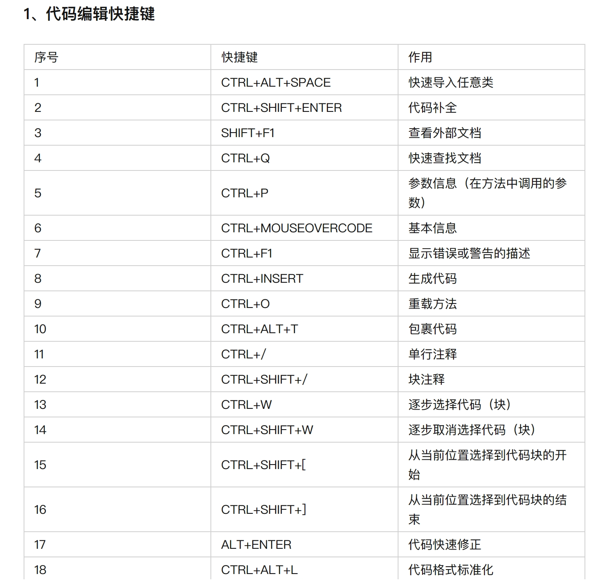


打开`F12`，令窗口左上角的小指针指向任一个表格，可以发现它都属于`<table>`这个父节点。这个网页上总共有9个表格，我们的任务就是提取出这9个表格。假如我们仍然使用requests发送请求，并用Beautifulsoup解析网页，这样得到的数据会把表格原有的规律破坏掉，还需要我们在后期人为恢复表格的格式。但是如果使用pandas就可以完美地提取出表格：

```python
# 导包并记录URL
import pandas as pd
url = 'https://zhuanlan.zhihu.com/p/472053977'
```

我们仅需要创建一个变量用于接受pandas读取到的表格即可，由于网页上的表格较多，我们可以创建一个列表，列表中每一个值就是一个列表：

```python
df_list = []
# 调用pandas中read_html()方法，并传入URL
df_list = pd.read_html(url, header=0)
# 预览一下df_list中的第一个表格
df_list[0]
```

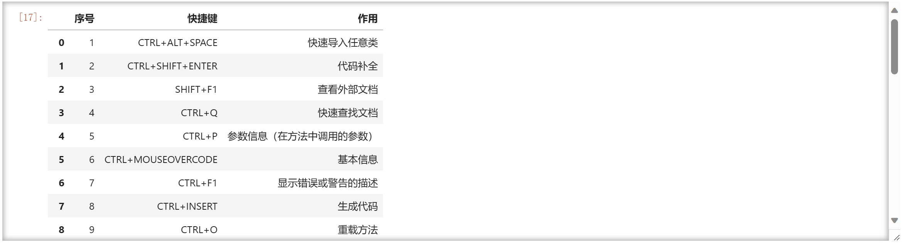

可见，表格很完美的爬取了出来。再来查询一下列表元素数量：

```python
print(f"列表长度为 {len(df_list)}")
```

```python
列表长度为 9
```

刚好对应html上的9个`<table>`标签。到此，我们已经成功把9张表爬取下来。最后，我们可以把它导出为Excel。这里有三种方法，第一种就是每一个表格导出为一个xlsx文件,代码和3.2.4中类型：

- **分别导出为不同的xlsx**

```python
df = pd.DataFrame(df_list[0])
df.to_excel("表格.xlsx", index=False)
```

运行完毕后，打开刚生成的xlsx文件：

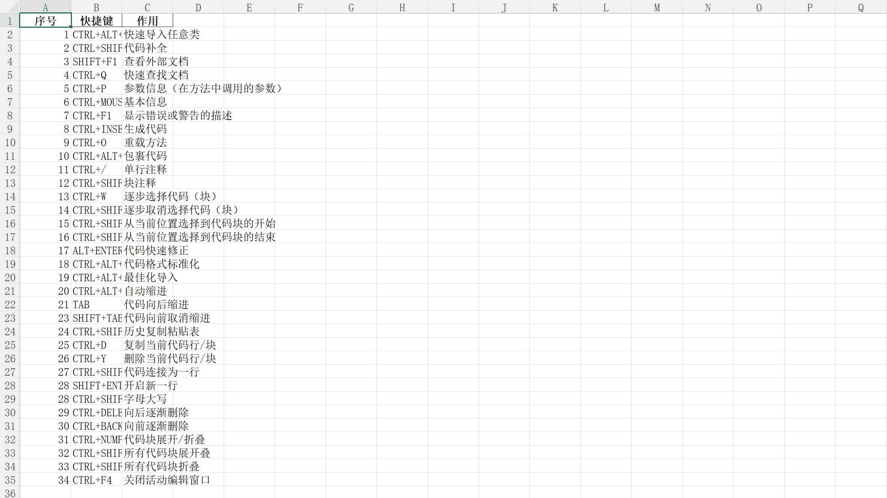

完成。但是这样一个表格就另存为一个excel文件，当有很多个表格时，每次看都要打开一次xlsx文档，十分麻烦，不如把它们都合并为一张表。这就是第二种方法，把它们同保存到一个Excel文档中。

- **合并为一张表再导出**

在pandas中，`concat()`函数就是用来合并数据的，我们可以利用它来将多个表合并在一起并导出为Excel文件：

```python
pd.concat(df_list).to_excel('表格.xlsx',index=False)
```

运行完后打开该xlsx文件：

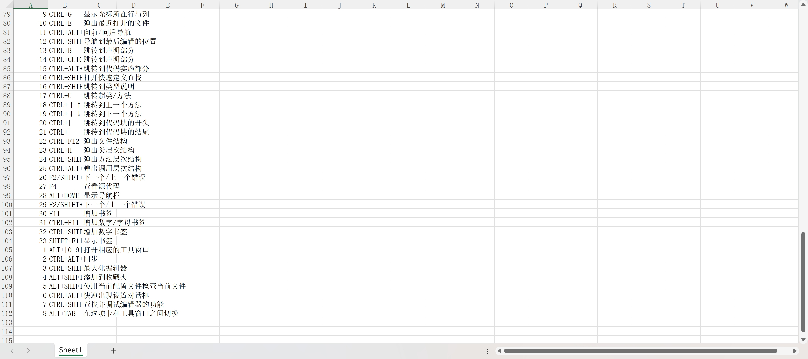

大致浏览一下，总共有112行，说明已经把9张表合并在一起了。

*这里再补充一下如何导出为csv文件。csv文件和xlsx文件相似，都是用来储存表格的，使用Excel也可以打开csv文件。*

但是它们也有一些区别：

*`i)`*csv是逗号分割的文本文件，而xlsx是标准的表格文件。

*`ii)`*csv本质上就是一个文本文件，无任何格式，但xlsx却是一个带有格式的数据表格文件。

*`iii)`*xlsx有最大行数限制，但csv没有；二者可以相互转化。

现在使用to_csv()方法将表格导出为csv文件：

```python
pd.concat(df_list).to_csv("csv文件.csv", index=False)
```

运行完毕后，右键该csv文件-> 打开方式-记事本：

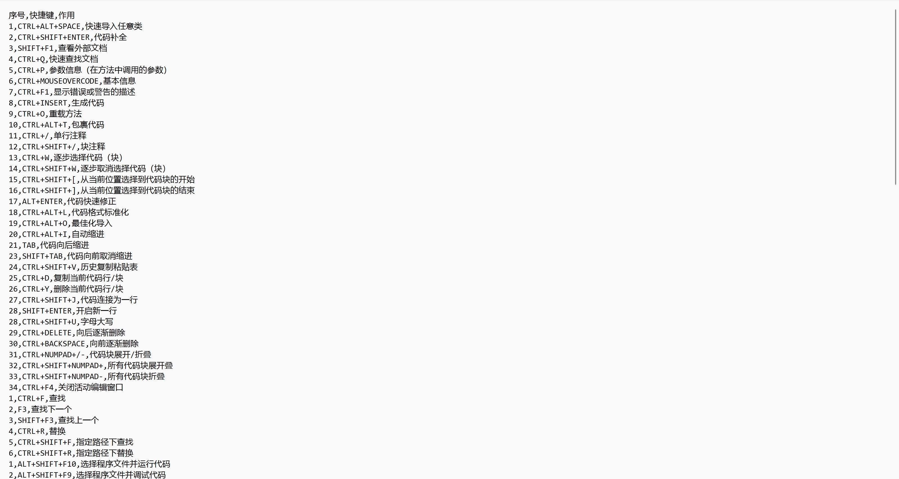

可以看到表格已经成功写入，不同数据之间用逗号分隔。再使用Excel打开：

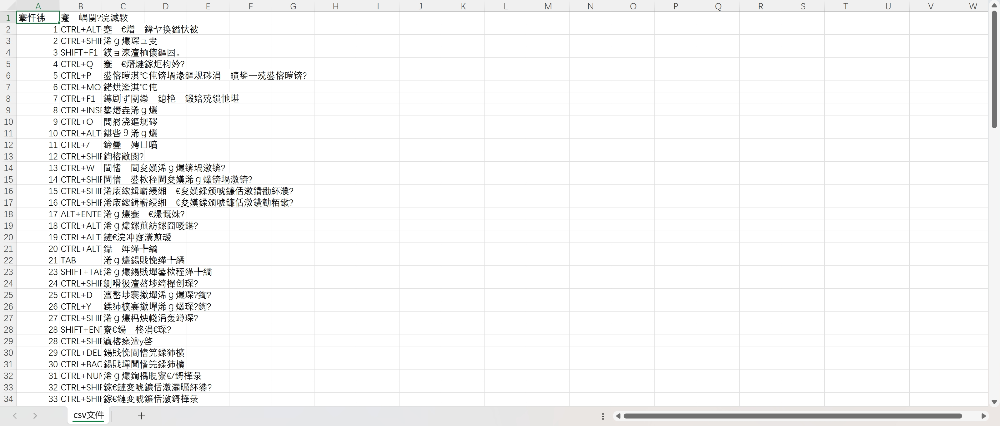

表格确实已经写入了，但是所有的中文都变成了乱码。此时，我们需要指定编码格式为`utf_8_sig`，即：

```py
pd.concat(df_list).to_csv("csv文件.csv", index=False, encoding="utf_8_sig")
```

再次使用Excel打开csv文件：

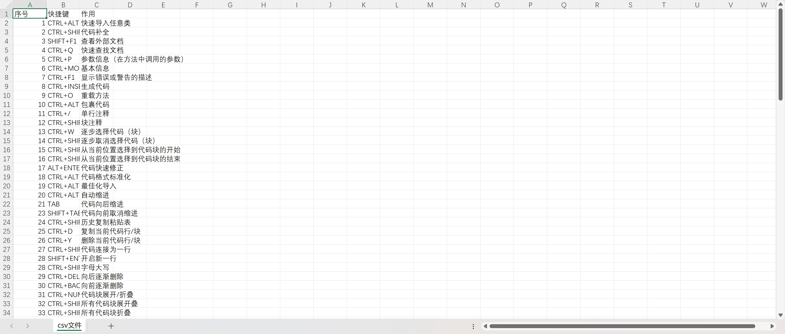

问题解决。

> 这里提一下，`utf-8-sig`并不是`utf-8`。
>
> - utf-8 以字节为编码单元，它的字节顺序在所有系统中都是一样的，没有字节序问题，也因此它实际上并不需要 BOM；
>
> - uft-8-sig 中 sig 全拼为 signature，即带有签名的 utf-8（UTF-8 with BOM）；
>
> - BOM 全称 ByteOrder Mark，字节顺序标记，出现在文本文件头部，Unicode编码标准中用于标识文件是采用哪种格式的编码。
>
> > Excel 在读取 csv 文件的时候是通过读取文件头上的 BOM 来识别编码的，如果文件头无 BOM 信息，则默认按照 Unicode 编码读取。当我们使用 utf-8 编码来生成 csv 文件的时候，并没有生成 BOM 信息，Excel 就会自动按照 Unicode 编码读取，就会出现乱码问题了。


- **导出为同一个xlsx的不同Sheet**

第三种方法仍是将不同的表格保存到一个Excel文档中，但不同的表格会被保存到不同的Sheet里。这种方法是最清晰明了的，但它操作起来会有些难度。在此之前，我们需要下载一个xlsxwriter模块：`pip install xlsxwriter`，并且手动先在Excel中新建一个空的xlsx文件，否则ExcelWriter会因找不到指定的xlsx文件而报错。

> 其实，在`to_excel()`方法中还有一个缺省参数`sheet_name`，这个参数在`read_excel()`方法中代表了读取某一个Sheet的xlsx文档，而不再是读取整个excel文件。

`sheet_name`在`read_excel()`中的用法如下：

| 值                          | 说明                                                         |
| --------------------------- | ------------------------------------------------------------ |
| sheet_name = 0              | 第一个Sheet页中的数据作为DataFrame对象                       |
| sheet_name = 1              | 第二个Sheet页中的数据作为DataFrame对象                       |
| sheet_name = 'Sheet1'       | 名称为Sheet1的Sheet页中的数据作为DataFrame对象               |
| sheet_name = [0,1,'Sheet3'] | 第一个、第二个和名称为Sheet3的Sheet页中的数据作为DataFrame对象 |
| sheet_name = None           | 读取所有工作表                                               |

但是在to_excel()方法中，由于这个xlsx文件是pandas帮我们创建的，所以默认都是把表格写在`Sheet1`。对于多个表格，即使指定将它们导出到同一个xlsx文档的不同Sheet，实际上真正的结果是该xlsx文档只保留了最后导出的表格所在的Sheet，其余的表格(或者说Sheet)都被覆盖了。

正确的做法是**提前创建好空xlsx文档，并让ExcelWriter来实现写入表格**，代码如下：

```python
writer = pd.ExcelWriter("表格.xlsx", engine='xlsxwriter')
n = 1
for table in df_list:
    df = pd.DataFrame(table)
    # 第一个参数不再是文件路径，而是ExcelWriter的对象
    # 缺省参数sheet_name来指定当前表格写在哪一个Sheet
    df.to_excel(writer, index=False, sheet_name=f"Sheet{n}")
    n += 1
# 保存并退出xlsx文档
writer._save()
writer.close()
```

运行完成后，打开该xlsx文档：

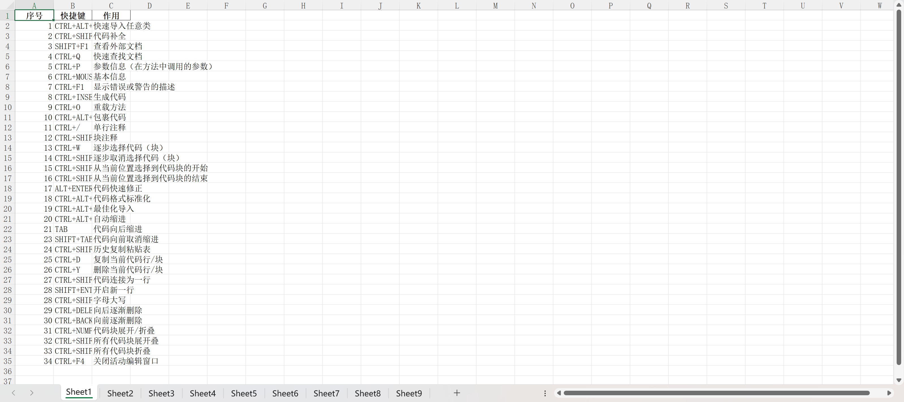

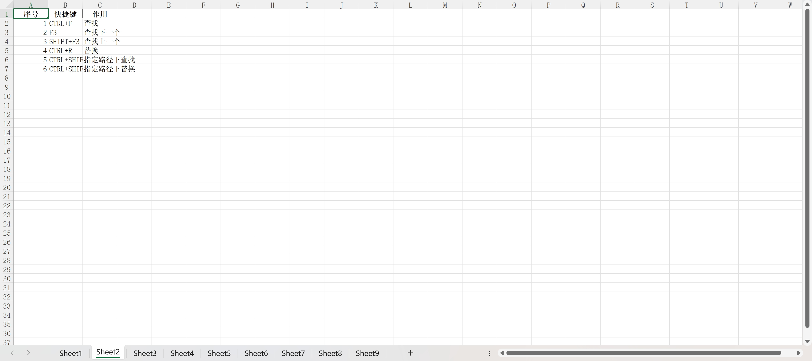

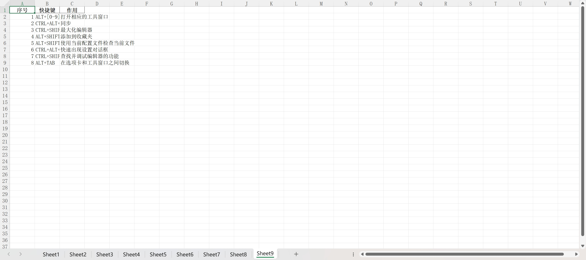

可以发现，每一个Sheet都对应着一个表格，总共9个Sheet对应9个表格。

回归主题，了解Pandas如何提取表格信息后，开始代码实现：

#### 3.3.3代码实现

在开始之前，要先复制一下请求URL，不用复制参数部分，因为参数部分都在负载**(Payload)**中。


导入本次用到的库

```py
import requests
import pandas as pd
```

记录**URL**和请求头

```py
url = "http://tianqi.2345.com/Pc/GetHistory"
headers = {
        'User-Agent':'Mozilla/5.0 (Windows NT 10.0; Win64; x64) AppleWebKit/537.36 (KHTML, like Gecko) Chrome/116.0.0.0 Safari/537.36 Edg/116.0.1938.81'
}
```

写一个函数，需要提供年份和月份来爬取对应的表格数据

```py
def craw_table(year, month):
    # 参数要把4个都写上,变化的只有year和month
    params = {
        "areaInfo[areaId]": 54511,
        "areaInfo[areaType]": 2,
        "date[year]": year,
        "date[month]": month
    }
    # 发送请求时把url,请求头和参数都带上
    r = requests.get(url, headers=headers, params=params)
    if r.status_code != 200:
        raise Exception("error!")
    # 由于真正执行业务的是后台，所以我们要把响应里Json文件里的html取出(对应的key是data)
    data = r.json()["data"]

    # 网页中可能有多个表格，所以是以列表的方式储存(和<class>标签一样)
    df = pd.read_html(data)[0]

    # html中有table标签，故需要lxml库解析表格
    return df

```

当我们提供一个年份和月份时，该函数就会帮我们把对应表格信息返还给我们，现在还需要一个循环去遍历这10年：

```py
# 定义一个列表，这个列表会储存10年天气数据
df_list = []
# 循环获取2013-2022这10年的天气数据
for year in range(2013, 2023):
    for month in range(1, 13):
        # 调用函数获得这个月的天气数据，使用变量df接收
        df = craw_table(year, month)
        # 将df添加到列表中
        df_list.append(df)
```

由于我们得到的每一个`df`文件其实都是独立的，每一个里面都会记录着30(或31天)的数据，它的索引都是从0开始，到30结束。当我们需要合并这些数据的时候，就用到了pandas提供的concat()方法，再将其保存为excel文件：

```py
pd.concat(df_list).to_excel("北京10年天气数据.xlsx", index=False)  # index false为不写入默认索引
```

完成。

### 3.4爬取全本小说内容

#### 3.4.1分析网站

接下来要实现的是将整本小说的内容爬取下来，目标网站`https://www.ckxxbz.com/book/yuniqianbanhao/`。我们希望能将小说章节分别写入不同的文本里，一个文本对应一个章节，并且章节标题尽量居中，首段开头空两格，每段之间隔一行。现在点击进入网页：


往下滑，会看到这篇文章的所有章节目录。打开`F12`，点击左上角的小鼠标选中几个章节，在工具栏切换到元素**(Elements)**就可以发现所有的章节都在`<dd class="col-sm-3">`下的a节点，已经包括了它的章节以及URL。


切换到网络**(Network)**，在响应当中的`charset`可以看到它的编码格式是UTF-8。


随便点进一篇文章，切换回元素，小鼠标选中正文内容，可以发现所有的内容均在`<div id="booktext">`下的p节点，且每一个p节点就是对应一段的内容。分析完毕，开始代码实现。

#### 3.4.2代码实现

本次用到的库：

```py
import requests
from bs4 import BeautifulSoup
import pprint
```

记录一下入口URL并请求访问：

```py
url = "https://www.ckxxbz.com/book/yuniqianbanhao/" 

r = requests.get(url)
# 打印一下状态码和编码格式
print(r.status_code) # 200
print(r.encoding) # ISO-8859-1
```

发现编码是ISO-8859-1，在前面1.1说过，编码为这个说明requests无法推测出编码，我们需要手动修改编码

```py
r.encoding = "utf-8"
```

得到每一个章节的标题和URL:

```py
html_doc = r.text
soup = BeautifulSoup(html_doc,"html.parser")
# 获取所有的小说章节节点
dd_nodes = soup.find_all('dd',class_="col-sm-3")
# 创建列表分别用来存放所有的URL和章节标题
htmls = []
chapters = []
# 每一个dd节点下的a节点就包含了这个章节的标题和url
for dd_node in dd_nodes:
    a_node = dd_node.find('a')
    html = a_node['href']
    chapter = a_node.get_text()
#     将它们添加到列表当中
#     href提供的url不完整，需要手动补齐，否则requests无法通过它找到网页
    htmls.append('https://www.ckxxbz.com' + html)
    chapters.append(chapter)
```

可以打印一下这两项指标看看有没有出错：

```py
pprint.pprint(htmls)
pprint.pprint(chapters)
```


能够正常打印后，用for循环将每一个章节的内容写入：

```py
# 定义一个变量代表当前文章标题的索引
n = 0
for html in htmls:
    r = requests.get(html)
    r.encoding = "utf-8"
    html_doc = r.text
    soup = BeautifulSoup(html_doc,"html.parser")
#     小说的正文均在<div id='booktext'>下的p节点，先取出所有p节点
    node_p = soup.find('div',id="booktxt").find_all('p')
#     给小说章节添加路径(文件名不使用章节标题是因为有特殊字符，无法作为文件名字)
    name =  f"C:/Users/Raymond/Desktop/与你千般好/第{n+1}章.txt"
# 开始文件的写出
    with open(name, 'w',encoding="UTF-8") as f:
#         在正文上方赋予标题
        f.write("\t" * 3 + chapters[n] + "\n")
#         遍历所有的p节点
        for p in node_p:
            f.write("   " + p.get_text()+ "\n" * 2)
            f.flush()
#     当这篇文章结束后，标题索引加1
    n += 1
# 运行完毕后，给出提示
print("小说爬取完毕！")
```

打开文件创建的位置：


随便点开一个看看格式是否正确：


可以发现，没有任何问题。


### 3.5爬取b站up主空间图片

#### 3.5.1分析网站

​    先打开b站首页`https://www.bilibili.com/`，观察一下：


很快发现b站是一个动态网站，每次滑到页面底部，就会立马刷出新的内容，且保留我们之前刷到的内容在上方，新内容在下方。这种下拉式加载的网页通常是通过**JavaScript**动态加载内容的。假设我们继续使用requests库只能获取初始加载的部分内容，无法获取后续通过JavaScript加载的内容。

> 要获取下拉式加载的部分，我们需要尝试模拟浏览器操作，使用工具**Selenium**来自动滚动页面并获取动态加载的内容。它可以模拟用户的交互行为，包括滚动页面、点击按钮等操作。
>
> > 我们可以通过Selenium打开网页，模拟下拉操作，直到加载了所有我们想要获取的内容。然后，再使用BeautifulSoup解析获取到的完整页面，提取你需要的信息。

#### 3.5.2selenium库

在本次代码中，我们会使用到selenium以下几个包：

1.`webdriver`: 对象用于创建不同的浏览器实例，如 `Chrome()`,`Firefox()`等，它是与浏览器进行交互的主要接口

```py
from selenium import webdriver
```

2.`Keys`: 用于模拟键盘按键的类，例如 `Keys.END` 可以模拟按下 "End" 键，用于向下滚动页面(按下键盘的`End`就立马滚动到当前视图的底部)

```py
from selenium.webdriver.common.keys import Keys
```

3.`By`: 提供不同的定位元素的方式，如 `By.TAG_NAME` 可以基于标签名进行元素定位

```py
from selenium.webdriver.common.by import By
```

4.`WebDriverWait`: 用于等待页面加载完成或某个元素出现等条件，它可以设置一个等待时间，并在超时后抛出异常或执行下一步操作

```py
from selenium.webdriver.support.ui import WebDriverWait
```

不过如果一般我们不做特殊要求，time库的time.sleep()也可以实现该方法。

5.`expected_conditions as EC`: 包含预定义的条件，用于配合`WebDriverWait`使用，例如 `EC.presence_of_element_located` 表示等待元素出现在页面中。

```py
from selenium.webdriver.support import expected_conditions as EC
```

- **模拟网页登录**

```py
from selenium import webdriver
# 创建一个 WebDriver 实例,建议使用谷歌浏览器
driver = webdriver.Chrome()
url = "https://www.bilibili.com/"
# 打开网页
driver.get(url)
```

运行结果，系统会自动弹出Chrome并进入到b站首页。

最好再设置一个等待时间等待页面加载完成或某个特定条件出现，如果超过设置的等待时间仍未满足条件，则会抛出超时异常：

```py
from selenium.webdriver.support.ui import WebDriverWait
wait = WebDriverWait(driver, 10) # 单位：秒
```

- **模拟下拉操作，滚动到页面底部**

```py
from selenium.webdriver.common.keys import Keys
from selenium.webdriver.common.by import By
# 先基于标签名进行元素定位，再模拟按下 "End" 键，用于向下滚动页面
driver.find_element(By.TAG_NAME, 'body').send_keys(Keys.END)
```

- **等待页面加载**

```py
import time
time.sleep(1) # 单位：秒
```

sleep() 函数推迟调用线程的运行。

- **获取页面的源代码**

```py
page_source = driver.page_source
```

- **关闭WebDriver**

```py
driver.quit()
```

现在关键的问题已经得到了解决，后续需要补充的只是使用循环，不断的下拉网页并获取内容。

#### 3.5.3图片写入

打开目标网站(up主的空间)，打开`F12`检查任意我们需要获取的照片的元素


很快发现所有的照片元素其实都是在`<pircture class="b-img__inner">`下的``节点，其中`img`就是image，图像的意思，而它的链接就在它的`src`属性里。复制`src=`后面的链接，这个链接并不完整，它缺少了一个开头`https:`，我们在后续需要补上。新建一个标签页打开就可以看到这个图片了。但是，我们查看到的图片并不清楚，因为此时我们获取的是这个图片的缩略图。

缩略图：


对比原图：


仔细观察，会发现这个链接会以`@`作为分隔，@前面是.jpg文件，@后面是webp文件，而其实我们真正需要的是前面的.jpg文件。对于这个问题，我们只需要做一下字符串分割即可解决。

而在之前，我们使用open()方法写入的都是文字，而当我们要写入图片时，方法略有不同：

```py
# 先记录一个图片的src
src = "https://i2.hdslb.com/bfs/face/63a3067864d9371dfab9b7acdd68b84e5ca243db.jpg"
```

为了获取图片的名字，还需要调用os模块的basename()方法：

```py
import os
# 帮我们从src的信息中提取出图片文件名
filename = os.path.basename(src)
```

调用with open()方法开始写入图片信息：

```py
import requests
with open(f"./{filename}","wb") as f:
	# 请求访问src
	r = requests.get(src)
	# 得到二进制流
	f.write(r.content)   
```

其中，文件的操作模式为"wb"，即 wirte_byte，写入二进制的意思。另外，在1.1中也介绍过r.text是获得网页的文字内容，而r.content是以字节的形式返回内容，是用于下载图片的。了解完所有流程后，开始代码实现：

#### 3.5.4代码实现

导入本次需要用到的所有库

```py
from selenium import webdriver
from selenium.webdriver.common.keys import Keys
from selenium.webdriver.common.by import By
from bs4 import BeautifulSoup
import os
import requests
import time
```

新建一个入口URL并模拟浏览器登录网页：

```py
url = "https://space.bilibili.com/480305216/dynamic"
# 创建一个 WebDriver 实例
driver = webdriver.Chrome()
# 打开网页
driver.get(url)
```

模拟浏览器下拉滚到底部的操作：

```py
scroll_pause_time = 1  # 下拉后等待的时间，可以根据需要进行调整
max_scroll_count = 3  # 最大下拉次数，根据需要进行调整
scroll_count = 0  # 当前下拉次数
# 设置循环确定下拉次数
while scroll_count < max_scroll_count:
    # 模拟下拉操作，滚动到页面底部
    driver.find_element(By.TAG_NAME, 'body').send_keys(Keys.END)
    # 等待页面加载
    time.sleep(scroll_pause_time)
    # 更新下拉次数
    scroll_count += 1
    # 继续下拉操作
```

在运行的时候，网页刚登录进去就需要我们输入验证码。而在输验证码的过程中，很可能已经超过了我们设定的下拉后等待的时间`scroll_pause_time`，导致系统以为已经爬取完数据，自动退出了程序。为了防止这种现象，我们可以重新设置一下时间：

```py
# 先设置一下首次下拉的时间在10秒，而这10秒其实是给我们输入验证码的
scroll_pause_time = 10 
max_scroll_count = 3 
scroll_count = 0 
while scroll_count < max_scroll_count:
    driver.find_element(By.TAG_NAME, 'body').send_keys(Keys.END)
    time.sleep(scroll_pause_time)
    # 验证码输入完毕后，系统开始帮我们记录每次下拉时爬取到的数据，再次把下拉后等待的时间复原为1秒
    if scroll_pause_time == 10:
        scroll_pause_time = 1
    scroll_count += 1
```

获取完整页面的源代码并关闭WebDriver

```py
page_source = driver.page_source
driver.quit()
```

接下来得到源代码后开始常规操作

```py
# 使用 BeautifulSoup 解析页面
soup = BeautifulSoup(page_source, "html.parser")
# 提取我们需要的信息所在的节点
imgs = soup.find_all('img')
```

现在我们需要写一个函数去帮我们还原图片的真实链接而不是缩略图：

```py
# 定义函数获取原图链接
def pic(oldsrc):
    srcs = oldsrc.split("@")
    src = 'https:' + srcs[0]
    return src
```

使用循环将每一个img节点的`src`信息取出并调用函数得到链接，写入图片：

```py
for img in imgs:
    # 由于在测试时，发现一些节点的src值为空，所以我们要先排除这些空值
    if img.get('src') != None:
        src = pic(img.get('src'))
        # 打印一下这些链接看看是否正确
        print(src)
        filename = os.path.basename(src)
        with open(f"C:/Users/Raymond/Desktop/一个蟹蟹梨/{filename}","wb") as f:
            #请求访问src
            r = requests.get(src)
            f.write(r.content)   
# 在循环结束后，可以添加一个提示语句
print("图片爬取完毕！")
```

点击运行，看看图片写出的位置是否开始新增图片：


​	当然，如果想一次性获取动态的所有图片，即下拉到页面的底部，不再刷新新数据位置，可以使用3.5.2所述的expected_conditions模块实现。它能获取到当前页面的高度。我们只需要设置两个高度变量，这个记录上一次的，一个记录当前的。每循环一次后，将当前高度赋值给上一次，再进入下一轮循环。只有当循环到某一次，当前高度还没赋值给上一次高度，但两者已经相等了，说明已经到达了页面底部，可以退出循环。

另外，我们可以看到，爬取图片的时候还会把b站的表情爬取到，这不是我们想要的。可以稍微优化一下：


可以看到，虽然B站表情对应的节点标签也是**img**，但它的上一级节点是`<div class="bili-rich-text">`，而我们需要爬取的图片实际上在`<picture class="b-img__inner">`下方。所以只要我们先定位到**picture**节点，再找img就可以避免爬取到b站表情：

```py
# 获取页面高度
last_height = driver.execute_script("return document.documentElement.scrollHeight")
# 模拟下拉操作，直到页面底部
# 这次需要把while循环改为死循环，只有它到达页面底部才退出循环
while True:
    # 模拟下拉操作，滚动到页面底部
    driver.find_element(By.TAG_NAME, 'body').send_keys(Keys.END)
    # 等待页面加载
    time.sleep(1)
    # 获取当前页面高度
    new_height = driver.execute_script("return document.documentElement.scrollHeight")
    # 检查是否到达页面底部
    if new_height == last_height:
        break
    # 更新页面高度
    last_height = new_height
```

完整代码如下：

```py
from selenium import webdriver
from selenium.webdriver.common.keys import Keys
from selenium.webdriver.common.by import By
import time
from bs4 import BeautifulSoup
import os
import requests

url = "https://space.bilibili.com/480305216/dynamic"

# 创建一个 WebDriver 实例
driver = webdriver.Chrome()

# 打开网页
driver.get(url)

# 获取页面高度
last_height = driver.execute_script("return document.documentElement.scrollHeight")
scroll_pause_time = 10
# 模拟下拉操作，直到页面底部
while True:
    # 模拟下拉操作，滚动到页面底部
    driver.find_element(By.TAG_NAME, 'body').send_keys(Keys.END)
    
    # 等待页面加载
    time.sleep(scroll_pause_time)
    if scroll_pause_time == 10:
        scroll_pause_time = 5
    # 获取当前页面高度
    new_height = driver.execute_script("return document.documentElement.scrollHeight")

    # 检查是否到达页面底部
    if new_height == last_height:
        break

    # 更新页面高度
    last_height = new_height

# 获取完整页面的源代码
page_source = driver.page_source

# 关闭 WebDriver
driver.quit()

# 使用 BeautifulSoup 解析页面
soup = BeautifulSoup(page_source, "html.parser")

# 提取所需要的信息(只爬取动态图片)
pictures = soup.find_all('picture',class_="b-img__inner")
imgs = []
for picture in pictures:
    img = picture.find('img')
    imgs.append(img)

# 定义函数获取原图链接
def pic(oldsrc):
    srcs = oldsrc.split("@")
    src = f"https:{srcs[0]}"
    return src

for img in imgs:
    if img.get('src') != None:
        src = pic(img.get('src'))
        print(src)
        filename = os.path.basename(src)
        # 操作模式为"wb"即 wirte_byte，写入二进制
        with open(f"./一个蟹蟹梨/{filename}","wb") as f:
            # 请求访问src
            r = requests.get(src)
            # 得到二进制流
            f.write(r.content)   
```

> *注意，由于网络波动，在实际爬取当中可能还未到底部，但是由于下滑后新数据未在我们指定的等待页面加载时间内加载出来，系统会以为已经到达了网页底部，退出循环。所以我们可以适当延长等待页面加载，如果出现新数据未及时刷新的情况，我们可以人工拖动滚动条，先往上拖动，再拉到网页底部人工刷新。*

另外，爬取的时候，可能会将相同的src记录多次，如果不处理直接写入的话，会使得写入的效率变低（相同的图片多次写入），这时可以使用1.2的URL管理器进行处理：

```py
# 创建两个集合用于储存处于两种状态的URL(集合不允许重复添加相同元素)
# 创建集合储存已爬取的URL
old_urls = set()
# 创建集合储存待爬取的URL
new_urls = set()
# 写一个函数，用于添加单个新的URL
def add_new_url(url):
#     先判断URL是否真实存在
    if len(url) > 0 and url is not None and url not in old_urls:    
#  只有URL没有重复才会添加到里面
        new_urls.add(url)
#     写一个函数，用于批量添加URL
def add_new_urls(urls):
#     调用添加单个url的方法
    for url in urls:
        add_new_url(url)
# 写一个函数，从待爬取的集合中随机取出一个URL进行爬取，并将其添加到已爬取URL中
def get_a_url():
    if len(new_urls) > 0:
        url = new_urls.pop()
        old_urls.add(url)
        return url
# 写一个函数，返回当前待爬取URL的数量
def get_count():
    return len(new_urls)
# 将爬取到的所有src交给url管理器处理
add_new_urls(all_srcs)
print(f"查重后共有{get_count()}张图片")
```

写入图片时，通过URL管理器的get_count()方法确定循环停止条件：

```py
while get_count() != 0:
    src = get_a_url()
    # 这里书写写入图片的代码
```


### 3.6爬取专利库数据

#### 3.6.1分析网站

接下来，我们试试在佰腾网`https://www.baiten.cn/`以"智能家居"为关键词，爬取一些数据。


打开佰腾网，直接在搜索框输入"智能家居"，然后点击搜索：


可以发现，这个网站会立刻弹出登录窗口，如果此时点击叉号关闭，是不会让我们查询到任何数据的。所以要先注册、登录账号。我们代码实现的第一步，也是要用selenium帮我们模拟用户登录。


登陆成功后，就可以查看到数据了。我们这次的目标要爬取专利名、主分类号和摘要，并且将爬取的前几页数据，保存到Excel中。

#### 3.6.2模拟用户操作

打开Jupyter notebook，导入实现这个过程所需要的库：

```py
from selenium import webdriver
from selenium.webdriver.common.by import By
```

对于入口URL，我们首先要实现selenium模拟我们搜索内容：


观察到，搜索框所对应的节点有一个**name**属性，而这个name属性一般是可以精准定位节点的，我们可以使用3.5.2介绍过的`find_element()`方法，不过不再是用标签名(By.TAG_NAME)来定位，而是它的name属性(By.NAME)，而它的完整表达形式为`name='q'`，我们就可以写成：

```py
url = 'https://www.baiten.cn/'
driver = webdriver.Chrome()
driver.get(url)
driver.find_element(By.NAME, "q")
```

在selenium定位到它之后，还需要执行输入"智能家居"的操作，其实在上一次练习当中也用过这个方法，不过上次是执行滚动的操作，这一次是在键盘上输入内容：

```py
driver.find_element(By.NAME, "q").sen
d_keys('智能家居')
```

此时就能完成模拟输入"智能家居"的操作了。接下来还需要完成点击搜索的操作：


观察到它所在的节点并没有`name`这个属性，但也有一个独特的属性`type="submite"`代表确认搜索，此时我们可以利用find_element()的其他形式来查找它，即**xpath**，格式为`//input[@属性名="属性值"]`

```py
driver.find_element(By.XPATH, '//input[@type="submit"]')
```

找到搜索按钮之后，就要执行点击的操作：

```py
driver.find_element(By.XPATH, '//input[@type="submit"]').click() # 连在一起写
```

这个时候selenium就已经帮我们完成了输入内容和点击搜索的操作了。由于跳转页面需要时间，为了防止页面还没跳转出来，后面代码就已经开始执行了，可以设置一下等待时间：

```py
import time
time.sleep(2)
```

在跳转成功后，登录账号的弹窗会立马弹出来：


> 由于我们是用代码来实现这个登录过程的，自然就会选择账号密码登录。而这时又会出现一个新的问题，无论是"微信登录"、"账号密码登录"还是"短信登录"它所对应的源代码的节点标签都是**li**，除了我们目前选中的登陆方式有`class="selected"`以外，它们都没有任何的属性供我们定位。
>
> > 其实，find_element()还提供了一种方法供我们定位元素，而且这种方法定位的效率会比前两者都高，而且不需要依赖任何属性进行定位，就是利用CSS选择器查找：


点击"账号密码登录"，在跳转到的源代码的位置右键 - 复制(copy) - 复制selector(copy selector)，接着输入代码：

```py
# 在引号内粘贴复制到的内容，完成后还需要补充一个点击的操作
driver.find_element(By.CSS_SELECTOR,'#loginDialog > div > div:nth-child(2) > div.patLogin > ul > li:nth-child(2)').click()
```

现在系统就会帮我们切换到"账号密码登录"了。接下来，就是输入账号以及密码。然而在调试的过程中，我发现如果通过name属性或者xpath来定位，系统都会报错"**Element Not Interactable Exception**"，这可能是因为其实组件有先后顺序或者已被隐藏，所以我们没法定位到它的输入框的位置。解决的办法依旧是直接用css选择器定位即可解决：

```py
user = "xxx"
password = "xxx"
# 定位到后输入账号或者密码
driver.find_element(By.CSS_SELECTOR,'#loginDialog > div > div:nth-child(2) > div.patLogin > div.login-content.accountLogin > form > div:nth-child(1) > input[type=text]').send_keys(user)
driver.find_element(By.NAME,'login_pwd').send_keys(password)
# 点击登录
driver.find_element(By.XPATH,'//div[@class="JS_accountLoginBtn"]').click()
time.sleep(5)
```

此时，我们就成功地利用selenium帮我们实现登录的过程。


不过，在成功登录后，如果你是普通用户，它又会多一个弹窗。我们希望继续通过代码实现把他关掉。由于打开`F12`后发现它也是没有属性值的，所以我们干脆直接继续使用css选择器进行关闭处理：

```py
driver.find_element(By.CSS_SELECTOR,'body > div.JS_vipad_content > span').click()
```

此时，我们已经完成了从打开页面、模拟输入并确认搜索、完成账号密码输入和关闭弹窗的操作了。

#### 3.6.3元素定位方式

总结一下，**find_element()**可以用到的定位方式有：

```py
driver.find_element(By.ID, "value") # 利用ID属性查找

driver.find_element(By.CLASS_NAME, "value") # 利用class属性查找

driver.find_element(By.NAME, "value") # 利用name属性查找

driver.find_element(By.TAG_NAME, "value")  # 利用节点标签名查找

driver.find_element(By.XPATH, "value") # 利用xpath查找

driver.find_element(By.CSS_SELECTOR, "value")  # 利用CSS选择器查找
```

接下来开始代码实现：

#### 3.6.4代码实现

**本次用到的包有：**

```py
from selenium import webdriver
from selenium.webdriver.common.by import By
import pandas as pd
import time
from bs4 import BeautifulSoup
```

**将常量定义好**

```py
url = 'https://www.baiten.cn/'
user = "xxx"
password = "xxx"
```

**模拟用户操作**

```py
# 获取浏览器对象
driver = webdriver.Chrome()
driver.get(url)
time.sleep(1)
# 输入搜索字段来爬取对应的专利
driver.find_element(By.NAME, "q").send_keys('智能家居')
driver.find_element(By.XPATH, '//input[@type="submit"]').click()
time.sleep(2)
# 输入账号和密码，并点击登录
# 切换到账号密码登录
driver.find_element(By.CSS_SELECTOR,'#loginDialog > div > div:nth-child(2) > div.patLogin > ul > li:nth-child(2)').click()
# 输入账号
driver.find_element(By.CSS_SELECTOR,'#loginDialog > div > div:nth-child(2) > div.patLogin > div.login-content.accountLogin > form > div:nth-child(1) > input[type=text]').send_keys(user)
# 输入密码
driver.find_element(By.NAME,'login_pwd').send_keys(password)
# 点击登录
driver.find_element(By.XPATH,'//div[@class="JS_accountLoginBtn"]').click()
time.sleep(5)
# 关闭弹窗
driver.find_element(By.CSS_SELECTOR,'body > div.JS_vipad_content > span').click()
```

此时就已经真正进入了要爬取数据网页的第一页，我们可以写一个函数，提取出每一页html的专利名、主分类号和摘要。


观察到，每一项专利它的信息都在`div class="u-list-div"`这个节点下，而专利名所在的节点有独一的属性值`class="c-blue title nl-ti"`，主分类号也有`class="main_ipc"`，摘要有`class=content`。有了这些定位，我们可以很轻易的找到我们需要的数据：

```py
# 写一个函数，提取出每一页html的专利名、主分类号和摘要
def get_data(html_doc):
    soup = BeautifulSoup(html_doc,"html.parser")
#     找到它们都在的一个父节点
    data_lists = soup.find_all('div',class_='u-list-div')
#     定义一个列表，用于储存这些数据
    page_data = []
    for data in data_lists:
        title = data.find('a',class_='c-blue title nl-ti').get_text()
        main_ipc = data.find('a',class_='main-ipc').get_text()
        content = data.find('span',class_='content').get_text()
#         按照字典的格式进行匹配
        data_dict = {"专利名":title,"主分类号":main_ipc,"摘要":content}
#     把字典添加到列表中
        page_data.append(data_dict)
#     返回列表
    return page_data
```

定义好函数后，我们再写一个循环遍历每一页，得到每一页的html文档调用该函数。不过还有一个问题，由于该网站的特殊性，在网页内按下"END"并不会滚动到页面的最下端，所以我们继续使用其他方式来定位到页面最下端。


可以看到，每一个按钮对应的节点标签、属性其实都是一样的，这样我们就只能通过css选择器来定位了。把前几页的css选择器信息辅助出来进行比较：


很快发现，除了当前页面外，其他页面唯一的不同就在尾数是和它的按钮显示的页数一致。这就是我们循环的依据：

```py
# 定义好一个列表用于储存所有的数据
all_data = []
# 定义好当前页数，我们爬取前10页
idx = 0
while idx < 10:
#     等待数据刷新
    time.sleep(2)
#     提取本页内容
    html_doc = driver.page_source
#     调用函数将数据处理好，并追加到大列表中
    all_data.extend(get_data(html_doc))
#     模拟用户点击下一页
    driver.find_element(By.CSS_SELECTOR,f'#paging > div > span.btui-paging-nums > span:nth-child({idx + 1})').click()
#     页数刷新
    idx += 1
#     获取完前10页数据后，关掉webdriver
driver.quit()
```

此时我们就已经获得了前10页的数据了。再将数据交给pandas保存：

```py
df = pd.DataFrame(all_data)
df
```


无误后，再保存到excel当中：

```py
df.to_excel("智能家居.xlsx",index=False)
```

打开Excel表格：


完成。

## 4.总结

至此，已经完成了Python网络爬虫的入门了。给出全流程图：


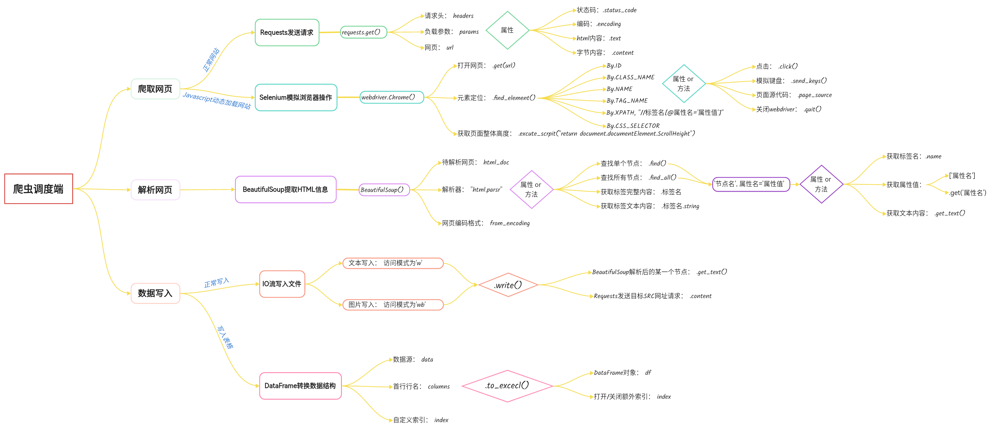


1. 对于没有做反爬措施的网站，可以直接通过`Requests`发送请求，使用属性`.text`将当前页面爬取下来后交给`BeautifulSoup`解析网页。`Beautifulsoup`通过`find()`以及`find_all()`方法，根据属性查找一个或多个节点，通过`.get_text()`提取出文本内容。
2. 如果网站有反爬措施，就需要打开该网页源代码，在 网络 - 标头 的最低端找到请求头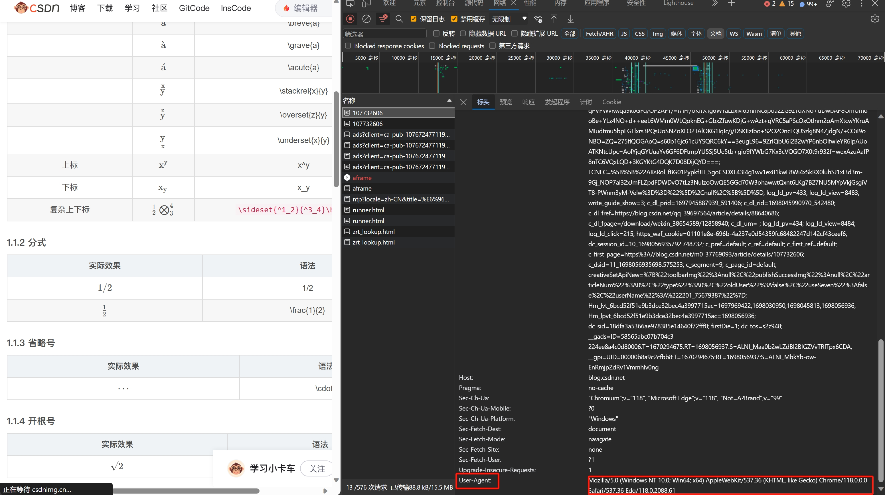在使用`requests`的`get`或者`pose`方法时，将请求头`headers`与`URL`一同传入。
3. 对于后台加载页面的网站，还需要经过抓包处理。在源代码中找到`响应`中的数据作为参数`params`传入`.get()`。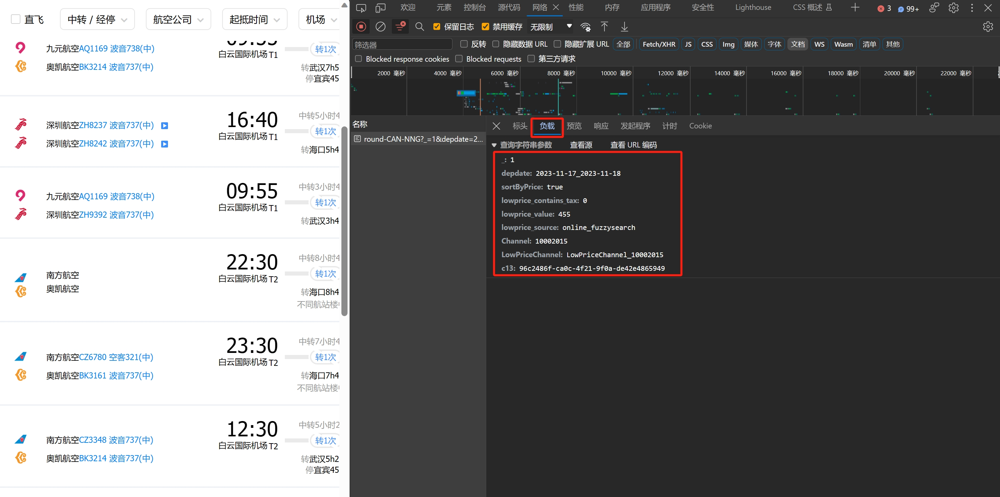
4. 对于由Javascript动态加载内容的网站，使用`requests`只能获取初始加载的部分内容，需要用到`selenium`模拟浏览器进入网页。实例`webdriver`对象后，通过`.get()`方法打开网页，再通过`.find_element()`方法定位元素。需要进行交互时，用`.send_keys()`方法执行键盘输入，`.click()`方法执行鼠标左键单机。定位到元素后，再通过`page_source`获取当前网页的html。之后就可以回归`BeautifulSoup`解析网页。
5. 需要处理表格时，如果网页中本身含有`<table>`标签，直接使用`pandas`的`read_html()`方法读取。如果是把爬取出的数据制作成表格，还需要将每一行数据按照字典的方式配对，再将所有配对好的数据储存到集合或列表中。最后通过`.DataFrame()`交由`pandas`储存数据，通过`.to_cxcel()`方法导出为`xlsx`文件。其实源数据经由DataFrame转换数据结构不止这一种方式，现在再补充另外的两种方式。
